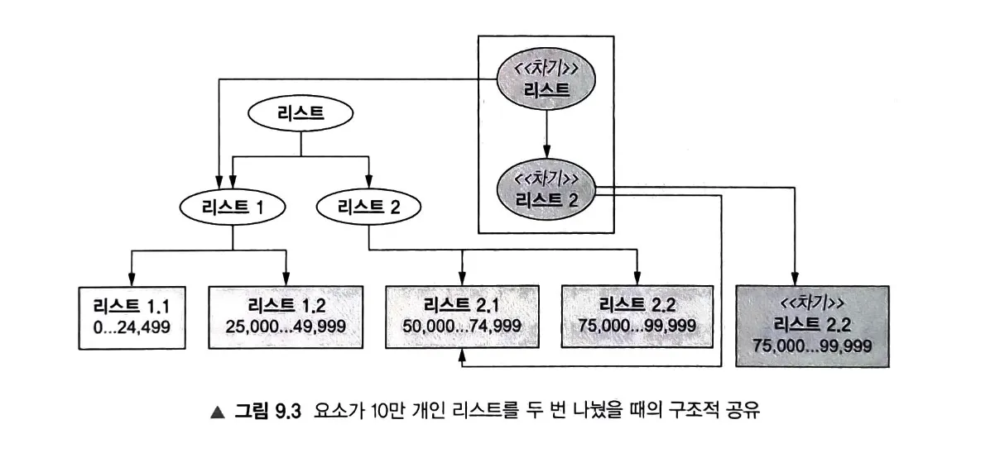

DOP에서 데이터는 불변이다. 데이터를 직접 변경할 수 없고 필요하다면 새로운 버전의 데이터를 만들어야 한다. 이런 방식에서 우려되는 점은 크게 2가지, 안정성과 효율성이다. 어디서도 데이터를 변경할 수 없음을 보장할 수 있을까? 매번 새로운 버전의 데이터를 만들어야 한다면 성능적인 문제는 없는 걸까? 이번 장에서는 이 2가지에 대한 해답을 제시한다.

  

## 영속 자료구조로 안정성을 보장하는 방식

안정성을 보장하는 방식은 사실 간단하다. 수정 메서드를 사용할 경우 예외를 발생시키면 된다. 예를 들어 Java에서 불변 Collection에 데이터를 수정하려 하면 UnsupportedOperationException을 발생시킨다. Javascript의 경우 Object.freeze를 사용하면 동일한 효과를 얻을 수 있다. 다만, 변경을 시도할 때 오류가 발생하냐 마냐는 strict/sloppy mode에 따라 다르다. 하지만 어떤 경우이든 데이터가 변경되지는 않으니 큰 문제는 아니다.

  

## 영속 자료구조로 효율성을 보장하는 방식

영속 자료구조를 사용하면 데이터의 새로운 버전을 만들 때 이전 버전과 공유할 수 있는 부분은 재사용한다. 이를 통해 메모리 사용량을 최적화하고 성능을 향상시킬 수 있다.

영속 자료구조의 핵심은 **구조적 공유(Structural Sharing)**이다. 새로운 버전의 자료구조를 만들 때, 변경되지 않은 부분은 이전 버전과 공유하여 메모리 효율성을 극대화한다.

  

## 영속 자료구조의 특징

영속 자료구조는 다음과 같은 특징을 가진다:

1. **불변성**: 생성된 후 절대 변경되지 않는다
2. **버전 관리**: 새로운 버전이 생성되어도 이전 버전이 유지된다
3. **구조적 공유**: 변경되지 않은 부분은 버전 간 공유된다
4. **효율성**: 전체 복사 없이 부분적 변경만으로 새 버전을 생성한다

  

## 영속 자료구조의 구현 원리

영속 자료구조는 주로 트리 구조를 기반으로 구현된다. 변경이 필요한 경우:

1. 변경되는 경로(path)만 새로 생성한다
2. 변경되지 않는 부분은 기존 구조를 참조한다
3. 루트에서 변경 지점까지의 경로만 복사하여 새 버전을 만든다

이러한 방식으로 O(log n) 시간 복잡도로 효율적인 업데이트가 가능하다.

  

## 실제 활용 사례

영속 자료구조는 함수형 프로그래밍 언어와 라이브러리에서 널리 사용된다:

- **Clojure**: 모든 기본 자료구조가 영속 자료구조
- **Immutable.js**: JavaScript에서 영속 자료구조 제공
- **Immer**: JavaScript에서 불변 업데이트를 간편하게 지원

  

## 마무리

영속 자료구조는 DOP의 핵심 개념 중 하나로, 안정성과 효율성이라는 두 마리 토끼를 모두 잡을 수 있게 해준다. 불변성을 보장하면서도 성능상의 이점을 제공하여, 함수형 프로그래밍과 데이터 지향 프로그래밍에서 중요한 역할을 한다.