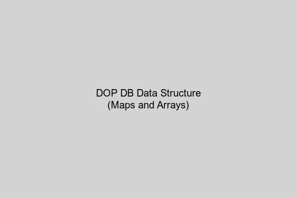
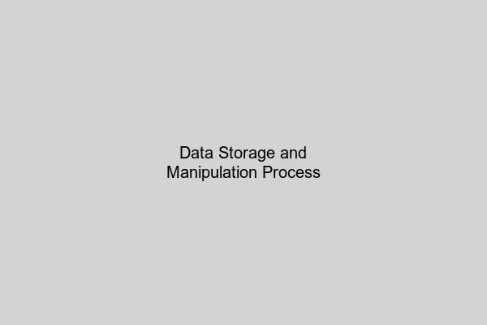

## How DOP Handles DB Data

```json
[
  {
      "title": "7 Habits of Highly Effective People",
      "isbn": "978-1982137274",
      "publication_year": 1989
  },
  {
      "title": "The Power of Habit",
      "isbn": "978-0812981605",
      "publication_year": 2012
  }
]
```

In DOP, DB data is no different from memory data we've handled so far. Basically, data is managed as maps and each piece of data is stored in arrays. Because DB data is handled in the same way as before, everything previously applied for data management, such as JSON schemas, can be equally applied to DB data.



When retrieving data from DB in DOP, if the driver returns results as a list of maps, no additional work is needed. Otherwise, utility functions can be used to convert the driver's return values into list-map format.

```javascript
let dbClient;

const ajv = new Ajv({ allErrors: true });

const title = "habit";

const matchingBooksQuery = `
  SELECT title, isbn
  FROM books
  WHERE title LIKE '%' || $1 || '%'
`;

const books = dbClient.query(matchingBooksQuery, [title]);

if (!ajv.validate(dbSearchResultSchema, books)) {
  const errors = ajv.errorsText(ajv.errors);
  throw "Internal error: Unexpected result from the database: " + errors;
}

JSON.stringify(books);
```

<br></br>

## Data Storage and Manipulation

Data storage and manipulation in DOP also proceed in the same way as before. Data is managed in map format and only necessary fields are extracted for use in database queries.

```javascript
class CatalogDB {
  static addMember(member) {
    const addMemberQuery = `
      INSERT INTO members (email, encrypted_password)
      VALUES ($1, $2)
    `;

    dbClient.query(addMemberQuery, _.at(member, ["email", "encryptedPassword"]));
  }
}
```

In the above example, the `_.at()` function is used to extract only necessary fields from the member map and pass them to the query. This allows consistent database operations regardless of data structure.



<br></br>

## How DOP Handles Client Response Data

The same principles apply when sending responses to clients in web services. Data consists of combinations of maps and lists, and is delivered to clients through JSON serialization.

Client response data can also apply validation schemas and use the same data transformation functions. This enables maintaining consistent data processing methods throughout the system.

<br></br>

## Relationships Between Internal Components in DOP

DOP pursues loose coupling between internal system components. Each component interacts through the same interface regardless of data source or destination.

The advantages of this approach are:

- **Consistency**: Handle memory, database, and network data in the same way
- **Reusability**: Generic functions can be utilized in various contexts
- **Maintainability**: Minimize the impact of data structure changes on the entire system
- **Testability**: Enable independent testing of data validation and transformation logic


<br></br>

## My Thoughts

The most impressive aspect of DOP is that it provides consistent processing methods regardless of data source. Whether it's data in memory, data retrieved from databases, or data received from clients, everything is handled with the same map and list structures.

This allows developers to focus on core business logic without worrying about data transformation or interface changes. It also allows each part of the system to evolve independently, which I think has great advantages from a long-term maintenance perspective.

However, handling all data only as maps and lists can sometimes be disappointing in terms of type safety. But validation through JSON schemas can compensate for this to some extent, making it a practical approach.