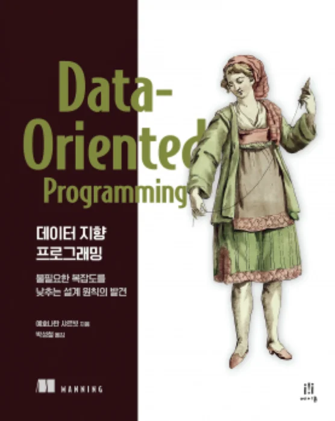

The logic we've covered so far has mostly been related to data manipulation. However, system logic doesn't consist only of data manipulation but inevitably includes **business logic**. Eventually, logic becomes complex with business and data manipulation, and this chapter proposes various methods to maintain readability in complex logic.

<br></br>

## Utilizing Generic Functions

```javascript
// AS-IS
function removeAuthorDuplicates(book) {
    var authors = _.get(book, "authors");
    var uniqAuthors = _.uniq(authors);
    return _.set(book, "authors", uniqAuthors);
}

// Generic function
function update(map, path, fun) {
    var currentValue = _.get(map, path);
    var nextValue = fun(currentValue);
    return _.set(map, path, nextValue);
}

// TO-BE
function removeAuthorDuplicates(book) {
    return update(book, "authors", _.uniq);
}
```

The above code is a method that removes duplicate authors using uniq(). While you could write similar code for each similar operation, having a generic function that updates map fields in a specific way allows for more concise code.

<br></br>

## Naming Operations

```javascript
// AS-IS
function authorIdsInBooks(books) {
    return _.map(books, "authorIds");
}

// Problem data
[
    ["sean-covey", "stephen-covey"],
    ["alan-moore", "dave-gibbons"]
]

// TO-BE
function authorIdsInBooks(books) {
    return _.flatten(_.map(books, "authorIds"));
}

function flatMap(coll, f) {
    return _.flatten(_.map(coll, f));
}

function authorIdsInBooks(books) {
    return flatMap(books, "authorIds");
}
```

The AS-IS code above doesn't achieve the desired result because it returns an array of arrays. While flatten() was used to solve this, naming this operation as flatMap() function makes the code's intention clearer.

<br></br>

## Using the Most Appropriate Tools

When dealing with complex logic, it's important to choose the most appropriate tools for the situation. Basic functions should be used for simple data manipulation, while higher-level abstractions should be utilized for complex business logic.

<br></br>

## My Thoughts

The methods proposed in this chapter are all useful refactoring techniques. Particularly, utilizing generic functions or naming operations can greatly improve code readability.

However, I think the criteria for when to extract methods can vary depending on individual or team preferences. Extracting too granularly can make code harder to follow, while grouping too broadly can reduce readability. Finding the right balance point seems important.