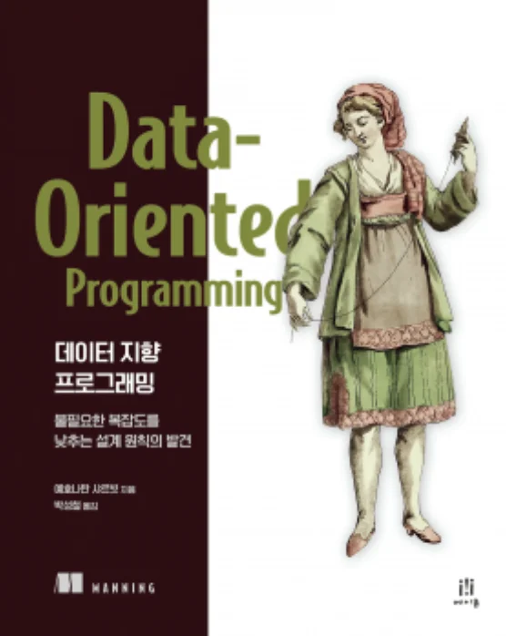

지금까지 다룬 로직은 대부분 데이터 조작과 관련된 내용이다. 하지만 시스템 로직은 데이터 조작으로만 이루어지지 않고 **비즈니스 로직**이 포함되어 있기 마련이다. 결국 로직은 비즈니스와 데이터 조작으로 복잡해지기 마련인데 이번 장에서는 복잡한 로직에서 가독성을 챙기는 여러 방법들을 제안한다.

<br></br>

## 범용 함수 활용하기

```javascript
// AS-IS
function removeAuthorDuplicates(book) {
    var authors = _.get(book, "authors");
    var uniqAuthors = _.uniq(authors);
    return _.set(book, "authors", uniqAuthors);
}

// 범용 함수
function update(map, path, fun) {
    var currentValue = _.get(map, path);
    var nextValue = fun(currentValue);
    return _.set(map, path, nextValue);
}

// TO-BE
function removeAuthorDuplicates(book) {
    return update(book, "authors", _.uniq);
}
```

위 코드는 uniq()를 활용해 중복 저자를 제거하는 메서드이다. 비슷한 동작마다 위와 같은 코드를 작성할 수도 있지만 map 필드를 특정 방식으로 update하는 범용 함수를 둔다면 코드를 조금 더 간결하게 작성할 수 있다.

<br></br>

## 연산에 이름 붙이기

```javascript
// AS-IS
function authorIdsInBooks(books) {
    return _.map(books, "authorIds");
}

// 문제의 데이터
[
    ["sean-covey", "stephen-covey"],
    ["alan-moore", "dave-gibbons"]
]

// TO-BE
function authorIdsInBooks(books) {
    return _.flatten(_.map(books, "authorIds"));
}

function flatMap(coll, f) {
    return _.flatten(_.map(coll, f));
}

function authorIdsInBooks(books) {
    return flatMap(books, "authorIds");
}
```

위 코드에서 AS-IS는 원하는 결과를 얻지 못한다. 배열의 배열이 반환되기 때문이다. 이를 해결하기 위해 flatten()을 사용했지만, 이 연산에 이름을 붙여 flatMap()이라는 함수로 만들면 코드의 의도를 더 명확하게 표현할 수 있다.

<br></br>

## 가장 적합한 도구 사용하기

복잡한 로직을 다룰 때는 상황에 맞는 가장 적절한 도구를 선택하는 것이 중요하다. 단순한 데이터 조작에는 기본적인 함수들을, 복잡한 비즈니스 로직에는 더 고차원적인 추상화를 활용하는 것이 좋다.

<br></br>

## 내 생각

이번 장에서 제안하는 방법들은 모두 리팩토링에 유용한 기법들이다. 특히 범용 함수를 활용하거나 연산에 이름을 붙이는 것은 코드의 가독성을 크게 향상시킬 수 있다. 

다만 메서드를 언제 추출할지에 대한 기준은 개인이나 팀의 성향에 따라 달라질 수 있다고 생각한다. 너무 세세하게 추출하면 오히려 코드를 따라가기 어려워질 수 있고, 너무 크게 묶으면 가독성이 떨어질 수 있다. 적절한 균형점을 찾는 것이 중요할 것 같다.