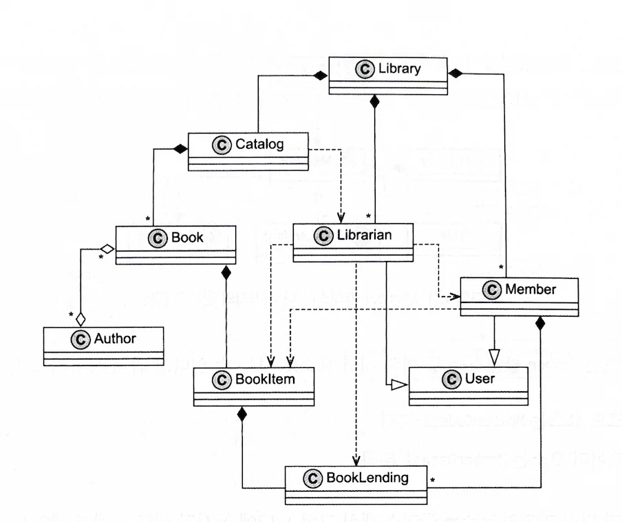

I want to summarize the complexity of object-oriented programming covered in Chapter 1 of the "Data-Oriented Programming" book I recently read.

## Book Structure

When I first purchased the book, I expected dry content based on the title alone, but it had an interesting structure. It features Klafim, a businessman, and Theo, a developer, with Klafim requesting Theo to develop an **Integrated Library Management System**. Theo builds a system that meets the requirements and faces and resolves OOP disadvantages in the process.

The conversational format made it less dry and helped me focus better on the content, so I really liked the structure.

  

## OOP Design and UML

Before starting development, Theo constructs a UML diagram of the system. The UML diagram contains four types of relationships: **composition**, **association**, **inheritance**, and **usage**.

Some examples include:
- Library contains Members. If Library disappears, all Members would also disappear.
- On the other hand, Book and Author have an association relationship. Books can disappear while Authors remain, and vice versa.
- Librarian and Member inherit from User to prevent code duplication.

  

## Four Reasons Why OOP Increases Complexity

The book presents four main reasons why OOP increases complexity:

### 1. Code and Data are Mixed Together

One reason UML diagrams become complex is because code and data are coupled together. The author suggests that this can be simplified by separating data relationships from code relationships.

### 2. Objects are Mutable

Mutable objects create unpredictability. Especially in multithreaded environments, object states can change unexpectedly, making debugging difficult.

### 3. Serialization Difficulties

Difficulties arise in converting between JSON and object formats. OOP requires extensive classes and code writing for serialization/deserialization.

### 4. Complex Class Hierarchies

Using the User/Member/Librarian class structure as an example, it shows how inheritance structures become complex when adding new features (e.g., VIP Member). Methods being fixed to specific classes cause structural problems.

  

## Conclusion

Chapter 1 of this book allowed me to reconsider the complexity of object-oriented programming that we took for granted. The conversational structure particularly makes difficult concepts easier to understand.

The next chapter will explore how these OOP problems can be solved with data-oriented programming.