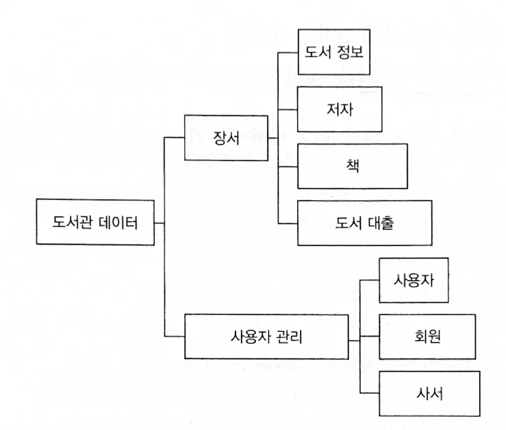

> **DOP Principle 1**  
> Separate code from data by placing code in functions. Function behavior should not depend on data encapsulated in the function context in any way.

## How to View Systems - Code and Data

In Data-Oriented Programming (DOP), systems are divided into two parts: code and data. While OOP encapsulates data as fields and code as functions together within classes through encapsulation, DOP opposes encapsulation. The reason is that the mixture of data and code causes system complexity and rigidity.

  

## Data Entities

Data entities are the parts that store system information. The data needed for the library system can be represented as various information components when organized in a mind map.

  

## Code Modules

Code modules are the system's functionality. The book constructs a higher-level module called Library with APIs that should be exposed externally.

Two main characteristics of code modules:

1. **Stateless functions**
2. **Only "usage" relationships can exist between modules**

  

## Advantages of DOP

The approach of separating data and code provides flexibility in system design. Compared to traditional OOP methods, adding and modifying features becomes easier.

Through this separation, we can achieve:
- Reduced system complexity
- Resolution of rigidity issues
- Improved maintainability
- Enhanced scalability