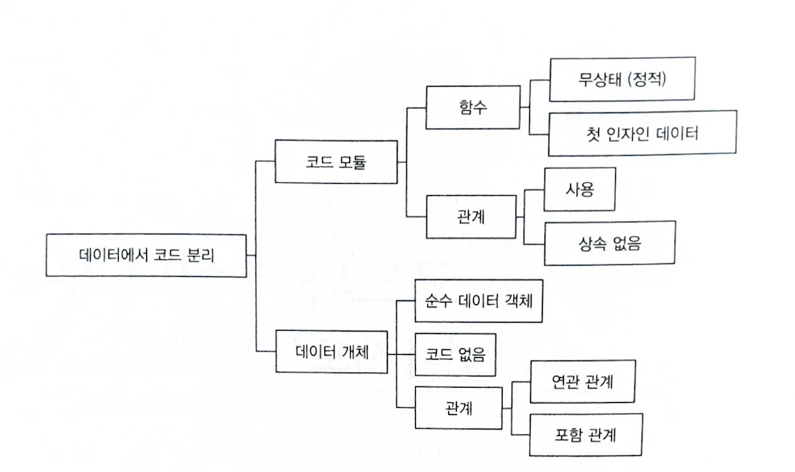
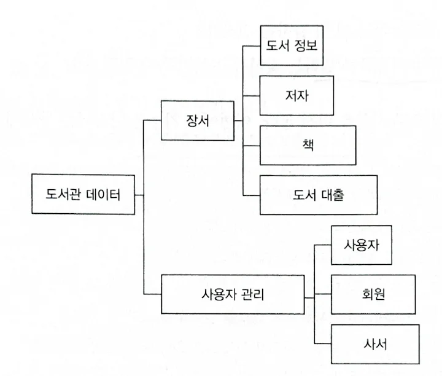
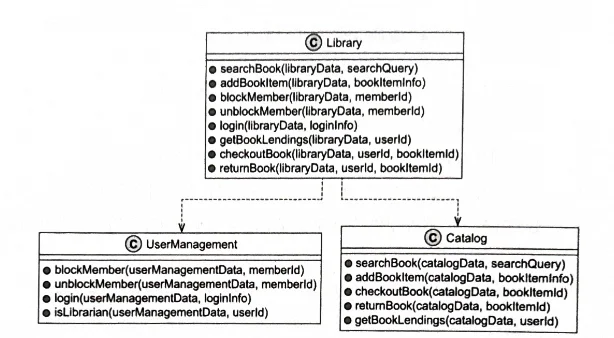

> **DOP 원리 1**  
> 코드를 함수 안에 두는 방식으로 데이터에서 코드를 분리한다. 함수의 동작은 어떤 식으로든 함수 컨텍스트에 캡슐화된 데이터에 따라 달라져서는 안 된다.

## 시스템을 바라보는 방식 - 코드, 데이터

데이터 지향 프로그래밍(DOP)에서 시스템은 코드와 데이터 2가지로 나뉜다. OOP에서는 캡슐화를 통해 클래스 내부에 데이터는 필드로, 코드는 함수로 함께 존재하지만 DOP에서는 캡슐화에 반대한다. 그 이유는 데이터와 코드가 혼합되어 있다는 점이 시스템의 복잡성과 경직성을 유발하기 때문이라 말한다.

  

## 데이터 개체

데이터 개체는 시스템의 정보를 보관하는 부분이다. 도서관 시스템에서 필요한 데이터를 마인드맵으로 정리하면 다양한 정보 구성 요소들로 나타낼 수 있다.

  

## 코드 모듈

코드 모듈은 시스템의 기능이다. 책에서는 외부에 공개되어야 할 API들로 Library라는 상위 모듈을 구성한다.

코드 모듈의 두 가지 주요 특징:

1. **상태가 없는 함수들**
2. **모듈 간에는 "사용" 관계만 존재할 수 있음**

  

## DOP의 장점

데이터와 코드를 분리하는 접근 방식은 시스템 설계에서 유연성을 제공한다. 기존 OOP 방식과 비교했을 때 기능을 추가하고 수정하는 것이 더 쉬워진다.

이러한 분리를 통해:
- 시스템의 복잡성 감소
- 경직성 문제 해결
- 유지보수성 향상
- 확장성 개선

을 달성할 수 있다.