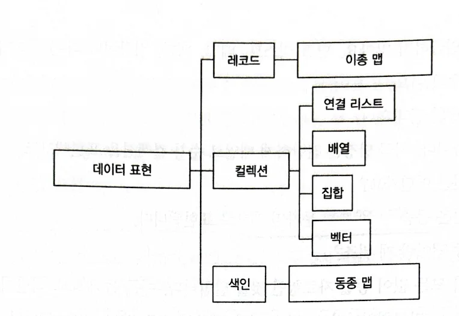

> **DOP 원리 2**  
> 데이터 개체를 범용 자료구조로 표현하라  

## 범용 자료 구조로 데이터 표현하기

DOP에서 데이터를 표현하는 방식에 대한 주장이 있다. 우선 데이터 개채들은 레코드로 표현되며 레코드 간의 관계는 순차 컬렉션과 색인으로 표현된다. 이때 중요한 건 레코드는 범용 자료구조로 표현되어야 한다는 점이다. 색인과 컬렉션이 어떤 방식으로 구현되어야 주장은 없다. (책에서는 컬렉션은 배열, 색인은 동종 맵을 활용해 구현한다.) 단, 레코드의 경우 동종 맵으로 표현되어야 한다고 말한다.

대개 레코드를 표현하는 방식은 클래스의 인스턴스이고 각 필드는 클래스의 멤버 변수가 된다. 하지만 DOP에서 모든 레코드는 맵으로 표현되고 각 필드는 key - value 형태로 표현된다.

이 방식의 장점은 클래스를 만들 필요가 없고 동적으로 필드를 추가/수정/삭제할 수 있는 유연성이다. 반면 자유도를 얻은 만큼 안정성은 떨어지게 된다.