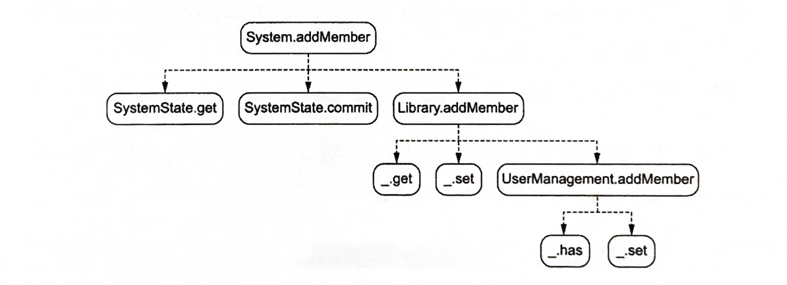

## Unit Testing Query Functions

How should we test methods that perform queries in DOP? Let's examine the Library.searchBooksByTitleJSON method as an example. First, create a tree of functions called by the method you want to test. You don't necessarily need to create a tree; it's fine if you can visualize it mentally. Testing the methods at the bottom of the tree is simplest because the only thing to test is the method itself.


```javascript
Catalog.authorNames = function (catalogData, authorIds) {
    return _.map(authorIds, function (authorId) {
        return _.get(catalogData, ["authorsById", authorId, "name"]);
    });
};
```

Testing the authorNames method is simple. Prepare two parameters and expected results, then compare with the method's return value.

| **catalogData** | **authorIds** | **authorNames (Expected Result)** |
|----------------|--------------|------------------------------|
| Catalog with two authors | [] | [] |
| Catalog with two authors | ["alan-moore"] | ["Alan Moore"] |
| Catalog with two authors | ["alan-moore", "dave-gibbons"] | ["Alan Moore", "Dave Gibbons"] |

```javascript
// Complete form of catalogData
var catalogData = {
    "authorsById": {
        "alan-moore": {
            "name": "Alan Moore",
            "bookIds": ["book-1", "book-2"]
        },
        "dave-gibbons": {
            "name": "Dave Gibbons",
            "bookIds": ["book-1"]
        }
    },
    "booksById": {
        "book-1": {
            "isbn": "978-1779501127",
            "title": "Watchmen",
            "authorIds": ["alan-moore", "dave-gibbons"],
            "publicationYear": 1987
        },
        "book-2": {
            "isbn": "978-1779501127",
            "title": "V for Vendetta",
            "authorIds": ["alan-moore"],
            "publicationYear": 1982
        }
    }
};
```

You could prepare complete catalogData in advance and test with it. However, since DOP uses generic data structures, it's better to prepare only the minimum data needed for testing.

```javascript
// Prepare only minimum data needed for testing
function authorNamesTestData(authorIds) {
    const authorsById = {};
    _.forEach(authorIds, function (authorId) {
        authorsById[authorId] = {
            "name": authorId.replace("-", " ").replace(/\b\w/g, l => l.toUpperCase())
        };
    });
    return {
        "authorsById": authorsById
    };
}
```

<br></br>

## Unit Testing Modification Functions

How should we test functions that perform modifications? Let's examine the addMember method as an example.



```javascript
Library.addMember = function (library, member) {
    return _.set(library, ["members", member.email], member);
};
```

This method returns library data with a member added. Testing can be done as follows:

1. Prepare initial library data
2. Prepare member data to add
3. Execute addMember method
4. Verify results

```javascript
// Test example
var initialLibrary = {
    "members": {}
};

var newMember = {
    "email": "john@example.com",
    "name": "John Doe"
};

var expectedLibrary = {
    "members": {
        "john@example.com": {
            "email": "john@example.com",
            "name": "John Doe"
        }
    }
};

var actualLibrary = Library.addMember(initialLibrary, newMember);
// Compare actualLibrary with expectedLibrary
```

When testing modification functions, consider the following:

1. **Immutability verification**: Confirm original data wasn't changed
2. **Failure case testing**: Verify handling of invalid inputs
3. **JSON serialization**: For serialized data, compare values after deserialization

<br></br>

## My Thoughts

This chapter didn't seem to have much new content. I thought it was easier to prepare test data because data is used as generic data structures, but thinking about it more, weren't we already passing unnecessary data to methods? 

If designed from the beginning to receive only necessary data as parameters, test data preparation would have been simple originally. However, the advantage in DOP seems to be that while managing all data as one large data structure, during testing you can extract and use only the necessary parts.

The core of testing is as follows:

1. **Test from lowest level first**: Test functions with fewer dependencies first
2. **Minimal test data**: Prepare only minimum data needed for testing
3. **Consider failure cases**: Always test failure cases together
4. **Verify immutability**: Check whether original data was modified

I confirmed that basic testing principles apply the same way in DOP, and test writing and maintenance become easier as data structures become simpler.