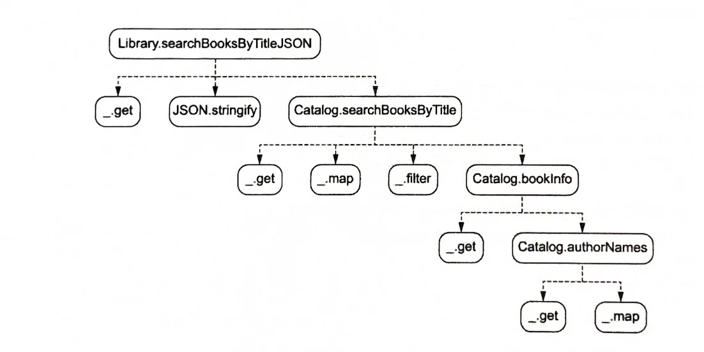
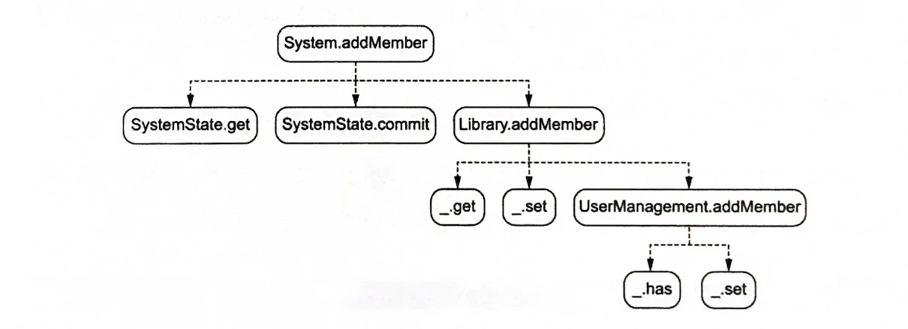

## 조회 함수의 단위 테스트

DOP에서 조회를 수행하는 메서드는 어떻게 테스트를 해야할까? Library.searchBooksByTitleJSON 메서드를 예시로 알아보자. 우선 테스트하려는 메서드에 의해 호출되는 함수들로 트리를 만든다. 꼭 트리를 만들지 않아도 머리 속으로 그려지면 된다. 트리의 가장 하단에 존재하는 메서드의 테스트가 가장 간단하다. 그 이유는 테스트할 부분이 메서드 메서드 자신밖에 없기 때문이다.



```javascript
Catalog.authorNames = function (catalogData, authorIds) {
    return _.map(authorIds, function (authorId) {
        return _.get(catalogData, ["authorsById", authorId, "name"]);
    });
};
```

authorNames 메서드를 테스트하는 건 간단하다. 파라미터 2개와 예상되는 결과를 준비하고 해당 메서드의 결과값과 비교하면 된다.

| **catalogData** | **authorIds** | **authorNames (예상 결과)** |
|----------------|--------------|------------------------------|
| 저자가 둘인 장서 | [] | [] |
| 저자가 둘인 장서 | ["alan-moore"] | ["Alan Moore"] |
| 저자가 둘인 장서 | ["alan-moore", "dave-gibbons"] | ["Alan Moore", "Dave Gibbons"] |

```javascript
// 완전한 형태의 catalogData
var catalogData = {
    "authorsById": {
        "alan-moore": {
            "name": "Alan Moore",
            "bookIds": ["book-1", "book-2"]
        },
        "dave-gibbons": {
            "name": "Dave Gibbons",
            "bookIds": ["book-1"]
        }
    },
    "booksById": {
        "book-1": {
            "isbn": "978-1779501127",
            "title": "Watchmen",
            "authorIds": ["alan-moore", "dave-gibbons"],
            "publicationYear": 1987
        },
        "book-2": {
            "isbn": "978-1779501127",
            "title": "V for Vendetta",
            "authorIds": ["alan-moore"],
            "publicationYear": 1982
        }
    }
};
```

위와 같이 완전한 catalogData를 미리 준비하고 테스트할 수도 있다. 하지만 DOP에서는 범용 자료 구조를 사용하기 때문에 테스트에 필요한 최소한의 데이터만 준비하는 것이 좋다.

```javascript
// 테스트에 필요한 최소한의 데이터만 준비
function authorNamesTestData(authorIds) {
    const authorsById = {};
    _.forEach(authorIds, function (authorId) {
        authorsById[authorId] = {
            "name": authorId.replace("-", " ").replace(/\b\w/g, l => l.toUpperCase())
        };
    });
    return {
        "authorsById": authorsById
    };
}
```

<br></br>

## 변경 함수의 단위 테스트

변경을 수행하는 함수는 어떻게 테스트해야 할까? addMember 메서드를 예시로 살펴보자.



```javascript
Library.addMember = function (library, member) {
    return _.set(library, ["members", member.email], member);
};
```

이 메서드는 멤버를 추가한 라이브러리 데이터를 반환한다. 테스트는 다음과 같이 할 수 있다:

1. 초기 라이브러리 데이터 준비
2. 추가할 멤버 데이터 준비
3. addMember 메서드 실행
4. 결과 검증

```javascript
// 테스트 예시
var initialLibrary = {
    "members": {}
};

var newMember = {
    "email": "john@example.com",
    "name": "John Doe"
};

var expectedLibrary = {
    "members": {
        "john@example.com": {
            "email": "john@example.com",
            "name": "John Doe"
        }
    }
};

var actualLibrary = Library.addMember(initialLibrary, newMember);
// actualLibrary와 expectedLibrary 비교
```

변경 함수의 테스트에서는 다음 사항들을 고려해야 한다:

1. **불변성 확인**: 원본 데이터가 변경되지 않았는지 확인
2. **실패 케이스 테스트**: 잘못된 입력에 대한 처리 확인
3. **JSON 직렬화**: 직렬화된 데이터의 경우 역직렬화 후 값 비교

<br></br>

## 내 생각

이번 장에서는 크게 새로운 내용은 없었던 것 같다. 데이터를 범용 자료 구조로 사용하기 때문에 테스트 데이터를 준비하기 수월하다는 생각이 들었지만 조금 더 생각해보니 원래도 필요 없는 데이터를 함께 메서드에 넘기고 있는 건 아닌가? 하는 생각도 들었다. 

처음부터 필요한 데이터만 파라미터로 받도록 설계한다면 테스트 데이터 준비는 원래도 간단했을 것이다. 하지만 DOP에서는 전체 데이터를 하나의 큰 자료 구조로 관리하면서도 테스트 시에는 필요한 부분만 추출해서 사용할 수 있다는 점이 장점인 것 같다.

테스트의 핵심은 다음과 같다:

1. **가장 하위 레벨부터 테스트**: 의존성이 적은 함수부터 테스트
2. **최소한의 테스트 데이터**: 테스트에 필요한 최소한의 데이터만 준비
3. **실패 케이스 고려**: 항상 실패 케이스도 함께 테스트
4. **불변성 검증**: 원본 데이터의 변경 여부 확인

DOP 방식에서도 기본적인 테스트 원칙들은 동일하게 적용되며, 데이터 구조가 단순해진 만큼 테스트 작성과 유지보수가 더 수월해진다는 것을 확인할 수 있었다.