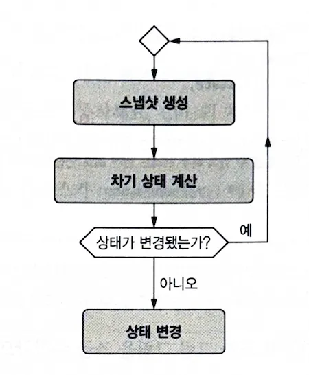

## DOP의 동시성 관리

일반적으로 다중 스레드 환경에서 동시성을 관리하기 위해 임계 영역(Critical Section) 접근 작업을 뮤텍스와 같은 잠금 장치로 보호한다. 보호 대상에는 읽기 영역도 포함되는데 그 이유는 읽기 도중에 다른 스레드에 의해 값이 변경되어 일관성을 잃을 수 있기 때문이다.

하지만 DOP에서 읽기 작업은 다중 스레드를 고려하지 않아도 된다. 그 이유는 DOP에서 데이터는 불변이기 때문이다. 즉, 다른 작업에 의해 값이 변해도 문제가 없다. 그렇다면 쓰기 작업의 경우 어떨까?

DOP에서는 쓰기 작업에서도 잠금을 사용하는 대신 더 **원자**라는 단순한 구조를 사용한다. DOP의 쓰기는 다음과 같은 단계를 거치는데 **상태가 변경됐는가?** 부분에서 원자적으로 비교 후 상태를 반영한다.



이때 언어 별로 이런 동작을 지원하는 구현체가 이미 존재하거나 외부 라이브러리를 활용할 수 있다.

```ruby
# Class: Concurrent::Atom

# 초기값 생성
atom = Concurrent::Atom.new(1)

# compare_and_set(old_value, new_value)
# old_value가 일치하기 때문에 2로 변경이 된다;
atom.compare_and_set(1, 2);

# old_value가 일치하지 않기 때문에 3으로 변경에 실패한다.
atom.compare_and_set(1, 3);
```

<br></br>

## 내 생각

DOP의 동시성 관리 접근법은 기존의 잠금 메커니즘과는 완전히 다른 패러다임을 제시한다. 불변 데이터를 기반으로 하여 읽기 작업에서의 동시성 문제를 원천적으로 해결하고, 쓰기 작업에서는 원자적 연산을 통해 더 효율적이고 안전한 동시성 제어를 가능하게 한다.

이러한 접근법은 특히 함수형 프로그래밍과 잘 어울리며, 현대의 멀티코어 환경에서 더욱 중요한 의미를 갖는다. 기존의 뮤텍스 기반 동시성 제어에서 발생할 수 있는 데드락이나 라이브락 같은 문제들을 근본적으로 피할 수 있다는 장점이 있다.