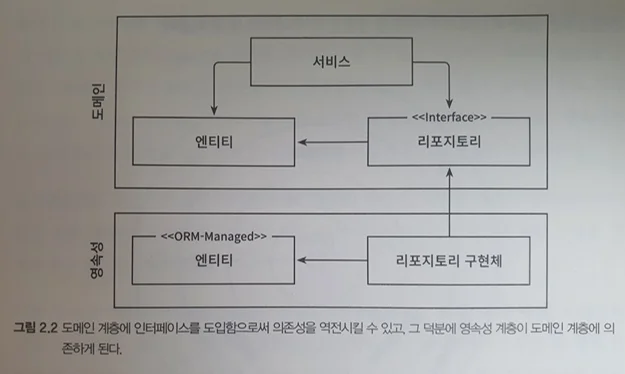

## Inverting Dependencies

### 1. Single Responsibility Principle

- Definition: There should be only one reason to change a component.
- The more dependencies a component has, the more it needs to react to changes in other components.
- As this happens, the cost of change gradually increases.
  - Side effect: One change breaks other functionality...

### 2. Dependency Inversion Principle

- In the 3-layer structure, dependency direction always points downward.
- That is, changes in upper layers happen more frequently (due to changes in lower layers).
- `But what if we want to prevent persistence layer changes -> domain layer changes?`
- 
  - Place an interface in the domain layer
  - Place the implementation in the persistence layer to avoid circular references while removing dependencies between the two layers.
- Thoughts
  - Place the interface in the domain layer and the implementation in the persistence layer. (Repository pattern)
  - This way, persistence changes don't affect the domain

### 3. Clean Architecture

- The domain layer should be independent of external concerns.
- External layers should depend on the domain layer, not the other way around.
- This creates a stable core that can evolve independently of implementation details.

### 4. Hexagonal Architecture

- Also known as Ports and Adapters architecture.
- The application core is at the center, surrounded by adapters that handle external concerns.
- Ports define the interface between the core and external systems.
- Adapters implement these interfaces for specific technologies.

## Benefits of Dependency Inversion

### 1. Testability
- Domain logic can be tested in isolation without external dependencies.
- Mock implementations can be easily substituted for testing.

### 2. Flexibility
- Different implementations can be swapped without changing the core business logic.
- Technology choices become less constraining.

### 3. Maintainability
- Changes in external systems don't ripple through to the business logic.
- Code becomes more modular and easier to understand.

## Implementation Strategy

1. **Define Interfaces**: Start by defining interfaces in the domain layer that express what the domain needs.
2. **Implement in Infrastructure**: Create concrete implementations in the infrastructure layer.
3. **Inject Dependencies**: Use dependency injection to wire everything together.
4. **Test Independently**: Create unit tests that use mock implementations.

## Conclusion

By inverting dependencies, we can create more flexible and maintainable architectures. The domain layer becomes the stable center around which other layers can evolve independently. This is the foundation for both Clean Architecture and Hexagonal Architecture approaches.