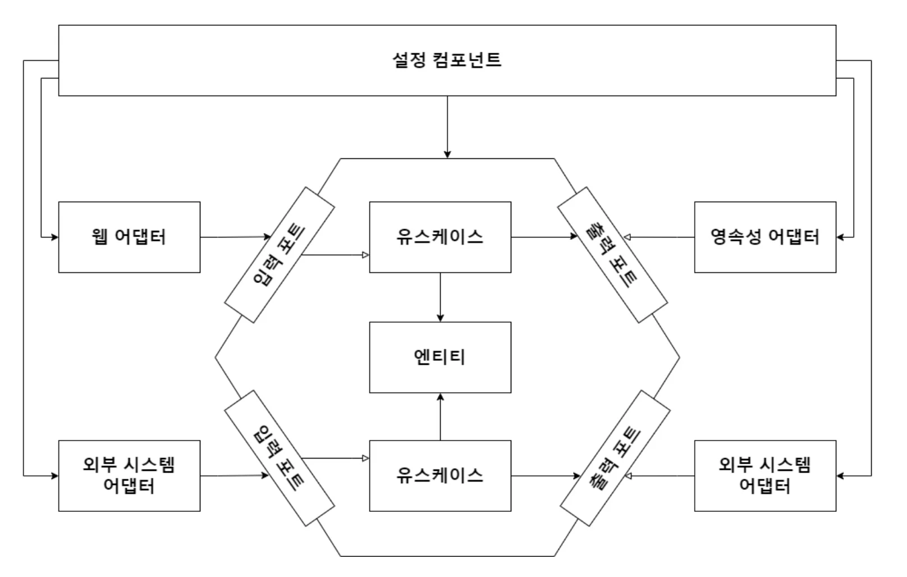

## Assembling the Application

- In the current architecture, all dependencies point inward.
- If a use case calls a persistence adapter, the dependency is created in the wrong direction.
- Therefore, use cases should only know interfaces (ports) and receive implementations at runtime.
  - This characteristic makes testing much easier.
  - You can pass required implementations through constructors, and it's easy to pass mocks instead of actual implementations
- For this, we need a configuration component that depends on all classes.

### 1. Configuration Component
```
1. Create web adapters
2. Ensure HTTP requests are actually delivered to web adapters
3. Create use case instances
4. Provide use case instances to web adapters
5. Create persistence adapter instances
6. Provide persistence adapter instances to use cases
7. Ensure persistence adapters can access the database
```

The configuration component is responsible for:
- **Instantiating all objects** in the correct order
- **Injecting dependencies** into each component
- **Managing the lifecycle** of application components
- **Handling configuration** from external sources

### 2. Plain Java Configuration

#### Manual Dependency Injection:
```java
public class Application {
    
    public static void main(String[] args) {
        // Create infrastructure components
        AccountRepository accountRepository = new JpaAccountRepository();
        ActivityRepository activityRepository = new JpaActivityRepository();
        AccountMapper accountMapper = new AccountMapper();
        
        // Create persistence adapter
        AccountPersistenceAdapter accountPersistenceAdapter = 
            new AccountPersistenceAdapter(accountRepository, activityRepository, accountMapper);
        
        // Create use case
        SendMoneyUseCase sendMoneyUseCase = 
            new SendMoneyService(accountPersistenceAdapter, accountPersistenceAdapter);
        
        // Create web adapter
        SendMoneyController sendMoneyController = 
            new SendMoneyController(sendMoneyUseCase);
        
        // Start web server
        startWebServer(sendMoneyController);
    }
}
```

#### Configuration Factory:
```java
public class ApplicationConfiguration {
    
    private final AccountRepository accountRepository;
    private final ActivityRepository activityRepository;
    
    public ApplicationConfiguration() {
        this.accountRepository = new JpaAccountRepository();
        this.activityRepository = new JpaActivityRepository();
    }
    
    public SendMoneyUseCase sendMoneyUseCase() {
        return new SendMoneyService(
            accountPersistenceAdapter(),
            accountPersistenceAdapter()
        );
    }
    
    public AccountPersistenceAdapter accountPersistenceAdapter() {
        return new AccountPersistenceAdapter(
            accountRepository,
            activityRepository,
            new AccountMapper()
        );
    }
    
    public SendMoneyController sendMoneyController() {
        return new SendMoneyController(sendMoneyUseCase());
    }
}
```

### 3. Spring Framework Configuration

#### Annotation-Based Configuration:
```java
@Configuration
@EnableJpaRepositories
public class ApplicationConfiguration {
    
    @Bean
    public AccountPersistenceAdapter accountPersistenceAdapter(
            AccountRepository accountRepository,
            ActivityRepository activityRepository) {
        return new AccountPersistenceAdapter(
            accountRepository,
            activityRepository,
            new AccountMapper()
        );
    }
    
    @Bean
    public SendMoneyUseCase sendMoneyUseCase(AccountPersistenceAdapter accountPersistenceAdapter) {
        return new SendMoneyService(accountPersistenceAdapter, accountPersistenceAdapter);
    }
    
    @Bean
    public SendMoneyController sendMoneyController(SendMoneyUseCase sendMoneyUseCase) {
        return new SendMoneyController(sendMoneyUseCase);
    }
}
```

#### Component Scanning:
```java
// Use case implementation
@Service
public class SendMoneyService implements SendMoneyUseCase {
    
    private final LoadAccountPort loadAccountPort;
    private final UpdateAccountStatePort updateAccountStatePort;
    
    public SendMoneyService(
            LoadAccountPort loadAccountPort,
            UpdateAccountStatePort updateAccountStatePort) {
        this.loadAccountPort = loadAccountPort;
        this.updateAccountStatePort = updateAccountStatePort;
    }
    
    // Implementation methods...
}

// Web adapter
@RestController
@RequestMapping("/accounts")
public class SendMoneyController {
    
    private final SendMoneyUseCase sendMoneyUseCase;
    
    public SendMoneyController(SendMoneyUseCase sendMoneyUseCase) {
        this.sendMoneyUseCase = sendMoneyUseCase;
    }
    
    // Controller methods...
}

// Persistence adapter
@Repository
public class AccountPersistenceAdapter implements LoadAccountPort, UpdateAccountStatePort {
    
    private final AccountRepository accountRepository;
    private final ActivityRepository activityRepository;
    
    // Implementation methods...
}
```

### 4. Configuration by Feature

#### Modular Configuration:
```java
// Account feature configuration
@Configuration
public class AccountConfiguration {
    
    @Bean
    public AccountPersistenceAdapter accountPersistenceAdapter(
            AccountRepository accountRepository,
            ActivityRepository activityRepository) {
        return new AccountPersistenceAdapter(accountRepository, activityRepository, new AccountMapper());
    }
    
    @Bean
    public SendMoneyUseCase sendMoneyUseCase(AccountPersistenceAdapter accountPersistenceAdapter) {
        return new SendMoneyService(accountPersistenceAdapter, accountPersistenceAdapter);
    }
    
    @Bean
    public GetAccountBalanceUseCase getAccountBalanceUseCase(AccountPersistenceAdapter accountPersistenceAdapter) {
        return new GetAccountBalanceService(accountPersistenceAdapter);
    }
}

// User feature configuration
@Configuration  
public class UserConfiguration {
    
    @Bean
    public UserPersistenceAdapter userPersistenceAdapter(UserRepository userRepository) {
        return new UserPersistenceAdapter(userRepository, new UserMapper());
    }
    
    @Bean
    public CreateUserUseCase createUserUseCase(UserPersistenceAdapter userPersistenceAdapter) {
        return new CreateUserService(userPersistenceAdapter);
    }
}

// Main application configuration
@Configuration
@Import({AccountConfiguration.class, UserConfiguration.class})
public class ApplicationConfiguration {
    // Global configuration
}
```

### 5. Profile-Based Configuration

#### Different Configurations for Different Environments:
```java
@Configuration
public class ApplicationConfiguration {
    
    @Bean
    @Profile("development")
    public AccountPersistenceAdapter developmentAccountPersistenceAdapter() {
        return new InMemoryAccountPersistenceAdapter();
    }
    
    @Bean
    @Profile("production")
    public AccountPersistenceAdapter productionAccountPersistenceAdapter(
            AccountRepository accountRepository,
            ActivityRepository activityRepository) {
        return new JpaAccountPersistenceAdapter(accountRepository, activityRepository, new AccountMapper());
    }
    
    @Bean
    @Profile("test")
    public AccountPersistenceAdapter testAccountPersistenceAdapter() {
        return new MockAccountPersistenceAdapter();
    }
}
```

### 6. Configuration Best Practices

#### 1. **Fail Fast**
```java
@Configuration
public class ApplicationConfiguration {
    
    @Bean
    @ConditionalOnProperty(name = "database.url")
    public DataSource dataSource(@Value("${database.url}") String databaseUrl) {
        if (databaseUrl == null || databaseUrl.trim().isEmpty()) {
            throw new IllegalArgumentException("Database URL cannot be empty");
        }
        return createDataSource(databaseUrl);
    }
}
```

#### 2. **Configuration Validation**
```java
@Configuration
@Validated
public class ApplicationConfiguration {
    
    @Bean
    public SendMoneyUseCase sendMoneyUseCase(
            @Valid @NotNull LoadAccountPort loadAccountPort,
            @Valid @NotNull UpdateAccountStatePort updateAccountStatePort) {
        return new SendMoneyService(loadAccountPort, updateAccountStatePort);
    }
}
```

#### 3. **Conditional Configuration**
```java
@Configuration
public class ApplicationConfiguration {
    
    @Bean
    @ConditionalOnMissingBean(LoadAccountPort.class)
    public LoadAccountPort defaultLoadAccountPort() {
        return new InMemoryAccountPersistenceAdapter();
    }
    
    @Bean
    @ConditionalOnProperty(name = "cache.enabled", havingValue = "true")
    public LoadAccountPort cachedLoadAccountPort(LoadAccountPort delegate) {
        return new CachedAccountPersistenceAdapter(delegate);
    }
}
```

### 7. Testing Configuration

#### Test-Specific Configuration:
```java
@TestConfiguration
public class TestApplicationConfiguration {
    
    @Bean
    @Primary
    public LoadAccountPort mockLoadAccountPort() {
        return Mockito.mock(LoadAccountPort.class);
    }
    
    @Bean
    @Primary  
    public UpdateAccountStatePort mockUpdateAccountStatePort() {
        return Mockito.mock(UpdateAccountStatePort.class);
    }
}

// Integration test
@SpringBootTest
@Import(TestApplicationConfiguration.class)
class SendMoneyUseCaseTest {
    
    @Autowired
    private SendMoneyUseCase sendMoneyUseCase;
    
    @Autowired
    private LoadAccountPort loadAccountPort;
    
    @Test
    void shouldSendMoney() {
        // Given
        Account sourceAccount = givenAccount();
        when(loadAccountPort.loadAccount(any(), any())).thenReturn(sourceAccount);
        
        // When & Then
        boolean result = sendMoneyUseCase.sendMoney(createCommand());
        assertTrue(result);
    }
}
```

### 8. Configuration Anti-Patterns

#### 1. **God Configuration Class**
```java
// ❌ Avoid: Single massive configuration class
@Configuration
public class ApplicationConfiguration {
    // 50+ @Bean methods for all features
}

// ✅ Good: Feature-based configuration classes
@Configuration
public class AccountConfiguration { /* Account-related beans */ }

@Configuration  
public class UserConfiguration { /* User-related beans */ }
```

#### 2. **Circular Dependencies**
```java
// ❌ Avoid: Circular dependencies
@Configuration
public class ApplicationConfiguration {
    
    @Bean
    public ServiceA serviceA(ServiceB serviceB) {
        return new ServiceA(serviceB);
    }
    
    @Bean
    public ServiceB serviceB(ServiceA serviceA) {  // Circular dependency
        return new ServiceB(serviceA);
    }
}
```

#### 3. **Configuration in Application Logic**
```java
// ❌ Avoid: Configuration mixed with business logic
public class SendMoneyService {
    public void sendMoney() {
        LoadAccountPort port = new JpaAccountPersistenceAdapter(); // Configuration in service
        // Business logic...
    }
}

// ✅ Good: Dependencies injected through constructor
public class SendMoneyService {
    private final LoadAccountPort loadAccountPort;
    
    public SendMoneyService(LoadAccountPort loadAccountPort) {
        this.loadAccountPort = loadAccountPort;
    }
}
```

## Conclusion

The configuration component is the only component that **depends on all layers** and is responsible for **wiring everything together**. Key principles:

- **Single Location**: All dependency wiring happens in one place
- **Fail Fast**: Invalid configurations should be detected at startup
- **Environment-Specific**: Different configurations for different environments
- **Testable**: Easy to replace components for testing
- **Modular**: Organized by feature or layer for maintainability

This approach enables clean separation of concerns where:
- **Business logic** is independent of configuration
- **Infrastructure** is independent of business logic  
- **Configuration** manages the relationships between all components

The configuration component is what makes the entire clean architecture work in practice by ensuring the dependency rule is followed throughout the application.