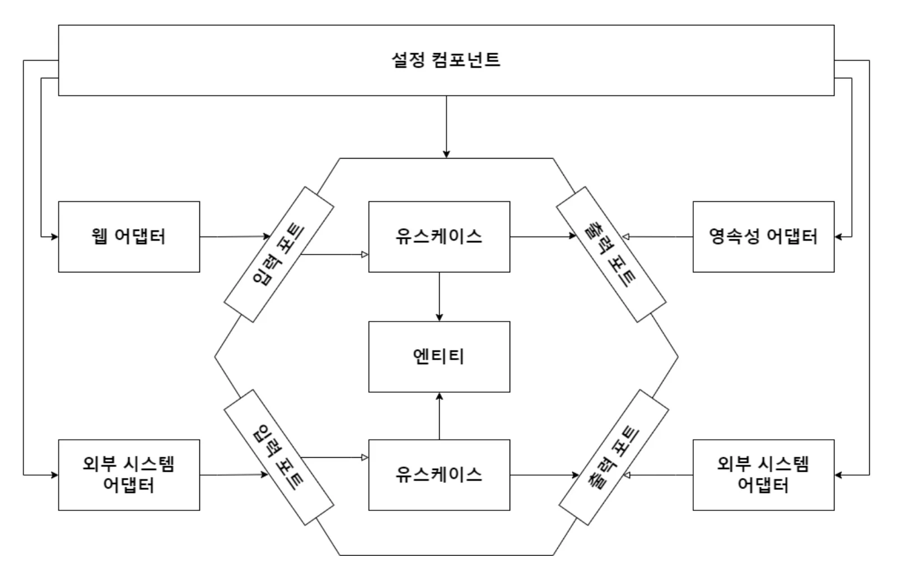

## 애플리케이션 조립하기

- 현재의 아키텍처에서 모든 의존성은 안쪽을 향하고 있다.
- 만약 유스 케이스가 영속성 어댑터를 호출한다면 의존성이 잘못된 방향으로 만들어진 것.
- 때문에 유스케이스는 인터페이스(포트)만 알아야 하고 런타임에 구현체를 제공 받아야 한다.
  - 이러한 특성은 테스트를 훨씬 쉽게 만든다.
  - 필요한 구현체를 생성자로 전달할 수 있고, 실제 대신 목으로 전달하기 용이하기 때문
- 이를 위해서는 모든 클래스를 의존하는 설정 컴포넌트가 필요하다.

### 1. 설정 컴포넌트
```
1. 웹 어댑터 생성
2. HTTP 요청이 실제로 웹 어댑터로 전달되도록 보장
3. 유스케이스 인스턴스 생성
4. 웹 어댑터 유스케이스 인스턴스 제공
5. 영속성 어댑터에 인스턴스 생성
6. 유스케이스에 영속성 어댑터 인스턴스 제공
7. 영속성 어댑터가