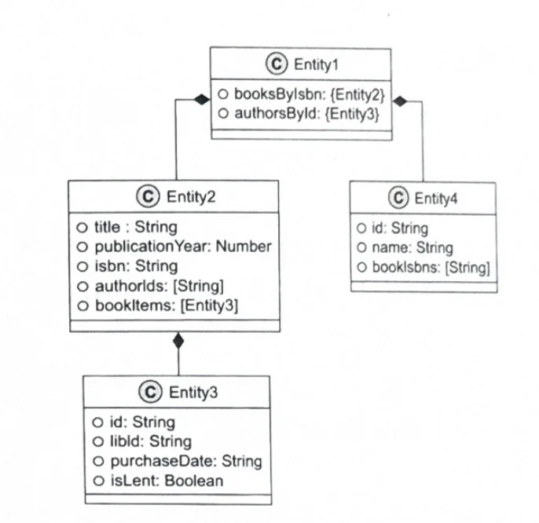

One of the difficulties I've encountered while developing with Ruby and Python recently is the challenge of clearly understanding the format of data entering and exiting methods. Of course, there's convenience in not having to define types for both values separately, but it becomes a bit difficult when the scale grows and I need to work on methods I didn't develop.

Coincidentally, Chapter 12 covers validation of method arguments and return values, and based on this, data model schemas and automatic test generation.

<br></br>

## Function Argument Validation

In Chapter 7 on data validation, we discussed using JSON schemas to validate data at boundaries with external systems. What's slightly different in this chapter is that the timing of data verification is internal to the system and at the beginning and end of methods.

JSON schemas can be used to validate function arguments and return values. This improves code stability and prevents errors caused by unexpected data formats.

```javascript
var isbnSchema = {
    "type": "string",
    "pattern": "^[0-9-]{10,20}$"
};

var libIdSchema = {
    "type": "string",
    "pattern": "^[a-z0-9-]{3,20}$"
};
```

<br></br>

## Data Schemas and Automatic Unit Test Generation Using JSON Schemas

Once JSON schemas are written, there are two benefits. First, they provide clear schemas for data models, and second, unit tests can be automatically generated based on them.



By defining data schemas, communication between developers becomes smoother and system stability can be improved. Such explicit data validation is especially important in dynamic type language environments.