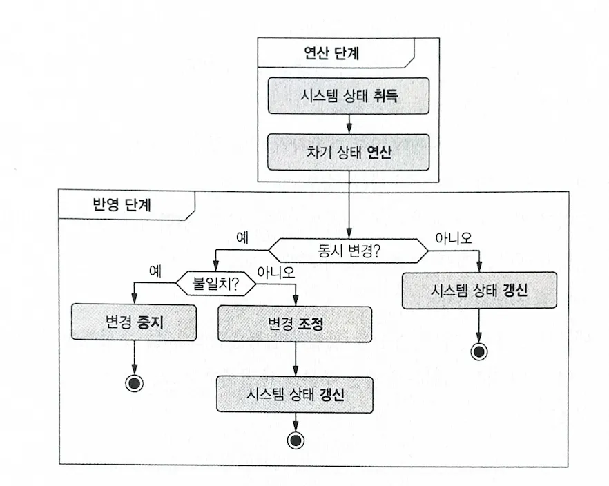

## Optimistic Concurrency Control

DOP uses an optimistic concurrency control strategy. The book describes optimistic concurrency control as **asking for forgiveness after making changes rather than asking for permission**, but the specific logic makes it easier to understand. Let's think about it in terms of DOP's change logic. DOP's change logic has computation and commitment phases. The optimistic concurrency control strategy performs changes in the computation phase as if this change is the only operation, then in the commitment phase, it reconciles if the changes don't conflict, or stops if they do conflict. In summary:

> **Computation**: Generate next version without worrying about concurrency  
> **Commitment**: Reconcile if not conflicting with simultaneous changes / Stop if conflicting

This strategy basically assumes that simultaneous changes occur and cases where two or more change operations conflict will be rare. This choice has clear advantages and disadvantages. There's the advantage of no performance degradation due to locking during changes, but the disadvantage of requests failing to change.



However, there are additional advantages this strategy has in DOP. The problem solving for issues caused by simultaneous changes exists only in the commitment code, and the commitment code is used generically across all systems. In other words, once you create the commitment code once and utilize it, you don't need to handle concurrency in subsequent change operations.

<br></br>

## Implementing Change Commitment Code

### 1. Structural Comparison

To know if two or more simultaneous changes conflict, you need to check which elements each change modified. Generally, changes mean modification/creation/deletion, but this chapter limits it to modification and creation. Trying to understand deletion all at once would make the code too complex.

```javascript
function diffObjects(data1, data2) {
  var emptyObject = Array.isArray(data1) ? [] : {};

  if (data1 === data2) {
    return emptyObject;
  }

  var keys = _.union(Object.keys(data1), Object.keys(data2));

  return _.reduce(keys, function (acc, k) {
    var res = diff(_.get(data1, k), _.get(data2, k));
    if (_.isObject(res) && _.isEmpty(res) || res === "no-diff") {
      return acc;
    }
    return _.set(acc, [k], res);
  }, emptyObject);
}

function diff(data1, data2) {
  if (_.isObject(data1) && _.isObject(data2)) {
    return diffObjects(data1, data2);
  }
  if (data1 !== data2) {
    return data2;
  }
  return "no-diff";
}
```

The above code structurally compares two arrays or HashMaps. Rather than explaining the code, it's important to explain the benefits of structural comparison in DOP. Each version's data in DOP utilizes structural sharing. That is, identical data unchanged in each version shares the same reference. Therefore, you can see logic comparing references at the top of the structural comparison logic, which maximizes comparison logic efficiency.

How can you tell if two or more change operations conflict using this code? Conflicting change operations means modifying the same data, and modifying the same data can be determined by comparing the key paths of changed data.

```javascript
function informationPaths(obj, path = []) {
  return _.reduce(obj, function (acc, v, k) {
    if (_.isObject(v)) {
      return _.concat(acc, informationPaths(v, _.concat(path, k)));
    }
    
    return _.concat(acc, [_.concat(path, k)]);
  }, []);
}

function havePathInCommon(diff1, diff2) {
  return !_.isEmpty(_.intersection(informationPaths(diff1), informationPaths(diff2)));
}

// Usage example
// previous is past version
// current is change 1, next is change 2

const diff1 = informationPaths(diff(previous, current));
const diff2 = informationPaths(diff(previous, next));

const isConflict = havePathInCommon(diff1, diff2);
```

### 2. Implementing Reconciliation Algorithm

In the structural comparison part, we checked code to find changed (modified, created) data, code to find key paths of changed data, and finally code to determine if two changes conflict based on key paths. Now let's look at the code that creates next data based on conflict status.

```javascript
class SystemConsistency {

  // Function that compares and merges three states (current, previous, next)
  static threeWayMerge(current, previous, next) {
    var previousToCurrent = diff(previous, current);  // Difference between previous and current
    var previousToNext = diff(previous, next);        // Difference between previous and next

    // If previousToCurrent and previousToNext don't have common paths, merging is possible
    if (!havePathInCommon(previousToCurrent, previousToNext)) {
      return _merge(current, previousToNext);  // Perform merge
    }

    // Throw exception when conflict occurs
    throw new Error("Conflicting concurrent mutations.");
  }

  // Function to reconcile state
  static reconcile(current, previous, next) {
    // If current is identical to previous, return next directly
    if (current === previous) {
      return next;
    }

    // Otherwise call threeWayMerge to merge states
    return SystemConsistency.threeWayMerge(current, previous, next);
  }
}
```

The data commitment code is created using the previous code. Three data pieces exist: previous, current, next, and conflict status is checked based on key paths of changed (modified, created) data. Then, if there's conflict, choose exception; if not, choose commitment. Looking at the reconcile method, there's handling for cases where current and previous are the same, which can be understood as a situation where there's no history of simultaneous changes being processed.

```javascript
class SystemState {
  constructor() {
    this.systemData = null;  // Initialize systemData
  }

  // systemData getter
  get() {
    return this.systemData;
  }

  // systemData setter
  set(_systemData) {
    this.systemData = _systemData;
  }

  // commit method: Compare previous state and next state to commit data
  commit(previous, next) {
    var nextSystemData = SystemConsistency.reconcile(this.systemData, previous, next);

    // Throw exception if data to be committed is invalid
    if (!SystemValidity.validate(previous, nextSystemData)) {
      throw new Error("The system data to be committed is not valid!");
    }

    // If valid, update systemData to nextSystemData
    this.systemData = nextSystemData;
  }
}
```

Finally, the commitment code implemented using SystemConsistency is as above. This code will be commonly used in all data change code.

<br></br>

## My Thoughts

In this chapter, we learned about the concept and implementation of optimistic concurrency control and the benefits of using this strategy in DOP. Using Git as an example made it easy to understand. However, I wonder what types of systems this design can cover. I felt that rather than being a general methodology that can be used in most situations, it's a design with clear advantages and disadvantages. I'm curious how this feeling will have changed when I finish reading the book.