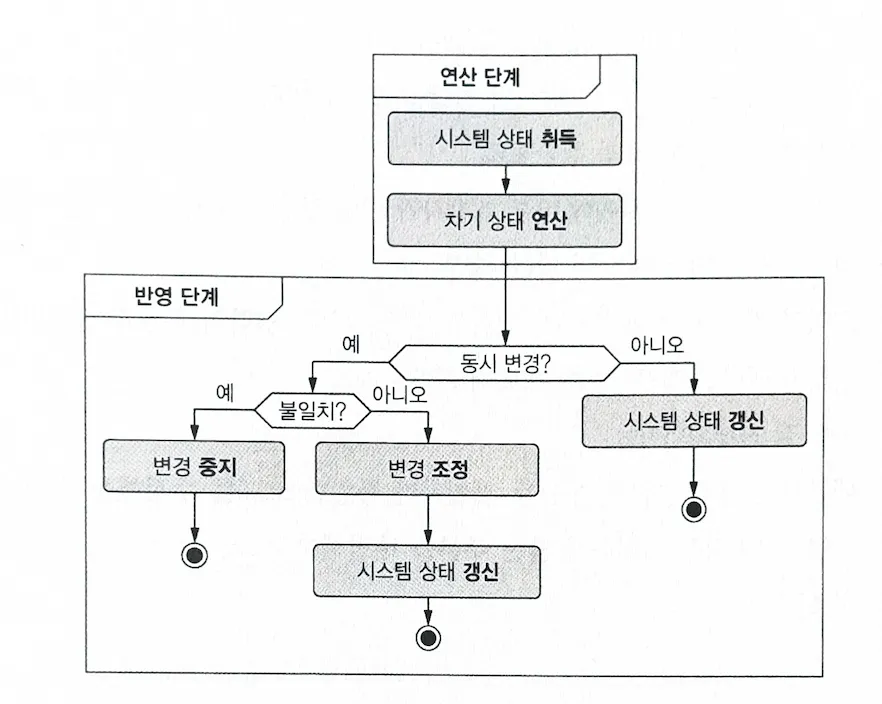

## 낙관적 동시성 제어

DOP에서는 낙관적 동시성 제어 전략을 사용한다. 책에서 낙관적 동시성 제어은 **허락을 받기보다 변경 후에 용서를 구하는 방식**이라 표현하는데 구체적인 로직을 보면 이해가 쉽다. DOP의 변경 로직에 맞게 생각해보자. DOP의 변경 로직에는 연산 단계와 반영 단계가 존재한다. 낙관적 동시성 제어 전략은 차기 버전을 만드는 연산 단계에서는 이 변경이 유일한 작업인 것처럼 변경을 수행하고, 이후 반영 단계에서 변경이 상충되지 않으면 조정을, 상충된다면 중지를 시킨다. 정리하자면 아래와 같다.

> **연산**: 동시성에 대한 고민 없이 차기 버전 생성  
> **반영**: 동시에 일어난 변경과 상충하지 않으면 조정 / 상충하면 중지

이 전략은 기본적으로 동시에 변경이 일어나고 2개 이상의 변경 작업이 상충하는 경우가 적을 것이라 가정한다. 이 선택은 분명한 장/단이 존재한다. 변경 과정에서 잠금으로 인한 성능 저하가 없다는 장점이 있는 반면 변경에 실패하는 요청이 생겨난다는 단점이 있다. 



하지만 DOP에서 이 전략이 가지는 추가적인 장점이 존재한다. 동시 변경에 의해 생길 수 있는 문제를 해결하는 건 반영 코드에만 존재하는데, 반영 코드는 모든 시스템에서 범용적으로 사용한다는 점이다. 즉, 반영 코드를 1번 만들어두고 활용하면 이후 변경 작업에서는 동시성에 대한 처리를 하지 않아도 된다는 점이다.

<br></br>

## 변경 반영 코드 구현하기

### 1. 구조적 비교

동시에 일어난 2개 이상의 변경들이 상충하는지를 알기 위해서는 각 변경이 어떤 요소를 변경시켰는지 확인해야 한다. 대개 변경은 수정 / 생성 / 삭제를 뜻하지만 이번 장에서는 수정과 생성으로 한정한다. 삭제까지 한번에 이해하려 했다가는 코드가 너무 복잡해진다고 한다.

```javascript
function diffObjects(data1, data2) {
  var emptyObject = Array.isArray(data1) ? [] : {};

  if (data1 === data2) {
    return emptyObject;
  }

  var keys = _.union(Object.keys(data1), Object.keys(data2));

  return _.reduce(keys, function (acc, k) {
    var res = diff(_.get(data1, k), _.get(data2, k));
    if (_.isObject(res) && _.isEmpty(res) || res === "no-diff") {
      return acc;
    }
    return _.set(acc, [k], res);
  }, emptyObject);
}

function diff(data1, data2) {
  if (_.isObject(data1) && _.isObject(data2)) {
    return diffObjects(data1, data2);
  }
  if (data1 !== data2) {
    return data2;
  }
  return "no-diff";
}
```

위 코드는 2개의 배열 또는 HashMap을 구조적으로 비교하는 코드이다. 코드에 대한 설명 보다는 DOP에서 구조적 비교를 할 경우 얻을 수 있는 이점에 대해 설명하는 게 중요하다. DOP에서 각 버전의 데이터는 구조적 공유를 활용한다. 즉, 각 버전에서 변경되지 않은 동일한 데이터는 동일한 참조를 공유하게 된다. 때문에 구조적 비교 로직 상단에 참조를 비교하는 로직을 확인할 수 있는데 이는 비교 로직의 효율성을 극대화 한다.

이 코드를 활용해 2개 이상의 변경 작업이 상충하는 지를 알려면 어떻게 해야할까? 변경 작업이 상충한다는 건 동일한 데이터를 수정했다는 의미이고, 동일한 데이터를 수정했다는 건 변경된 데이터의 key path를 비교하면 된다.

```javascript
function informationPaths(obj, path = []) {
  return _.reduce(obj, function (acc, v, k) {
    if (_.isObject(v)) {
      return _.concat(acc, informationPaths(v, _.concat(path, k)));
    }
    
    return _.concat(acc, [_.concat(path, k)]);
  }, []);
}

function havePathInCommon(diff1, diff2) {
  return !_.isEmpty(_.intersection(informationPaths(diff1), informationPaths(diff2)));
}

// 활용 예시
// previous는 과거 버전
// current는 변경 1, next는 변경 2

const diff1 = informationPaths(diff(previous, current));
const diff2 = informationPaths(diff(previous, next));

const isConflict = havePathInCommon(diff1, diff2);
```

### 2. 조정 알고리즘 구현

구조적 비교 파트에서 변경(수정, 생성) 데이터를 알아내는 코드와 변경된 데이터의 key path를 알아내는 코드 마지막으로 key path를 기준으로 2개의 변경이 상충되는지를 알아보는 코드를 확인했다. 이제는 마지막으로 상충 여부를 바탕으로 차기 데이터를 만들어내는 코드를 살펴보자.

```javascript
class SystemConsistency {

  // 세 가지 상태(current, previous, next)를 비교하고 병합하는 함수
  static threeWayMerge(current, previous, next) {
    var previousToCurrent = diff(previous, current);  // previous와 current의 차이
    var previousToNext = diff(previous, next);        // previous와 next의 차이

    // previousToCurrent와 previousToNext가 공통 경로를 가지지 않는다면 병합 가능
    if (!havePathInCommon(previousToCurrent, previousToNext)) {
      return _merge(current, previousToNext);  // 병합 수행
    }

    // 충돌이 발생했을 때 예외를 던짐
    throw new Error("Conflicting concurrent mutations.");
  }

  // 상태를 재조정하는 함수
  static reconcile(current, previous, next) {
    // current가 previous와 동일하다면, 바로 next를 반환
    if (current === previous) {
      return next;
    }

    // 그렇지 않으면 threeWayMerge를 호출하여 상태 병합
    return SystemConsistency.threeWayMerge(current, previous, next);
  }
}
```

데이터를 반영하는 코드는 이전 코드를 활용해 만든다. previous, current, next 3개의 데이터가 존재하고 변경(수정, 생성)된 데이터의 key path를 기준으로 Conflict 여부를 확인해본다. 이후 Conflict가 있다면 예외를 없다면 반영을 선택하면 된다. reconcile 메서드를 보면 current와 previous가 같은 경우에 대한 처리가 존재하는데 이 경우 동시에 변경이 처리된 이력이 없는 상황으로 이해할 수 있다.

```javascript
class SystemState {
  constructor() {
    this.systemData = null;  // systemData 초기화
  }

  // systemData getter
  get() {
    return this.systemData;
  }

  // systemData setter
  set(_systemData) {
    this.systemData = _systemData;
  }

  // commit 메서드: 이전 상태(previous)와 다음 상태(next)를 비교하여 데이터를 커밋
  commit(previous, next) {
    var nextSystemData = SystemConsistency.reconcile(this.systemData, previous, next);

    // 커밋하려는 데이터가 유효하지 않으면 예외를 던짐
    if (!SystemValidity.validate(previous, nextSystemData)) {
      throw new Error("The system data to be committed is not valid!");
    }

    // 유효한 경우 systemData를 nextSystemData로 업데이트
    this.systemData = nextSystemData;
  }
}
```

마지막으로 SystemConsistency를 활용해 구현한 반영 코드는 위와 같다. 이 코드는 모든 데이터 변경 코드에서 공통적 사용될 예정이다.

<br></br>

## 내 생각

이번 장에서는 낙관적 동시성 제어의 개념과 구현 그리고 DOP에서 이 전략을 사용했을 때 얻을 수 있는 이점에 대해 알아봤다. Git을 예시로 설명해 이해하기 수월했다. 다만 이 설계가 어떤 유형의 시스템까지 커버할 수 있을지는 의문이다. 그만큼 대다수의 상황에서 사용할 수 있는 일반적인 방법론이라기보다는 장점과 단점이 명확한 설계라는 느낌을 받았다. 이 느낌이 책을 다 읽었을 때 어떻게 변해있을지도 궁금하다.