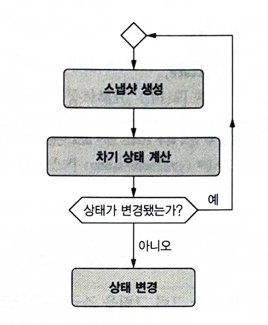

## DOP's Concurrency Management

Typically, to manage concurrency in multithreaded environments, critical section access operations are protected by locking mechanisms like mutexes. Read areas are also included in protection because values can be changed by other threads during reading, causing loss of consistency.

However, in DOP, read operations don't need to consider multithreading. This is because data in DOP is immutable. That is, there's no problem even if values change due to other operations. Then what about write operations?

In DOP, instead of using locks for write operations, a simpler structure called **atom** is used. DOP's write operations go through the following steps, where the **"Has the state changed?"** part atomically compares and then reflects the state.



At this time, implementations supporting such operations already exist for each language, or external libraries can be utilized.

```ruby
# Class: Concurrent::Atom

# Create initial value
atom = Concurrent::Atom.new(1)

# compare_and_set(old_value, new_value)
# Changes to 2 because old_value matches
atom.compare_and_set(1, 2);

# Fails to change to 3 because old_value doesn't match
atom.compare_and_set(1, 3);
```

<br></br>

## My Thoughts

DOP's concurrency management approach presents a completely different paradigm from traditional locking mechanisms. By being based on immutable data, it fundamentally solves concurrency problems in read operations, and enables more efficient and safer concurrency control through atomic operations in write operations.

This approach pairs particularly well with functional programming and has even more important meaning in modern multicore environments. It has the advantage of fundamentally avoiding problems like deadlocks or livelocks that can occur in traditional mutex-based concurrency control.