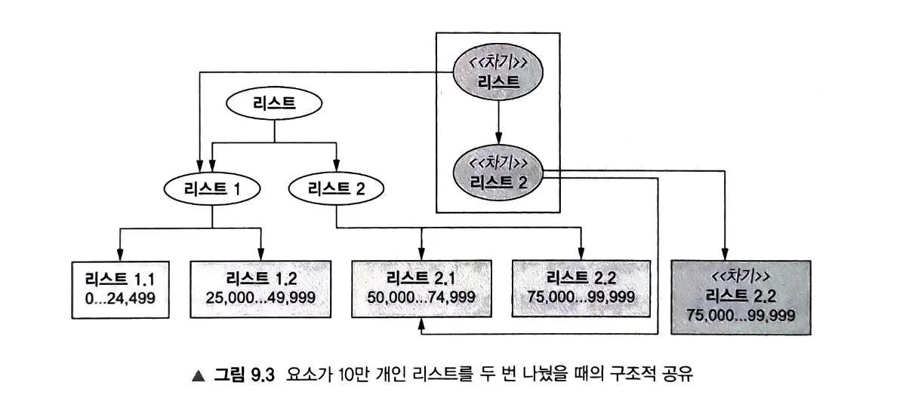

In DOP, data is immutable. Data cannot be directly modified, and if necessary, a new version of the data must be created. Two main concerns arise from this approach: stability and efficiency. Can we guarantee that data cannot be modified anywhere? If new versions of data must be created every time, are there no performance issues? This chapter provides answers to these two questions.

  

## How Persistent Data Structures Ensure Stability

The way to ensure stability is actually simple. When modification methods are used, exceptions should be thrown. For example, in Java, attempting to modify data in an immutable Collection throws an UnsupportedOperationException. In JavaScript, using Object.freeze achieves the same effect. However, whether an error occurs when attempting changes depends on strict/sloppy mode. But in any case, the data doesn't change, so it's not a big problem.

  

## How Persistent Data Structures Ensure Efficiency

When using persistent data structures, when creating new versions of data, parts that can be shared with previous versions are reused. This optimizes memory usage and improves performance.

The core of persistent data structures is **Structural Sharing**. When creating new versions of data structures, unchanged parts are shared with previous versions to maximize memory efficiency.

  

## Characteristics of Persistent Data Structures

Persistent data structures have the following characteristics:

1. **Immutability**: Never changed after creation
2. **Version Management**: Previous versions are maintained even when new versions are created
3. **Structural Sharing**: Unchanged parts are shared between versions
4. **Efficiency**: New versions are created through partial changes only, without full copying

  

## Implementation Principles of Persistent Data Structures

Persistent data structures are mainly implemented based on tree structures. When changes are needed:

1. Only the changing path is newly created
2. Unchanged parts reference existing structures
3. Only the path from root to change point is copied to create new versions

This approach enables efficient updates with O(log n) time complexity.

  

## Real-world Use Cases

Persistent data structures are widely used in functional programming languages and libraries:

- **Clojure**: All basic data structures are persistent data structures
- **Immutable.js**: Provides persistent data structures in JavaScript
- **Immer**: Simply supports immutable updates in JavaScript

  

## Conclusion

Persistent data structures are one of the core concepts of DOP, enabling us to catch both rabbits of stability and efficiency. By ensuring immutability while providing performance benefits, they play an important role in functional programming and data-oriented programming.