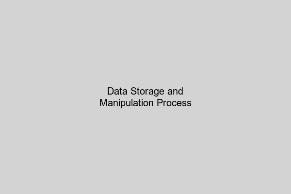

## DOP에서 DB 데이터를 다루는 방식

```json
[
  {
      "title": "7 Habits of Highly Effective People",
      "isbn": "978-1982137274",
      "publication_year": 1989
  },
  {
      "title": "The Power of Habit",
      "isbn": "978-0812981605",
      "publication_year": 2012
  }
]
```

DOP에서 DB 데이터는 이전까지 다뤄온 메모리 데이터와 차이가 없다. 기본적으로 데이터는 맵으로 관리되고 배열로 각 데이터를 담아둔다. 이처럼 기존과 동일한 방식으로 DB 데이터를 다루기 때문에 JSON 스키마와 같이 기존에 데이터 관리를 위해 적용하던 모든 것들은 DB데이터에도 동일하게 적용이 가능하다.


DOP에서 DB에서 데이터를 가져올 때 드라이버가 결과를 맵 리스트로 반환한다면 별다른 작업이 필요 없고, 그렇지 않다면 변환해주는 유틸 함수를 활용해 드라이버의 반환 값에서 리스트 맵 형태로 변환을 하면 된다.

```javascript
let dbClient;

const ajv = new Ajv({ allErrors: true });

const title = "habit";

const matchingBooksQuery = `
  SELECT title, isbn
  FROM books
  WHERE title LIKE '%' || $1 || '%'
`;

const books = dbClient.query(matchingBooksQuery, [title]);

if (!ajv.validate(dbSearchResultSchema, books)) {
  const errors = ajv.errorsText(ajv.errors);
  throw "Internal error: Unexpected result from the database: " + errors;
}

JSON.stringify(books);
```

<br></br>

## 데이터 저장 및 조작하기

DOP에서 데이터 저장과 조작 역시 기존과 동일한 방식으로 진행된다. 데이터를 맵 형태로 관리하고 필요한 필드만 추출해서 데이터베이스 쿼리에 활용한다.

```javascript
class CatalogDB {
  static addMember(member) {
    const addMemberQuery = `
      INSERT INTO members (email, encrypted_password)
      VALUES ($1, $2)
    `;

    dbClient.query(addMemberQuery, _.at(member, ["email", "encryptedPassword"]));
  }
}
```

위 예제에서 `_.at()` 함수를 사용해 member 맵에서 필요한 필드만 추출하여 쿼리에 전달한다. 이렇게 하면 데이터의 구조와 관계없이 일관된 방식으로 데이터베이스 작업을 수행할 수 있다.



<br></br>

## DOP에서 클라이언트 응답 데이터를 다루는 방식

웹 서비스에서 클라이언트로 응답을 보낼 때도 동일한 원칙이 적용된다. 데이터는 맵과 리스트의 조합으로 구성되며, JSON 직렬화를 통해 클라이언트에게 전달된다.

클라이언트 응답 데이터 역시 검증 스키마를 적용할 수 있고, 데이터 변환 함수들을 동일하게 사용할 수 있다. 이는 시스템 전반에 걸쳐 일관된 데이터 처리 방식을 유지할 수 있게 해준다.

<br></br>

## DOP가 지향하는 내부 구성요소 간의 관계

DOP는 시스템 내부 구성요소들 간의 느슨한 결합(loose coupling)을 추구한다. 각 구성요소는 데이터의 출처나 목적지에 관계없이 동일한 인터페이스를 통해 상호작용한다.

이러한 접근 방식의 장점은 다음과 같다:

- **일관성**: 메모리, 데이터베이스, 네트워크 데이터를 동일한 방식으로 처리
- **재사용성**: 범용적인 함수들을 다양한 컨텍스트에서 활용 가능
- **유지보수성**: 데이터 구조 변경이 시스템 전체에 미치는 영향 최소화
- **테스트 용이성**: 데이터 검증과 변환 로직의 독립적인 테스트 가능


<br></br>

## 내 생각

DOP에서 가장 인상적인 부분은 데이터의 출처와 관계없이 일관된 처리 방식을 제공한다는 점이다. 메모리에 있는 데이터든, 데이터베이스에서 가져온 데이터든, 클라이언트로부터 받은 데이터든 모두 동일한 맵과 리스트 구조로 다룬다.

이는 개발자가 데이터 변환이나 인터페이스 변경에 대한 걱정 없이 핵심 비즈니스 로직에 집중할 수 있게 해준다. 또한 시스템의 각 부분이 독립적으로 발전할 수 있어 장기적인 유지보수 관점에서도 큰 이점이 있다고 생각한다.

다만 모든 데이터를 맵과 리스트로만 다루는 것이 때로는 타입 안정성 측면에서 아쉬움이 있을 수 있다. 하지만 JSON 스키마를 통한 검증으로 이러한 부분을 어느 정도 보완할 수 있다는 점에서 실용적인 접근법이라고 볼 수 있다.