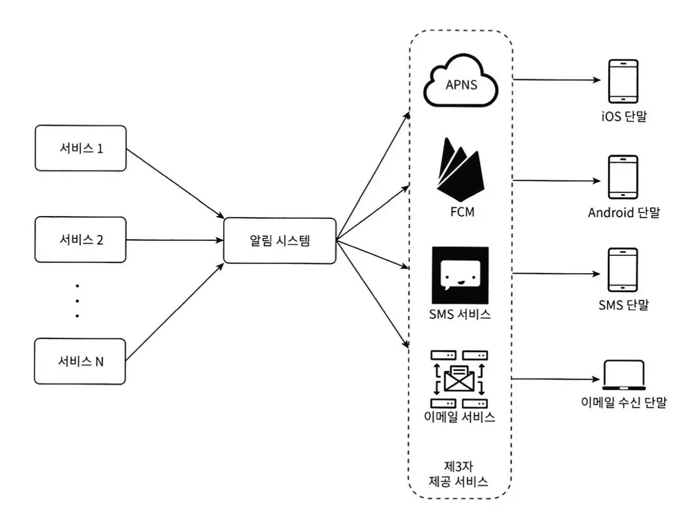
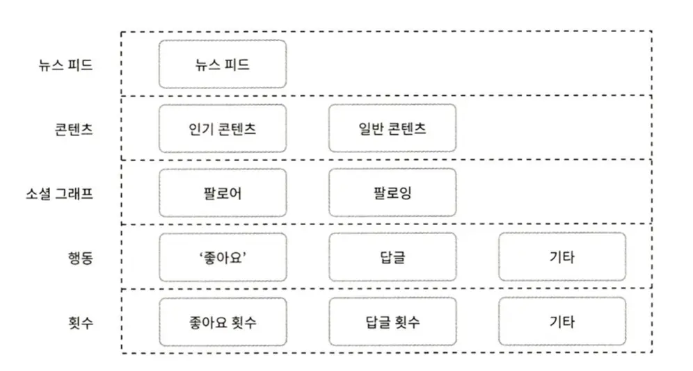

## Server Scaling

### Vertical Scaling
- Refers to adding high-performance resources to a server.
- Has clear limitations and makes it difficult to prepare disaster recovery and failure response plans.

### Horizontal Scaling
- Refers to increasing the number of servers.
- Requires a `load balancer` that distributes traffic evenly across multiple servers.
  - Users connect to the load balancer's public IP, and for security, private IP addresses are used for communication between the load balancer and multiple servers.
- Can prevent total server downtime.
- Relatively easier to scale compared to vertical scaling.

#### Stateless Web Tier
- A web tier that does not store client state (such as sessions) on web servers is called a stateless web tier.
- Essential for horizontal scaling (otherwise, client A - server A matching would be forced).
- To achieve this, state information must be stored in separate storage (e.g., Redis, DynamoDB) so web servers can share it.

  

## Database

### Replication
- Database replication can be implemented through master-slave setup.
- The master database performs only write operations, while slave databases perform only read operations.
- Data is preserved even if one of the database servers goes down.

### Design with Load Balancer and Database Replication Applied
- Users receive the load balancer's public IP address from DNS.
- They connect to the load balancer using this IP address.
- HTTP requests are forwarded to server 1 or server 2.
- Web servers read user data from slave databases.
- Web servers send data modification operations to the master database.

  

  

## Cache

### Cache Layer
- A storage that keeps expensive computation results or frequently referenced data in memory, allowing subsequent requests to be processed faster.
- Much faster than databases.

### Considerations When Using Cache
- When is cache desirable?: When data updates don't happen frequently but references occur frequently
- What data should be in cache?: Persistent data should not be stored in cache
- How does data in cache expire?: Having an expiration policy is a good practice
- How is consistency maintained?: Consistency can be compromised when operations updating the original storage and cache updates are not processed as a single transaction
- How to handle failures?: If you have only one cache server, it can become a single point of failure
- How large should cache memory be?: If cache memory is too small, data may be evicted from cache too frequently depending on access patterns

  

## Content Delivery Network (CDN)

### How CDN Works
- A geographically distributed network of servers used to deliver static content.
- Can cache images, videos, CSS, JavaScript files, etc.

### Considerations When Using CDN
- Cost: CDNs are usually operated by third parties, and you pay based on data transfer volume
- Proper expiration time setting: For time-sensitive content, expiration timing must be set appropriately
- CDN failure response plan: You must consider how websites/applications should behave when the CDN itself fails
- Content invalidation: Even content that hasn't expired yet can be removed from CDN using one of the following methods

  

  

## Stateless Web Tier

### State-Dependent Architecture
- Has the problem that clients must send requests to the same server.
- While load balancers provide sticky sessions, this burdens the load balancer and makes adding or removing backend servers difficult.

### Stateless Architecture
- HTTP requests from users can be forwarded to any web server.
- Web servers fetch data from shared storage when state information is needed.
- State information is physically separated from web servers.

  

## Data Centers

### Geographical Routing
- Users are directed to the nearest data center.
- This process is called geographical routing (geoDNS-routing or geo-routing).

### Technical Challenges to Solve When Building Multi-Data Center Architecture
- Traffic redirection: Must find effective ways to send traffic to the correct data center
- Data synchronization: If each data center uses separate databases, even when failures are automatically recovered and traffic is redirected to another database, the target data center might not have the required data
- Testing and deployment: When systems are configured to use multiple data centers, it's important to test websites or applications from multiple locations

  

## Message Queue

### Advantages of Message Queues
- Message queues are components that support asynchronous communication while guaranteeing message delivery without loss.
- Act as message buffers and transmit asynchronously.

### Message Queue Architecture
- Producers or publishers called input services create messages and publish them to the message queue.
- Services or servers called consumers or subscribers are usually connected to the queue, receiving messages and performing appropriate actions.

  

## Logging, Metrics, and Automation

### Logging
- Monitoring error logs is important.
- While you can monitor logs on a server-by-server basis, using tools that aggregate logs into a single service makes searching and viewing more convenient.

### Metrics
- Good metric collection can provide useful information about business status and make it easy to understand the current system state.
- Host-level metrics: Metrics about CPU, memory, disk I/O
- Aggregate metrics: Database tier performance, cache tier performance
- Core business metrics: Daily active users, revenue, return visits

### Automation
- As systems become larger and more complex, automation tools must be used to increase productivity.
- Using continuous integration tools can automatically verify that code created by developers has no issues, greatly improving development productivity.

  

## Database Scaling

### Vertical Scaling
- Also called scaling up.
- Method of adding more or higher-performance resources to existing servers.

### Horizontal Scaling
- Also called sharding.
- Technique of dividing large databases into smaller units called shards.
- All shards use the same schema, but there's no duplication among data stored in shards.

### Sharding Strategy
- How data is distributed among shards depends on how you choose the sharding key.
- Sharding key is also called partition key.
- When choosing a sharding key, the most important thing is to enable even data distribution.

### Problems to Solve When Introducing Sharding
- Data resharding: When data becomes too large for a single shard to handle
- Celebrity problem: Also called hotspot key problem. Issue where queries concentrate on specific shards, overloading servers
- Joins and denormalization: After splitting one database across multiple shard servers, joining data across multiple shards becomes difficult

  

## Million Users and Beyond

Scaling systems is a continuous and iterative process. Summarizing the techniques covered in this chapter:

- Make web tier stateless
- Introduce redundancy at all tiers
- Cache as much data as possible
- Support multiple data centers
- Serve static content through CDN
- Scale data tier through sharding
- Split each tier into independent services
- Continuously monitor systems and utilize automation tools