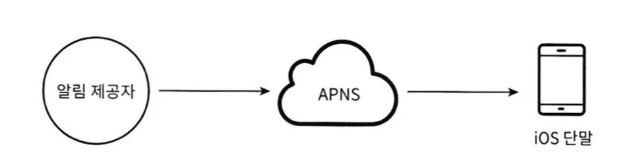

  

## 1. What is a Notification System?
- A system that asynchronously provides important information through mobile push notifications, SMS, and email

  

## 2. Design Considerations
- Notification types: Mobile push / SMS / email
- Real-time system requirements: Soft / hard real-time, etc.
- Supported devices: iOS / Android / PC, etc.
- Notification creators: Client app / server, etc.
- Whether notifications can be blocked
- Expected number of notifications

  

## 3. High-Level Design

### (1) Support Methods by Notification Type

- Above image shows 3 components needed for iOS push notifications
- Notification Provider: Responsible for creating notification requests and sending them to APNS
  - Requires data such as device tokens and notification content (payload)
- APNS: Apple's remote service responsible for sending push notifications to iOS devices
- iOS Device: User device that receives push notifications
- Android, SMS, and email have different intermediate components, but each component's role can be considered identical
  - Android: FCM
  - SMS: Twilio, Nexmo, etc.
  - Email: Sendgrid, Mailchimp, etc.

### (2) Contact Information Collection Process
- Information such as device tokens, phone numbers, email addresses is needed to send notifications
- Therefore, when registering accounts, it's necessary to store information that allows users to receive notifications
- The book recommends storing phone numbers and emails in user table, but creating separate table for device tokens (considering users can have multiple devices)

### (3) Notification Sending and Receiving Process

#### Single Server Assumption

- N services refers to all services wanting to use notification service (delivery notifications, due date notifications, etc.)
- Notification system must provide APIs to N services and create notification content (payload) to deliver to third-party services
- Third-party services actually deliver notifications to users
  - Should be able to easily integrate new services or improve existing ones
  - Must consider available services by region
- Single server problems:
  - (SPOF) If notification system fails, all notification services experience complete failure
  - No way to individually scale critical components (cache, DB, etc.)
  - All requests concentrate on one server, causing overload during high traffic times

#### Improved Structure

- Improvements:
  - Separated DB and cache from notification system server -> enables horizontal scaling of notification servers
  - Used message queues to break tight coupling between system components -> easy to add/remove third-party services
  - SPOF eliminated
  - Uses one or more message queues and worker servers -> enables parallel notification processing
- Role changes:
  - Notification Server: Responsible for notification validation, DB/cache queries, notification sending (insert to message queue)
  - Worker Server: Responsible for extracting notifications to send from message queue and delivering them to third-party services

  

## 4. Detailed Design

### (1) Reliability
- Several points need consideration to ensure reliability in distributed environments
- `Retry logic` or `log storage` may be needed to prevent notification loss under any circumstances
- Important to configure system to prevent duplicate notification sending
  - Example: Store event ID after notification sending and add logic to check if it's already processed event ID when requests come in

### (2) Additional Required Components and Considerations

#### Notification Templates
- Millions of notifications are likely to have similar forms
- Using templates and replacing only necessary parts can maintain format consistency and reduce notification creation time

#### Notification Settings
- Users should be able to configure notification preferences in detail to reduce notification fatigue
- Requires separate notification settings table with data like user_id/channel(notification channel)/opt_in(notification reception status)
- Add logic to query this table when sending notifications to determine whether to send

#### Rate Limiting
- Good method to limit notifications a user can receive within specific time period to prevent users from turning off notifications due to too many notifications

#### Retry Methods
- When notification sending fails, consider putting data in retry-only queue and configuring developer alerts when this process repeats

#### Push Notifications and Security
- For iOS and Android, only authenticated clients can use APIs, so need to understand security when building notification systems

#### Queue Monitoring