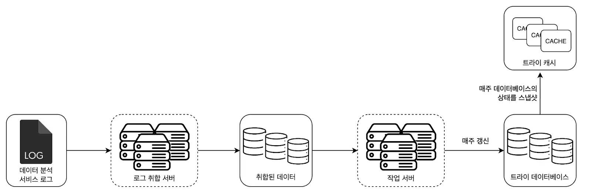
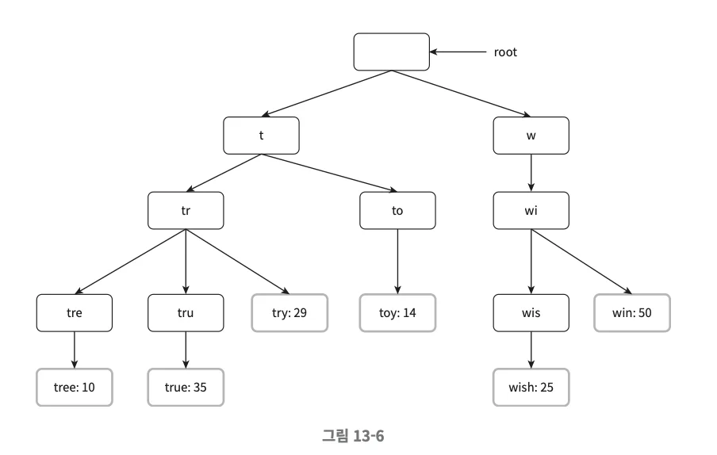
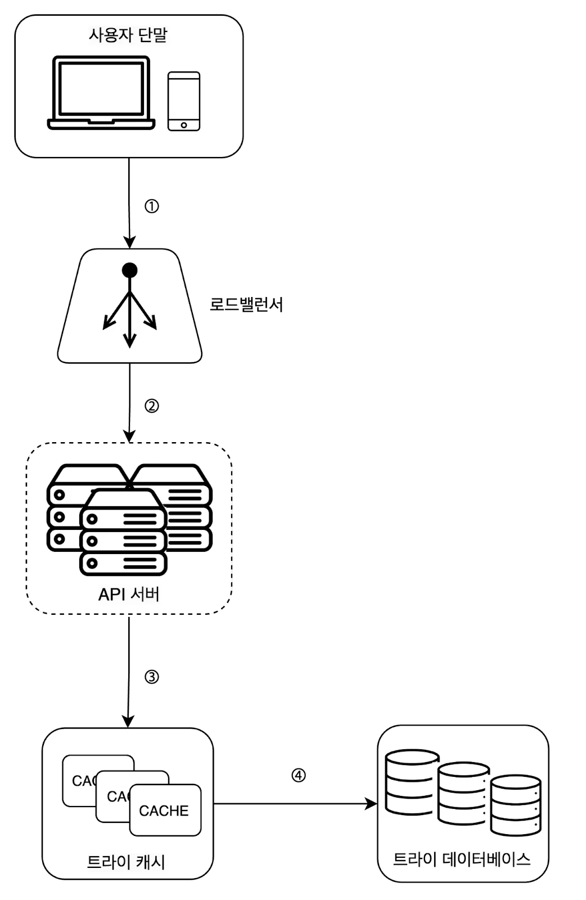
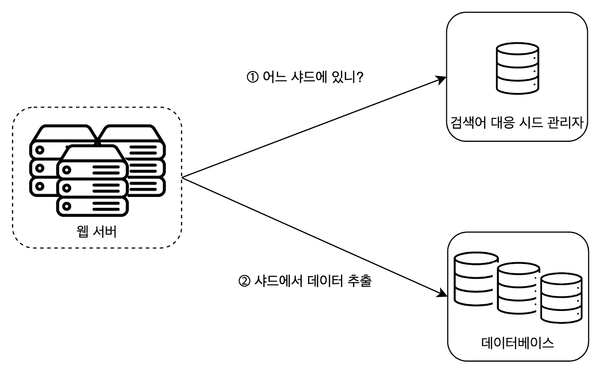

## 1. What is a Search Autocomplete System?
- When you type words in Google search box, it recommends search terms that match the word you're typing
- This service is called a search autocomplete system

<br></br>

## 2. Design Considerations
- Where in the autocomplete search term is the word entered by user: beginning, anywhere, etc.
- How many autocomplete search terms should be displayed?
- What are the criteria for selecting autocomplete search terms to be suggested?: popularity, ranking model
- Whether to include spell check functionality
- Supported languages
- Handling uppercase or special characters
- Response speed
- High availability: Search should be possible even if autocomplete function fails
- Scalability
- Scale estimation method
  - Assume 10 million daily active users
  - Average 10 searches per user
  - Average 4 words per query, average 5 characters per word
  - Assuming ASCII format, average 4 x 5 = 20 bytes of data input per query
  - Since requests go to autocomplete backend for each character input, 20 requests are needed per search
  - Daily request volume estimate: 10,000,000 x 10 x 20 x 24 * 3600

<br></br>

## 3. High-Level Design of Search Autocomplete System
### (1) Data Collection Service
- System that collects user input queries in real-time (real-time is not desirable for apps with large amounts of data. Will change later)

#### Query Table

- There is a table with 2 columns as above
- Frequency count is updated for each query

### (2) Query Service
- Service that provides 5 popular search terms sorted for given query
```
SELECT * FROM frequency_table
WHERE query Like `prefix%`
ORDER BY frequency DESC
LIMIT 5;
```
- Can get 5 popular search terms using above query
- However, can become bottleneck when data volume increases

<br></br>

## 4. Detailed Design
### (1) Trie Data Structure
- While the high-level design used RDB to query popular search terms, using trie data structure can more efficiently query autocomplete search terms

#### What is a Trie?

- Data structure that can store strings efficiently
- Root node has empty string
- Each node stores one character and can have 26 child nodes (based on alphabet)
- If you want results sorted by usage frequency, you must also store usage frequency information

#### Autocomplete Search Term Query Logic
```
p: prefix length
n: number of nodes in trie
c: number of child nodes of given node
```
1. Find node representing the prefix -> O(p)
2. Find all valid nodes in subtree of node found in (1) -> O(c)
3. Sort valid nodes to find k popular search terms -> O(clogc)

#### Problems
- In worst case, may need to search entire trie to get results

#### Solutions
- There are 2 approaches to prevent this:
- Limit maximum prefix length
  - Starts from idea that there are almost no cases of entering long search terms
  - Assume p <= 50
  - Time complexity of task 1 improves to O(1)
- Cache popular search terms in nodes
  - Method of caching k popular search terms in each node
  - However, requires a lot of storage space for nodes and real-time reflection becomes difficult
  - Time complexity of tasks 2 and 3 improves to O(1)

### (2) Data Collection Service (Improved Version)
- Modifying data every time user searches is not very practical
  - If it were a real-time service, trie would be updated every time and cache reflection would be difficult to reflect data changes
  - Compared to these disadvantages, real-time reflection of search autocomplete doesn't seem to provide much benefit


#### Data Analytics Service Log
- Raw data of queries entered in search box
- No modifications and no index needed

#### Log Aggregation Server
- Role of aggregating log data and refining it into consumable data
  - Will go through data validation and classification processes
- Data aggregation cycle can be set considering service characteristics

#### Aggregated Data
- Aggregated data will have fields like query, time, frequency
- For time, should be set considering log aggregation cycle

#### Worker Server
- Job server that runs periodically and is responsible for creating trie data structure and storing it in trie DB

#### Trie Cache
- Distributed cache system that updates by taking snapshots of trie DB according to work cycle

#### Trie DB
- There are 2 options:
- Document store: Periodically serialize trie and store in DB, example is Mongo DB
- Key-value store: Can convert trie -> hash table form by adding logic below
  - Convert all stored prefixes to hash table keys
  - Convert all data stored in each trie node to values

### (3) Query Service (Improved Version)

- Improved query service reflecting improved data collection service
- Other optimization approaches that can be considered include:
  - AJAX requests
  - Browser caching
  - Data sampling: Logging only 1 out of N requests

### (4) Trie Operations
#### Trie Creation
- Role of worker server to create trie based on aggregated log data

#### Trie Updates
- There are 2 options:
  - Update once per week. New trie replaces existing trie
  - Update each node of trie individually. Method that can be considered when trie is small
    - When updating each node individually, must consider that parent nodes also need to be updated

#### Search Term Deletion
- If need to remove words containing hate speech, violence, etc., there are 2 options:
- Physically delete from DB
- Add `filter layer` between API server and trie cache to make search impossible

### (5) Storage Scaling
- Preparing for cases where trie size is too large for one server
- Method of sharding based on first character when considering English-only support
  - This method limits maximum servers to 26
  - If server addition is needed beyond 26, hierarchical approach is required
  - For example, Server1: aa ~ ag, Server2: ah ~ an, Server3: ao ~ au, Server4: av ~ az
  - However, data volume varies according to frequency of alphabet used as word starting character


- Method that complements disadvantages of first character-based sharding
- Shard manager allocates DB by analyzing past query patterns
- If search term volume starting with 's' and search term volume starting with 'u ~ z' are similar, implementation is needed so that each case gets 1 DB

<br></br>

## 5. Additional Topics Worth Considering
- What if multi-language support is needed?
  - Need to store Unicode data in trie
- What if popular search term rankings differ by country?
  - Can apply different tries by country and store tries in CDN to improve response speed
- What if real-time reflection is needed?
  - Can try to reduce trie update data volume through sharding
  - Change ranking model to add higher weight to recent search terms