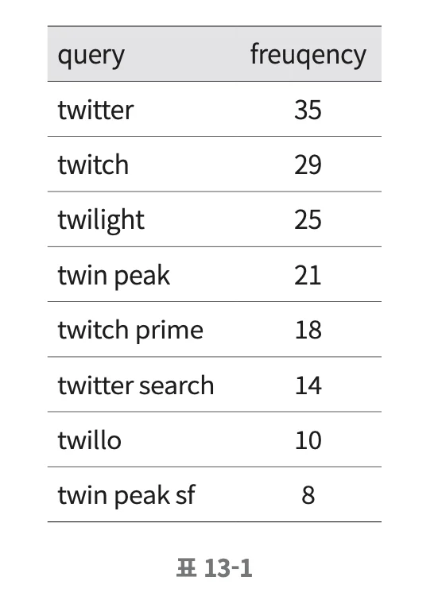
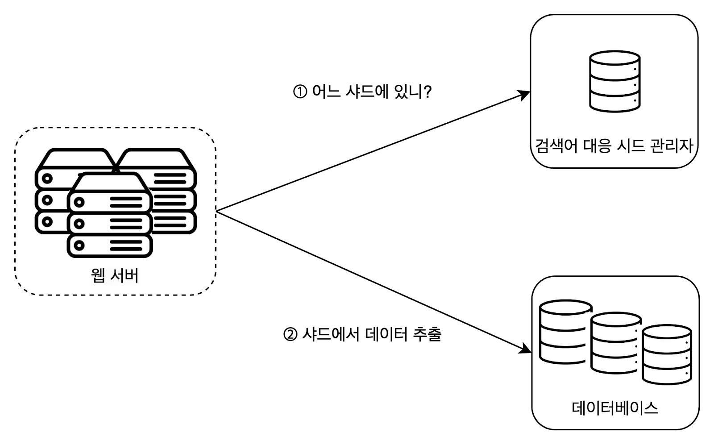

<br></br>

## 1. 검색어 자동완성 시스템?
- 구글 검색창에 단어를 입력하면 입력 중인 단어에 맞게 검색어들을 추천해준다.
- 이 서비슬르 검색어 자동 완성 시스템이라 부른다.


<br></br>

## 2. 설계 시 고민할 것들
- 사용자가 입력한 단어는 자동완성될 검색어의 어떤 위치인가: 시작부, 포함하면 됨 등
- 몇 개의 자동완성 검색어가 표시되어야 하는가?
- 제시될 자동 완성 검색어를 고르는 기준은 무엇인가?: 인기도, 순위 모델
- 맞춤법 검사 기능 여부
- 지원 언어
- 대문자 혹은 특수문자 처리
- 응답 속도
- 고가용성: 자동완성 기능에 장애가 발생해도 검색이 가능해야 한다.
- 규모 확장성
- 규모 추정 방식
  - 일간 능동 사용자를 천만 명으로 가정
  - 한 사용자가 평균 10회 검색
  - 질의마다 평균 4개 단어, 한 단어는 평균 5글자
  - ASCII 방식을 가정했을 때 질의당 평균 4 x 5 = 20byte 데이터 입력
  - 글자 입력마다 자동 완성 백엔드에 요청이 가기 때문에 검색 1회에 20개의 요청이 필요
  - 일간 요청량 추정치: 10,000,000 x 10 x 20 x 24 * 3600


<br></br>

## 3. 검색어 자동완성 시스템 개략적인 설계도
### (1) 데이터 수집 서비스
- 사용자 입력 질의를 실시간으로 수집하는 시스템 (데이터가 많은 App에 실시간은 바람직하지 않음. 추후에 변경)
#### 질의 테이블

- 위와 같이 2개의 컬럼을 가진 테이블이 있고
- 질의마다 빈도 수가 update된다.

### (2) 질의 서비스
- 주어진 질의에 5개의 인기 검색어를 정렬해서 제공하는 서비스
```
SELECT * FROM frequency_table
WHERE query Like `prefix%`
ORDER BY frequency DESC
LIMIT 5;
```
- 위와 같은 질의를 활용해 인기 검색어 5개를 얻을 수 있다.
- 단, 데이터 양이 많아지면 병목이 될 수 있다.


<br></br>

## 4. 상세 설계
### (1) 트라이 자료 구조
- 개략적 설계에서 RDB를 활용해 인기 검색어를 조회했지만 트라이 자료 구조를 활용하면 보다 효율적으로 자동 완성 검색어를 조회할 수 있다.

#### 트라이란?

- 문자열들을 간략하게 저장할 수 있는 자료 구조
- 루트 노드는 빈 문자열을 가진다.
- 각 노드는 글자 하나를 저장, 26개의 자식 노드를 가질 수 있다. (알파벳 기준)
- 이용 빈도에 따라 정열된 결과를 원한다면 이용 빈도 정보도 함께 저장해야 한다.

#### 자동 완성 검색어 조회 로직
```
p: 접두어 길이
n: 트랑이 안에 있는 노드 개수
c: 주어진 노드의 자식 노드 개수
```
1. 해당 접두어를 표현하는 노드를 찾는다 -> O(p)
2. (1)에서 찾은 노드의 하위 트리에서 모든 유효 노드를 찾는다 -> O(c)
3. 유효 노드들을 정렬하여 인기 검색어 k개를 찾는다 -> O(clogc)

#### 문제점
- 최악의 경우 결과를 얻기 위해 전체 트라이를 다 검색해야 하는 일이 생길 수도 있음

#### 해결책
- 이를 방지하기 위해 2가지 방안이 있다.
- 점두어 최대 길이 제한
  - 긴 검색어를 입력하는 경우가 거의 없다는 아이디어에서 시작됨
  - p \<= 50을 가정
  - 1번 작업의 시간 복잡도가 O(1)로 개선됨
- 노드에 인기 검색어 캐시
  - 각 노드에 k개의 인기 검색엉를 캐싱해두는 방식
  - 단, 노드의 저장 공간이 많이 필요하고 실시간 반영이 어려워진다.
  - 2번, 3번 작업의 시간 복잡도가 O(1)로 개선됨

### (2) 데이터 수집 서비스 (개선 버전)
- 사용자가 검색을 할 때마다 데이터를 수정하는 건 그리 실용적이지 못하다.
  - 실시간 서비스라면 매번 트라이는 갱신될 것이고 데이터 변화를 반영하기 위해 캐시 반영도 어려울 것이다.
  - 이러한 단점에 비해 검색어 자동 완성의 실시간성 반영이 주는 이점이 없어 보인다


#### 데이터 분석 서비스 로그
- 검색창에 입력된 질의 원본 데이터이다.
- 수정은 없으며 인덱스 또한 필요 없다.


#### 로그 취합 서버
- 로그 데이터를 취합하여 소비할 수 있는 데이터로 정제하는 역할
  - 데이터 검증, 분류 과정을 거칠 것이다.
- 데이터 취합 주기는 서비스의 특성을 고려해 정할 수 있을 것이다.

#### 취합된 데이터
- 취합된 데이터는 query, time, frequency와 같은 필드를 가질 것이다.
- time의 경우 로그 취합 주기를 고려하여 설정해야 한다.

#### 작업 서버
- 주기적으로 실행되는 JOB 서버이며 트라이 자료 구조를 만들고 트라이 DB에 저장하는 역할을 담당한다.

#### 트라이 캐시
- 분산 캐시 시스템으로 작업 주기에 맞게 트라이 DB 스냅샷을 떠서 갱신한다.

#### 트라이 DB
- 2가지 선택지가 존재한다.
- 문서 저장소: 주기적으로 트라잉를 직렬화하여 DB에 저장, 예시는 Mongo DB
- 키-값 저장소: 아래 로직을 추가하면 트라이 -> 해시 텡이블 형태로 변환 가능
  - 보관된 모든 접두어를 해시 테이블 키로 변환
  - 각 트라이 노드에 보관된 모든 데이터를 값으로 변환

### (3) 질의 서비스 (개선 버전)

- 개선된 데이터 수집 서비를 반영한 질의 서비스이다.
- 이외에도 고려할 수 있는 최적화 방안은 아래와 같다
  - AJAX 요청
  - 브라우저 캐싱
  - 데이터 샘플링: N개의 요청 중 1개만 로깅하도록 하는 것

### (4) 트라이 연산
#### 트라이 생성
- 작업 서버의 역할로 취합된 로그 데이터를 바탕으로 트라이를 생성한다.

#### 트라이 갱신
- 2가지 선택지가 존재한다.
  - 매주 1번 갱신. 새로운 트라이가 기존 트라이를 대체
  - 트라이의 각 노드를 개별적으로 갱신. 트라이가 작을 때 고려할 수 있는 방식
    - 각 노드를 개별적으로 갱신할 때는 노드의 상위 노드들도 갱신해야 한다는 사실을 고려해야 한다.

#### 검색어 삭제
- 혐오성, 폭력성 등이 포함된 단어를 제거해야 한다면 2가지 선택지가 존재한다.
- DB에서 물리적으로 삭제하는 것
- API서버와 트라이 캐시 사이에 `필터 계층`을 추가하여 검색이 불가하게 만들 수 있다.

### (5) 저장소 규모 확장
- 트라이의 크기가 한 서버에 넣기에 너무 큰 경우를 대비
- 영어만 지원을 고려했을 때 첫 글자를 기준으로 샤딩하는 방법
  - 이 방법은 최대 서버가 26대로 제한된다
  - 26대에서 서버 추가가 필요하다면 계층적인 접근이 필요하다
  - 예를들어, 서버1: aa ~ ag, 서버 2: ah ~ an, 서버3: ao ~ au, 서버4: av ~ az
  - 단, 단어의 시작 알팝벳으로 쓰이는 빈도에 따라 데이터 양이 달라진다.


- 첫 글자 기준 샤딩의 단점을 보완한 방식
- 과거 질의 패턴을 분석하여 샤드 관리자가 DB를 할당해줌
- 만약 s로 시작하는 검색어 양과 u ~ z로 시작하는 검색어 양이 비슷하다면 두 Case는 각 1개의 DB를 가지게 되도록 구현이 필요함


<br></br>

## 5. 추가로 고민하면 좋은 주제
- 다국엉 지원이 필요하다면?
  - 트라이에 유니코드 데이터 저장이 필요해진다.
- 국가별 인기 검색어 순위가 다르다면?
  - 국가별로 다른 트라이를 사용하도록 적용하고 트라이를 CDN에 저장하여 응답 속도를 높일 수 있다.
- 실시간 반영이 필요하다면?
  - 샤딩을 통하여 트라이 갱신 데이터 양을 줄여볼 수 있다.
  - 순위 모델을 바꾸어 최근 검색어에 보다 높은 가중치 추가