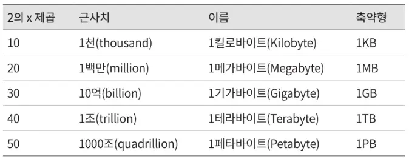
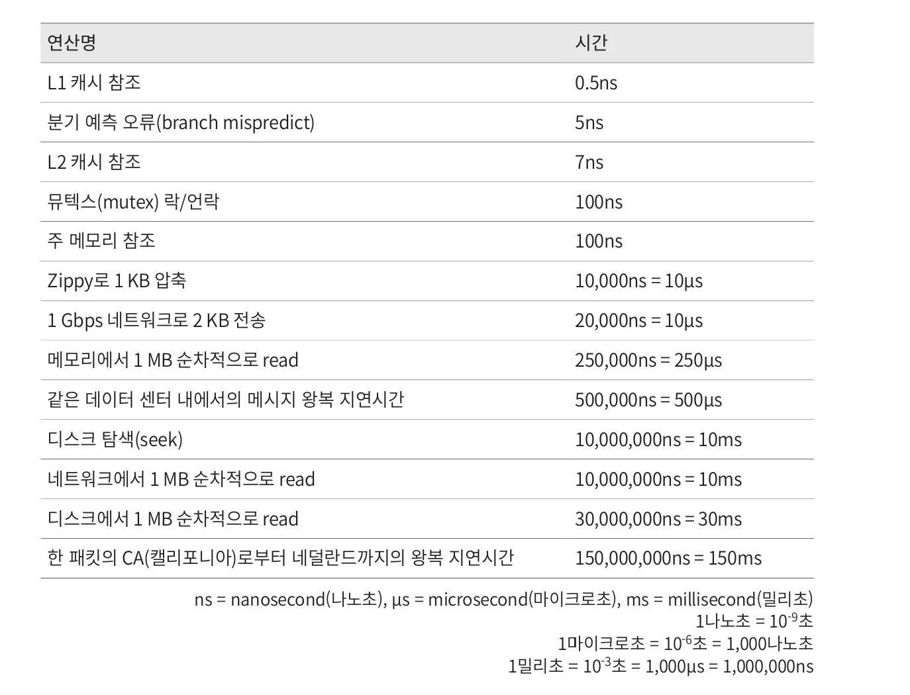

Back-of-the-envelope estimation is the practice of conducting thought experiments using commonly accepted performance metrics to derive estimates, aimed at determining whether a design will meet requirements.

  

## Powers of Two

Since distributed systems can handle enormous amounts of data, it's important to correctly understand which units to use.

### Data Volume Units
- **1 Byte** = 8 bits
- **1 KB (Kilobyte)** = 1,000 Bytes = 10³ Bytes
- **1 MB (Megabyte)** = 1,000 KB = 10⁶ Bytes
- **1 GB (Gigabyte)** = 1,000 MB = 10⁹ Bytes
- **1 TB (Terabyte)** = 1,000 GB = 10¹² Bytes
- **1 PB (Petabyte)** = 1,000 TB = 10¹⁵ Bytes

### Useful Approximations for Estimation
- **2¹⁰ = 1 thousand = 1 KB**
- **2²⁰ = 1 million = 1 MB**
- **2³⁰ = 1 billion = 1 GB**

  

## Latency Numbers Every Programmer Should Know

### Computer Operation Latencies
- **L1 cache reference**: 0.5ns
- **Branch mispredict**: 5ns
- **L2 cache reference**: 7ns (14x L1 cache reference)
- **Mutex lock/unlock**: 25ns
- **Main memory reference**: 100ns (200x L1 cache, 14x L2 cache)
- **Compress 1K bytes with Zippy**: 3,000ns = 3μs
- **Send 1K bytes over 1 Gbps network**: 10,000ns = 10μs
- **Read 4K randomly from SSD**: 150,000ns = 150μs
- **Read 1 MB sequentially from memory**: 250,000ns = 250μs
- **Round trip within same datacenter**: 500,000ns = 500μs
- **Read 1 MB sequentially from SSD**: 1,000,000ns = 1,000μs = 1ms
- **Disk seek**: 10,000,000ns = 10,000μs = 10ms
- **Read 1 MB sequentially from disk**: 20,000,000ns = 20,000μs = 20ms
- **Send packet CA → Netherlands → CA**: 150,000,000ns = 150,000μs = 150ms

### Latency Number Analysis
- **Memory is fast but disk is still slow**
- **Avoid disk seeks whenever possible**
- **Simple compression algorithms are fast**
- **Compress data before sending over the internet when possible**
- **Data centers are usually distributed across multiple regions, and sending data between centers takes time**

  

## Availability Numbers

High availability refers to a system's ability to operate continuously for extended periods without interruption.

### Availability Measurement
- **100% = System never goes down**
- **99% = 87.6 hours downtime per year**
- **99.9% = 8.8 hours downtime per year**
- **99.99% = 52.6 minutes downtime per year**
- **99.999% = 5.3 minutes downtime per year**

### SLA (Service Level Agreement)
Most services provide SLA between 99% and 100%. Major providers like Amazon, Google, and Microsoft offer SLA of 99.9% or higher.

  

## Estimation Techniques

### Twitter QPS and Storage Requirements Estimation

**Assumptions**
- Monthly active users (MAU): 300 million
- 50% of users use Twitter daily
- Each user posts 2 tweets per day on average
- 10% of tweets contain media
- Data is stored for 5 years

**Estimates**

**QPS (Queries Per Second) Estimation:**
- Daily active users (DAU) = 300 million × 50% = 150 million
- Tweet QPS = 150 million × 2 tweets / 24 hours / 3600 seconds ≈ 3,500
- Peak QPS = 2 × QPS = 7,000

**Media Storage Requirements:**
- Average tweet size:
  - tweet_id: 64 bytes
  - text: 140 bytes
  - media: 1MB
- Media storage: 150 million × 2 × 10% × 1MB = 30TB/day
- 5-year media storage requirement: 30TB × 365 × 5 ≈ 55PB

  

## Practical Estimation

### Purpose of Estimation
- **For rough estimation, not precise calculation**
- **Proper unit usage is important**
- **Clearly document assumptions**

### Estimation Considerations
- **Rounding and approximation**: Correct procedure is more important than exact calculations
- **State assumptions explicitly**: Share with interviewer and record for future reference
- **Be clear about units**: Distinction between KB, MB, GB units is important
- **Estimate basic items** like QPS, peak QPS, storage requirements, cache requirements, number of servers

  

## Summary

Back-of-the-envelope estimation is a very important technique in system design interviews. Keep the following in mind when estimating:

- **Use rounding and approximation**: Complex calculations are a waste of time
- **State your assumptions**: So you can come back and redo calculations later
- **Be clear about units**: Especially important when calculating data volumes
- **Practice commonly asked problems** like QPS, peak QPS, storage requirements, cache requirements, number of servers