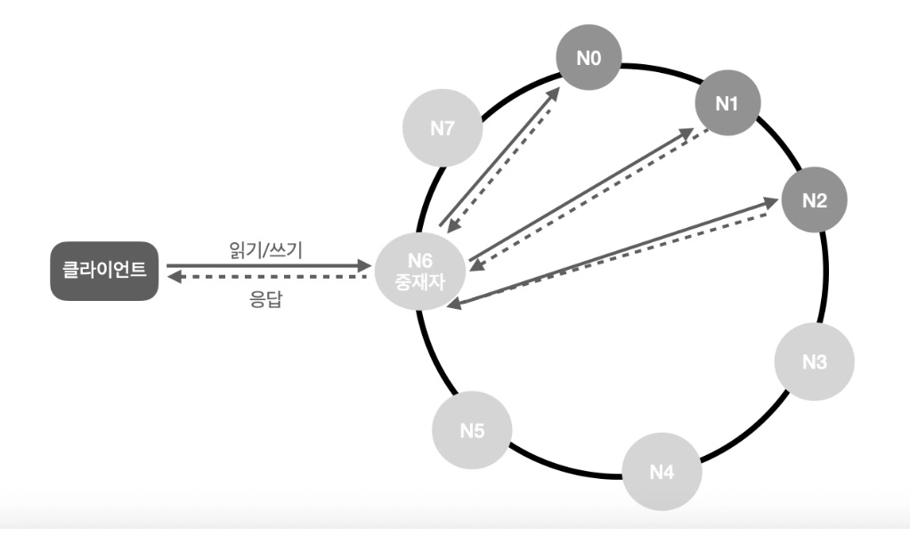
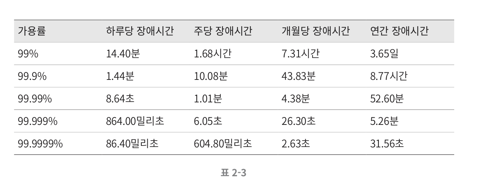

System design interviews simulate the process where two colleagues collaborate to find solutions to vague problems. Interviewers want to evaluate your design skills and discuss the reasoning behind the decisions made during the design process.

  

## 4-Step Approach for Effective Interviews

### Step 1: Understand the Problem and Establish Design Scope

System design interview problems are intentionally vague. It's important to make correct assumptions and gather necessary information for system construction.

**Examples of Good Questions:**
- What specific features need to be built?
- How many users will the product have?
- What is the company's technology stack? What existing services can we leverage?
- Are there existing cloud services that can be used to simplify the design?

**Chat System Design Example Questions:**
- Is this 1-on-1 chat or group chat?
- Is this a mobile app? Web app? Or both?
- What scale of users do we need to support?
- How many participants can join a group chat?
- What features should the chat app support? Should it support file attachments?
- Are there message length limitations?
- Is end-to-end encryption required?
- How long should chat history be stored?

### Step 2: Propose High-Level Design and Get Buy-In

Present an initial blueprint of your design and get feedback from the interviewer.

**Elements to Include:**
- API endpoints and HTTP methods
- Database schema
- High-level diagram

**Chat System Example:**
- API for sending messages
- API for receiving new messages
- Data model including user and message tables
- High-level diagram showing the overall system

**Tips for Using Whiteboard or Paper:**
- Stand or sit where you can face the interviewer while talking
- Be careful not to make diagrams too complex

### Step 3: Detailed Design

Once you've confirmed design goals and functional scope with the interviewer, focus on specific components for detailed design.

**Areas to Generally Focus On:**
- Prioritize the most critical components in the system
- Manage time - there isn't time to cover every detail
- Understand which components the interviewer wants to focus on

**Chat System Detailed Design Example:**
- Message sending and receiving flow
- Online status indication feature
- Push notifications
- Chat history storage and synchronization

### Step 4: Wrap Up

Suggest directions that the interviewer might want to discuss further.

**Topics for Discussion:**
- **System Bottlenecks**: Are there components that could become bottlenecks in the system? How would you resolve them?
- **Scale Requirements**: What if users grow to 10 million?
- **Additional Required Components**: Are there additional components to consider?
- **Error Scenarios**: What if servers fail? What about network failures?
- **Operational Issues**: How would you collect metrics? What about logs?
- **Next Scale**: How would you scale the current design to handle a million users?

  

## Do's and Don'ts

### Do's
- **Always clarify**: Ask questions if you're not sure you understand the requirements
- **Understand system components**: Databases, caches, load balancers, microservices, etc.
- **Show your calculation process**: Clearly demonstrate how you calculate estimates
- **State your assumptions**: Make reasonable assumptions and write them down for later reference
- **Offer multiple solutions**: Present multiple approaches from a trade-off perspective
- **Involve the interviewer in the solution-finding process**: Communicate with the interviewer

### Don'ts
- **Don't make typical mistakes**: Don't jump straight into details at the start of the interview
- **Avoid getting stuck on your initial design**: Ask for feedback and adjust the design if needed
- **Don't design in silence**: Communicate
- **Don't design without confirming requirements or assumptions**

  

## Time Allocation

Recommended time allocation for a 45-minute interview:

- **Step 1 Problem Understanding and Design Scope**: 3-10 minutes
- **Step 2 High-Level Design Proposal**: 10-15 minutes
- **Step 3 Detailed Design**: 10-25 minutes
- **Step 4 Wrap-Up**: 3-5 minutes

  

## Summary

System design interviews are not about testing knowledge. They simulate two engineers collaborating to design complex systems together.

The key points are:

- **Follow the correct procedure**
- **Present appropriate level of detail**
- **Communicate with the interviewer**
- **Offer solutions from multiple perspectives**

There is no perfect design. Every system has trade-offs, and interviewers want to see how you reason through these trade-offs.