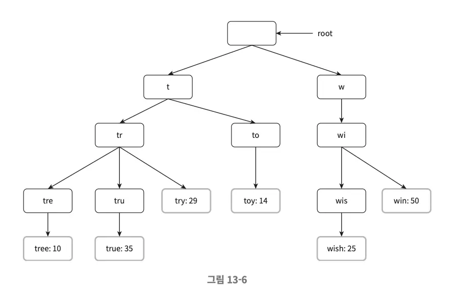
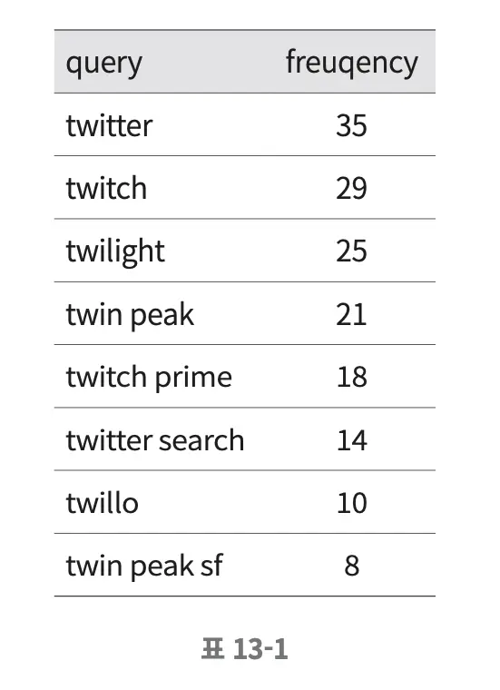
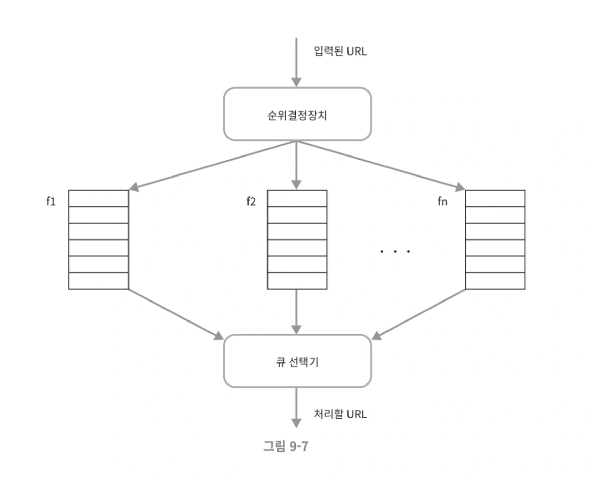

A rate limiter is a device used to control the rate of traffic sent by a client or service. In the HTTP context, it limits the number of client requests allowed to be sent over a specified period. API requests that exceed the threshold are blocked.

<br></br>

## Why Use a Rate Limiter



### Main Reasons
- **Prevent resource starvation from DoS attacks**: Whether intentional or not, Twitter limits users to 300 tweets per hour.
- **Cost reduction**: Limiting additional requests means fewer servers are needed, and more resources can be allocated to high-priority APIs.
- **Prevent server overload**: Rate limiters can be used to filter out traffic from bots or users' incorrect usage patterns.

<br></br>

## Step 1: Understand the Problem and Establish Design Scope

There are multiple algorithms for implementing rate limiters, each with unique advantages and disadvantages. Communication with the interviewer is essential to clarify what kind of rate limiter needs to be built.

**Example Questions:**
- Is this a client-side or server-side rate limiter?
- What criteria will be used to control API calls? IP address? User ID? Or other criteria?
- What is the system scale? Is it for a startup or a large enterprise?
- Does the system need to work in a distributed environment?
- Should the rate limiter be an independent service or embedded in application code?
- Should users be notified when their requests are throttled by the rate limiter?

**Requirements Summary:**
- Accurately limit requests that exceed the configured rate
- Low latency: Rate limiter should not adversely affect HTTP response time
- Use as little memory as possible
- Distributed rate limiting: Rate limiter should be shareable across multiple servers or processes
- Exception handling: Should clearly show to users
- High fault tolerance: Rate limiter failures should not affect the entire system

<br></br>

## Step 2: Propose High-Level Design and Get Buy-In

### Where to Place the Rate Limiter



**Client-Side Implementation**
- Clients are generally unreliable, so rate limiting cannot be reliably enforced
- Client requests can be easily forged

**Server-Side Implementation**
- It's common to place rate limiters on the server side

**Middleware**
- Another approach is to create rate limiting middleware that controls requests going to API servers

### Rate Limiting Algorithms

#### 1. Token Bucket Algorithm



**How it Works:**
- Assume there's a container with specified capacity
- The bucket is periodically filled with a preset amount of tokens
- No more tokens are added to a full bucket
- Each request consumes one token when processed
- When a request arrives with sufficient tokens in the bucket, one token is removed and the request is forwarded to the system
- If there aren't enough tokens, the request is dropped

**Parameters:**
- Bucket size: Maximum number of tokens the bucket can hold
- Refill rate: How many tokens are supplied to the bucket per second

**Advantages:**
- Easy to implement
- Memory efficient
- Can handle bursty traffic

**Disadvantages:**
- The two parameters (bucket size and token refill rate) can be challenging to tune properly

#### 2. Leaking Bucket Algorithm


**How it Works:**
- Similar to token bucket algorithm, but request processing rate is fixed
- Usually implemented with a FIFO queue
- When a request arrives, check if the queue is full. If there's space, add to queue
- If the queue is full, drop new requests
- Requests are pulled from the queue and processed at regular intervals

**Parameters:**
- Bucket size: Equal to queue size. Queue holds requests to be processed
- Outflow rate: How many items to process per specified time, usually expressed per second

**Advantages:**
- Memory efficient due to limited queue size
- Suitable when stable output is needed due to fixed processing rate

**Disadvantages:**
- When a lot of traffic comes in a short time, old requests accumulate in the queue, and recent requests may not be processed in time
- The two parameters can be challenging to tune correctly

#### 3. Fixed Window Counter Algorithm

**How it Works:**
- Divide timeline into fixed-interval windows and attach a counter to each window
- When a request is received, increase the counter value by 1
- When the counter reaches a preset threshold, new requests are dropped until a new window opens

**Advantages:**
- Memory efficient
- Easy to understand
- Resetting the counter when the window closes is suitable for handling certain traffic patterns

**Disadvantages:**
- When a lot of traffic concentrates near window boundaries, more requests than the system's expected processing limit can be processed

#### 4. Sliding Window Log Algorithm

**How it Works:**
- This algorithm solves the fixed window counter algorithm's problems
- Tracks request timestamps. Timestamp data is usually stored in cache like Redis sorted sets
- When a new request comes, remove expired timestamps. Expired timestamps are those older than the current window's start time
- Add the new request's timestamp to the log
- If the log size is less than or equal to the allowed count, forward the request to the system. Otherwise, reject processing

**Advantages:**
- The rate limiting mechanism implemented by this algorithm is very precise. At any moment in any window, the number of allowed requests never exceeds the system's rate limit

**Disadvantages:**
- Consumes a lot of memory as it stores timestamps of rejected requests too

#### 5. Sliding Window Counter Algorithm


**How it Works:**
- Combines fixed window counter and sliding window log
- Current 1-minute request count + previous 1-minute request count × overlap ratio between sliding window and previous minute

**Advantages:**
- Handles bursty traffic well by calculating current window state based on previous time period's average processing rate
- Memory efficient

**Disadvantages:**
- Somewhat loose as it calculates estimates assuming uniform distribution in the previous time period. However, Cloudflare experiments show only 0.003% error

### High-Level Architecture


The basic idea of rate limiting algorithms is simple:
- Maintain a counter that tracks how many requests have been received
- If the counter value exceeds a limit, additional requests are rejected

Where to store the counter? Database is not desirable due to slow disk access. Memory-based cache is preferable, and Redis is a frequently used memory-based storage device for implementing rate limiters.

**INCR**: Increases the value of the memory-stored counter by 1
**EXPIRE**: Sets a timeout value for the counter. The counter is automatically deleted after the set time

<br></br>

## Step 3: Detailed Design

### Rate Limiting Rules

Rate limiting rules are usually stored on disk as configuration files:

```yaml
domain: messaging
descriptors:
  - key: message_type
    Value: marketing
    rate_limit:
      unit: day
      requests_per_unit: 5
  - key: message_type  
    Value: social
    rate_limit:
      unit: day
      requests_per_unit: 20
```

### Handling Traffic Exceeding Rate Limits

When a request hits rate limits, the API sends an **HTTP 429 response (too many requests)** to the client. In some cases, rate-limited messages are stored in queues for later processing.

#### HTTP Headers Used by Rate Limiters

How can clients detect if they're being rate limited? How do they know how many more requests they can send before hitting the rate limit? The answer is HTTP response headers:

- **X-Ratelimit-Remaining**: Number of remaining requests allowed within the window
- **X-Ratelimit-Limit**: Number of requests the client can send per window
- **X-Ratelimit-Retry-After**: Number of seconds to wait before sending requests again to avoid hitting rate limit

### Implementing Rate Limiters in Distributed Environments

Implementing rate limiters in distributed environments requires solving two difficult problems:

#### Race Condition


Rate limiters work roughly as follows:
1. Read the counter value from Redis
2. Check if counter + 1 exceeds the threshold
3. If it doesn't exceed, increase the counter value stored in Redis by 1

Race conditions are a well-known problem. The most widely known solution is locks. However, locks significantly reduce system performance. Solutions include using Lua scripts or Redis data structures called sorted sets.

#### Synchronization Issues


Synchronization issues can appear when using multiple rate limiter servers. One solution is using sticky sessions to always send requests from the same client to the same rate limiter. However, this approach is neither scalable nor flexible.

A better solution is using centralized data storage like Redis.

### Performance Optimization

**Supporting multiple data centers**: Supporting multiple data centers is important to reduce latency. User traffic is directed to the nearest edge server to reduce latency.

**Using eventual consistency model when synchronizing data between limiters**: When rate limiters are installed in multiple regions, use the eventual consistency model.

### Monitoring

After installing rate limiters, monitor if they're working effectively:

- Whether the adopted rate limiting algorithm is effective
- Whether the defined rate limiting rules are effective

For example, if rate limiting rules are too strict, many valid requests won't be processed. In such cases, rules may need to be relaxed.

<br></br>

## Step 4: Wrap Up

This chapter examined various rate limiting algorithms and their pros and cons. Additional considerations include:

**Hard vs Soft Rate Limiting**
- Hard: Request count can never exceed the threshold
- Soft: Request count can temporarily exceed the threshold

**Rate limiting at various layers**: This chapter only looked at application layer rate limiting, but rate limiting is possible at other layers too.

**How to avoid rate limiting. How to design clients optimally**:
- Use client-side caches to reduce API call frequency
- Understand rate limiting thresholds and avoid sending too many messages in a short time
- Include exception and error handling code in clients so they can gracefully recover from exceptional situations
- Implement retry logic with sufficient backoff time