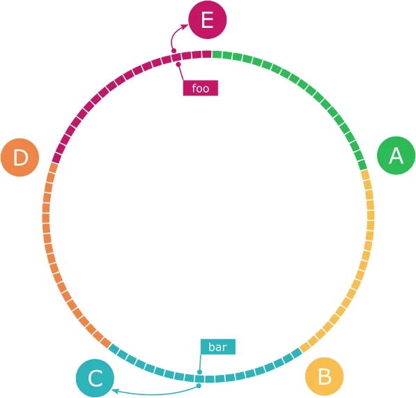
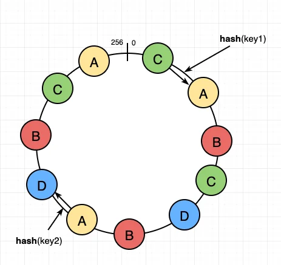

Consistent hashing is a hashing technique that redistributes only k/n keys on average when the hash table is resized, where k is the number of keys and n is the number of slots. In contrast, most traditional hash tables require redistributing almost all keys when the number of slots changes.

  

## Hash Key Rehashing Problem

If there are N cache servers, a common way to balance the load evenly is to use a hash function:

**serverIndex = hash(key) % N**

This method works well when the server pool size is fixed and data distribution is even. However, problems arise when servers are added or removed.

For example, let's say server 1 fails and stops operating. Now the server pool size becomes 3. The hash value for keys doesn't change, but the server index values change: hash % 3. As a result, key0 is redistributed from server 1 to server 0, and key1 from server 2 to server 1.

Consistent hashing emerged to solve such problems.

  

## Consistent Hashing

### Hash Space and Hash Ring

Let's say we use SHA-1 as hash function f, and its output value range is x0, x1, x2, x3, ..., xn. SHA-1's hash space ranges from 0 to 2^160 - 1. That is, x0 is 0, xn is 2^160 - 1, and the remaining hash values are between them.

By bending this hash space and connecting both ends, we create a hash ring.

### Hash Servers

Using hash function f, we can map server IPs or names to some position on this ring.

In the above figure, we've placed 4 servers on the hash ring:
- Server 0: f("Server0") = s0
- Server 1: f("Server1") = s1
- Server 2: f("Server2") = s2
- Server 3: f("Server3") = s3

### Hash Keys

Keys are also placed on the hash ring using the same hash function.

### Server Lookup

The server where a key is stored is the first server encountered when searching clockwise from that key's position.

- key0 is stored on server 0
- key1 is stored on server 1
- key2 is stored on server 2
- key3 is stored on server 3

### Adding Servers

When a new server 4 is added, only key0 is redistributed to server 4. key1, key2, and key3 remain on the same servers.

### Removing Servers

When server 1 is deleted, only key1 is redistributed to server 2. Other keys are not affected.

  

## Two Problems with Basic Consistent Hashing Algorithm

### Basic Procedure

The consistent hashing algorithm works as follows:

1. Map servers and keys to the hash ring using a uniformly distributed hash function
2. To find the server where a key is stored, go clockwise from the key's position on the ring until you meet the first server

This approach has two problems:

### First Problem: It's impossible to keep partition sizes uniform when servers are added or removed

When servers 1 and 3 are deleted from the hash ring, only servers 0 and 2 remain. key0 and key1 are handled by server 0, while key2 and key3 are handled by server 2. Server 0 handles 50% of the entire hash space, and server 2 handles the remaining 50%.

### Second Problem: It's difficult to achieve uniform key distribution

If servers are not uniformly distributed on the hash ring, some servers may be allocated very small hash spaces while others get very large hash spaces.

  

## Virtual Nodes

A technique called virtual nodes or replicas is used to solve this problem.

### How Virtual Nodes Work

There can be multiple nodes pointing to actual nodes or servers, and these are called virtual nodes.

In the above figure, servers 0 and 1 each have 3 virtual nodes. The number 3 is arbitrary; much larger values are used in actual systems. Instead of using just s0 to place server 0 on the ring, we use three virtual nodes: s0_0, s0_1, s0_2. Similarly, when placing server 1 on the ring, we use s1_0, s1_1, s1_2.

Each server must manage multiple partitions, not just one.

The first virtual node encountered when searching clockwise from a key's position determines the server where that key will be stored. In the above figure, to find the server where k0 is stored, we search clockwise from k0's position and find the first virtual node s1_1. Therefore, k0 is stored on server 1, which s1_1 represents.

### Number of Virtual Nodes

As the number of virtual nodes increases, key distribution becomes more uniform. This is because the standard deviation becomes smaller, leading to more even data distribution. Standard deviation is a measure showing how data is spread out. According to online research results, setting the number of virtual nodes to 100-200 results in standard deviation values between 5% (when virtual nodes are 200) to 10% (when virtual nodes are 100) of the average.

Increasing the number of virtual nodes further reduces standard deviation values. However, more space is needed to store virtual node data. This is an area requiring trade-off decisions.

  

## Determining Keys to Redistribute

When servers are added or removed, some data must be redistributed. Let's find out which range of keys need to be redistributed.

### Adding Servers

Let's say new server 4 is added at s4. The range of keys affected by this change is from s4 (newly added node) to the first server in the counterclockwise direction, s3. That is, keys between s3 and s4 need to be redistributed to server 4.

### Removing Servers

When server 1 (s1) is deleted, keys between s1 (deleted node) and the first server in the counterclockwise direction, s0, need to be redistributed to s2.

  

## Benefits of Consistent Hashing

Benefits gained from using consistent hashing techniques are:

- **The number of keys redistributed when servers are added or removed is minimized**
- **Data is distributed more uniformly, making it easier to achieve horizontal scalability**
- **Reduces hotspot key problems**: When access to specific shards is too frequent, server overload problems can occur. Consistent hashing reduces the likelihood of such problems by distributing data more uniformly

  

## Famous Systems Using Consistent Hashing

Consistent hashing is used in the following systems:

- **Amazon DynamoDB's partitioning-related components**
- **Data partitioning in Apache Cassandra clusters**
- **Discord chat application**
- **Akamai CDN**
- **Maglev network load balancer**

  

## Summary

In this chapter, we examined why consistent hashing is needed and how it works.

**Benefits of Consistent Hashing:**
- Minimizes the number of keys redistributed when servers are added or removed
- Makes it easier to achieve horizontal scalability as data is distributed more uniformly
- Reduces hotspot key problems

**Basic Procedure:**
1. Map servers and keys to the hash ring using a uniformly distributed hash function
2. The first server encountered when searching clockwise from a key's position is where the key will be stored

In actual systems, consistent hashing algorithms are implemented using virtual node techniques. Using virtual nodes:
- Each server manages multiple partitions, not just one
- Increasing the number of virtual nodes reduces standard deviation, enabling more uniform data distribution