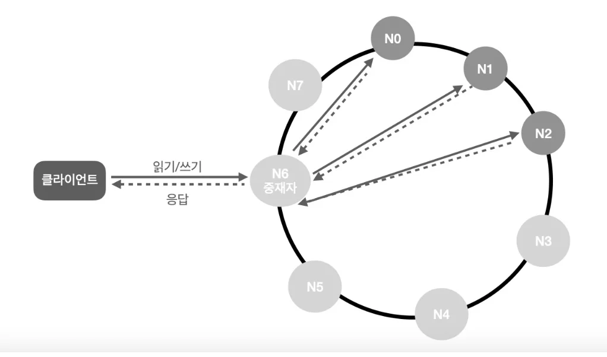

A key-value store is a non-relational database, also called a key-value database. Values stored in this store can only be accessed through unique identifiers called keys. The connection between keys and values is called a "key-value" pair.

  

## Characteristics of Key-Value Stores

In key-value pairs, keys must be unique, and values associated with keys can only be accessed through keys. Keys can be plain text or hash values. For performance reasons, shorter keys are better.

Values can be strings, lists, or objects. Key-value stores typically don't care what comes as values.

**Examples of key-value pairs:**
- Key: "last_logged_in_at", Value: "2022-01-01 10:00:00"
- Key: 144, Value: "{\"name\":\"john\", \"age\":30}"

  

## Understanding the Problem and Establishing Design Scope

Perfect design doesn't exist. You need to find balance between read, write, and memory usage, and make trade-off decisions between data consistency and availability.

**Requirements confirmed through questions:**
- Key-value pair size is under 10KB
- Must be able to store large data
- Must provide high availability. System should respond quickly even during failures
- Must provide high scalability. Automatic server scaling based on traffic volume
- Data consistency level should be adjustable
- Response latency should be low

  

## Single Server Key-Value Store

Designing a key-value store using only one server is easy. The most intuitive method is storing all key-value pairs as hash tables in memory. However, this approach has several constraints:

- **Fast access is possible, but storing all data in memory may not be feasible**
- **All data is lost if single server fails**

Two improvements can be considered to overcome these constraints:
- Data compression
- Store frequently used data in memory and rest on disk

However, even with these improvements, single server limitations cannot be overcome. A distributed key-value store must be built.

  

## Distributed Key-Value Store

Distributed key-value stores are also called distributed hash tables. When designing distributed systems, understanding the CAP theorem is important.

### CAP Theorem

The CAP theorem states that it's impossible to design a distributed system that simultaneously satisfies all three requirements: Consistency, Availability, and Partition tolerance.

**Consistency**: All clients accessing the distributed system should see the same data regardless of which node they connect to.

**Availability**: Clients accessing the distributed system should always receive responses even when some nodes fail.

**Partition Tolerance**: Partition means communication failure between two nodes. Partition tolerance means the system should continue operating even when network partitions occur.

### Real-world Understanding of CAP Theorem

Since network failures are inevitable, systems must be designed to tolerate partition problems. Therefore, we can only choose between consistency and availability.

**CP System**: Key-value store supporting consistency and partition tolerance. Sacrifices availability.

**AP System**: Key-value store supporting availability and partition tolerance. Sacrifices data consistency.

**CA System**: Key-value store supporting consistency and availability. Doesn't support partition tolerance. Since network failures are inevitable, distributed systems must be designed to handle partition problems. Therefore, CA systems don't actually exist.

  

## System Components

Now let's look at core components and technologies used to implement key-value stores:

- Data partitioning
- Data replication
- Consistency
- Inconsistency resolution
- Failure handling
- System architecture diagram
- Write path
- Read path

### Data Partitioning

For large-scale applications, storing all data on one server is impossible. The simplest solution is dividing data into smaller partitions and storing them on multiple servers.

**Requirements when dividing data into partitions:**
- Must be able to distribute data evenly across multiple servers
- Must minimize data movement when nodes are added or removed

Consistent hashing covered in Chapter 5 can satisfy both requirements.

**How to partition data using consistent hashing:**
- Place servers on hash ring
- Place keys on the same ring
- The server where a key is stored is the first server encountered when searching clockwise from the key's position

### Data Replication

To ensure high availability and reliability, data needs to be asynchronously replicated to N servers, where N is a tunable value.

**Method for selecting N servers:**
After placing a key on the hash ring, traverse the ring clockwise from that point and store data replicas on the first N servers encountered. For example, with N=3, key0 is stored on s1, s2, s3.

**Considerations when using virtual nodes:**
When using virtual nodes, the number of actual physical servers corresponding to the selected N nodes may be less than N. To avoid this problem, ensure the same physical server isn't selected multiple times when choosing nodes.

### Data Consistency

Data replicated across multiple nodes must be properly synchronized. The Quorum Consensus protocol can guarantee consistency for both read/write operations.

**Quorum consensus definitions:**
- **N = Number of replicas**
- **W = Write quorum. For write operation to be considered successful, must receive write success responses from at least W servers**
- **R = Read quorum. For read operation to be considered successful, must receive responses from at least R servers**

**Meaning of W=1**: Write operation considered successful when data is written to just one server
**Meaning of W=N**: Write operation considered successful only when write succeeds on all servers

**Determining values of N, W, R is a typical process of finding trade-offs between response latency and data consistency:**

**When W + R > N**: Strong consistency is guaranteed because there will be at least one overlapping node with latest data to ensure consistency.

**When W + R ≤ N**: Strong consistency is not guaranteed.

### Consistency Models

Consistency models are another important factor to consider when designing key-value stores.

**Strong consistency**: All read operations return the most recently updated results. Clients never see out-of-date data.

**Weak consistency**: Read operations may not return the most recently updated results.

**Eventual consistency**: A form of weak consistency where update results are eventually reflected in all replicas.

A common way to achieve strong consistency is prohibiting reads/writes on data until current write operation results are reflected in all replicas. This method is not suitable for high-availability systems because processing of new requests stops.

### Inconsistency Resolution Technique: Vector Clocks

Replicating data increases availability but raises the possibility of consistency breaking between replicas. Versioning and vector clocks are technologies used to resolve this problem.

**Versioning** means creating a new version of data each time it's modified. Therefore, each version of data is immutable.

**Vector clocks** are techniques that express versions using [server, version] pairs.

**Vector clock operation example:**
1. Client writes D1 to server Sx. Vector clock is D1([Sx, 1])
2. Another client writes D2 to server Sx. Vector clock is D2([Sx, 2])
3. Another client writes D3 to server Sy. Vector clock is D3([Sx, 2], [Sy, 1])
4. Yet another client writes D4 to server Sz. Vector clock is D4([Sx, 2], [Sy, 1], [Sz, 1])

**Disadvantages of vector clocks:**
- Client implementation becomes complex because conflict detection and resolution logic must be in the client
- The number of [server: version] pairs grows rapidly

In practice, this problem is solved by recording only the N most frequently used servers.

### Failure Handling

Must detect failures and distinguish whether failures are temporary or permanent.

#### Failure Detection

In distributed systems, we don't immediately consider server A failed just because one server says "server A is dead". Usually two or more servers must report server A's failure before considering it actually failed.

**Gossip protocol** can reduce time needed for failure detection.

**Gossip protocol operations:**
- Each node maintains a membership list. Membership list is a list of member ID and heartbeat counter pairs
- Each node periodically increments its own heartbeat counter
- Each node periodically sends its heartbeat counter list to randomly selected nodes
- Nodes receiving heartbeat counter lists update membership lists with latest values
- If a member's heartbeat counter isn't updated for a specified time, that member is considered failed

#### Handling Temporary Failures

**Sloppy quorum approach** can be used. This enforces quorum requirements while ignoring failed servers when calculating quorum.

When requests to failed servers due to network or server problems cannot be processed, other servers temporarily take over that role. The procedure of batch-applying changes when failed servers recover to preserve data consistency is called **hinted handoff**.

#### Handling Permanent Failures

Hinted handoff technique cannot handle permanent failures. To detect broken consistency between replicas and reduce amount of transferred data, **Merkle trees** are used.

**Merkle tree characteristics:**
- Each node stores hash of values in child nodes, or hash values calculated from child node labels
- Useful for synchronizing large amounts of data
- Amount of data to synchronize decreases at each step

  

## System Architecture

Let's look at key-value store architecture based on all techniques discussed so far.

**Main characteristics:**
- Clients communicate with two simple APIs provided by key-value store: get(key) and put(key, value)
- Coordinator is a node that acts as proxy to key-value store for clients
- Nodes are distributed on consistent hashing hash ring
- System is completely distributed to automatically add or remove nodes
- Data is replicated across multiple nodes
- No SPOF exists since all nodes have same responsibilities

Each node must support all the following functions:

### Write Path

Let's see what happens when write requests reach specific nodes.

1. Write request is recorded in commit log file
2. Data is written to memory cache
3. When memory cache is full or reaches predefined threshold, data is written to SSTable on disk. SSTable stands for Sorted-String Table, managing <key, value> pairs in sorted list form

### Read Path

Nodes receiving read requests first check if data is in memory cache. If so, that data is returned to client as shown in the figure.

When data is not in memory, it must be retrieved from disk. Bloom filters are commonly used to efficiently find which SSTable contains the target key.

1. Check if data is in memory. If not, go to step 2
2. Data not in memory, so check bloom filter
3. Use bloom filter to find which SSTable stores the key
4. Retrieve data from SSTable
5. Return that data to client

  

## Summary

This chapter examined characteristics and core components that distributed key-value stores should have:

**Core Components and Technologies:**
- Data partitioning: Use consistent hashing to evenly distribute data across multiple servers
- Data replication: Asynchronously replicate data to N servers
- Consistency: Use quorum consensus protocol
- Inconsistency resolution: Use vector clocks
- Failure handling: Detect failures with gossip protocol, handle temporary failures with hinted handoff, handle permanent failures with Merkle trees
- System architecture: Completely distributed architecture with no SPOF

**Technical Trade-offs:**
- Balance between read, write, and memory usage
- Balance between consistency and availability
- Strong consistency vs eventual consistency

In distributed systems, everything cannot be perfectly satisfied, so appropriate trade-offs must be found according to system requirements.