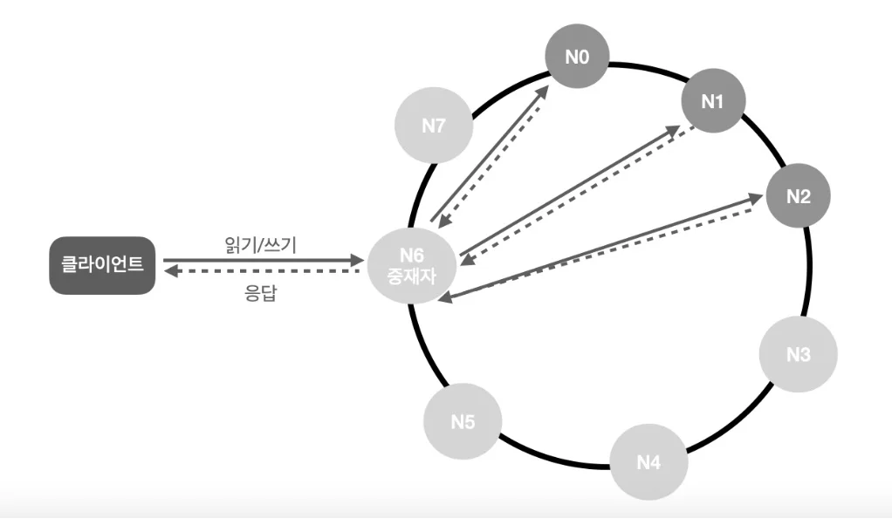

key-value 저장소는 key-value 데이터베이스라고도 불리는 비관계형 데이터베이스입니다. 이 저장소에 저장되는 값은 고유 식별자인 키를 통해서만 접근할 수 있습니다. 키와 값 사이의 이런 연결 관계를 "키-값" 쌍(pair)이라고 지칭합니다.

  

## key-value 저장소의 특징

key-value 쌍에서 키는 유일해야 하며, 키에 연결된 값은 키를 통해서만 접근 가능합니다. 키는 일반 텍스트일 수도 있고 해시 값일 수도 있습니다. 성능상의 이유로, 키는 짧을수록 좋습니다.

값은 문자열일 수도 있고 리스트일 수도 있고 객체일 수도 있습니다. key-value 저장소는 보통 값으로 무엇이 오든 상관하지 않습니다.

**key-value 쌍의 예:**
- 키: "last_logged_in_at", 값: "2022-01-01 10:00:00"
- 키: 144, 값: "{\"name\":\"john\", \"age\":30}"

  

## 문제 이해 및 설계 범위 확정

완벽한 설계란 존재하지 않습니다. 읽기, 쓰기, 그리고 메모리 사용량 사이에서 어떤 균형점을 찾고 데이터의 일관성과 가용성 사이에서 타협적 결정을 내려야 합니다.

**질문을 통해 확인할 요구사항:**
- 키-값 쌍의 크기는 10KB 이하다
- 큰 데이터를 저장할 수 있어야 한다
- 높은 가용성을 제공해야 한다. 따라서 시스템은 설사 장애가 있더라도 빨리 응답해야 한다
- 높은 규모 확장성을 제공해야 한다. 따라서 트래픽 양에 따라 자동적으로 서버 증설/삭제가 이루어져야 한다
- 데이터 일관성 수준은 조정이 가능해야 한다
- 응답 지연시간(latency)이 짧아야 한다

  

## 단일 서버 key-value 저장소

한 대 서버만 사용하는 key-value 저장소를 설계하는 것은 쉽습니다. 가장 직관적인 방법은 키-값 쌍 전부를 메모리에 해시 테이블로 저장하는 것입니다. 하지만 이 접근법에는 몇 가지 제약이 따릅니다:

- **빠른 접근은 가능하지만 모든 데이터를 메모리 안에 두는 것은 불가능할 수도 있다**
- **단일 서버에 장애가 발생하면 모든 데이터를 잃게 된다**

이런 제약을 극복하기 위해 두 가지 개선안을 생각해 볼 수 있습니다:
- 데이터 압축
- 자주 쓰이는 데이터만 메모리에 두고 나머지는 디스크에 저장

하지만 이렇게 해도 단일 서버가 지닐 수 있는 한계를 넘어설 수는 없습니다. 분산 key-value 저장소를 만들어야 합니다.

  

## 분산 key-value 저장소

분산 key-value 저장소는 분산 해시 테이블이라고도 불립니다. 분산 시스템을 설계할 때는 CAP 정리를 이해하는 것이 중요합니다.

### CAP 정리

CAP 정리는 일관성(Consistency), 가용성(Availability), 파티션 감내(Partition tolerance)라는 세 가지 요구사항을 동시에 만족하는 분산 시스템을 설계하는 것은 불가능하다는 정리입니다.

**일관성(Consistency)**: 분산 시스템에 접속하는 모든 클라이언트는 어느 노드에 접속했느냐에 관계없이 언제나 같은 데이터를 보게 되어야 한다.

**가용성(Availability)**: 분산 시스템에 접속하는 클라이언트는 일부 노드에 장애가 발생하더라도 항상 응답을 받을 수 있어야 한다.

**파티션 감내(Partition tolerance)**: 파티션은 두 노드 사이에 통신 장애가 발생하였음을 의미한다. 파티션 감내는 네트워크에 파티션이 생기더라도 시스템은 계속 동작하여야 한다는 것을 뜻한다.

### CAP 정리의 현실적 이해

네트워크 장애는 피할 수 없는 일이므로 파티션 문제를 감내할 수 있도록 시스템을 설계하여야 합니다. 따라서 우리가 선택할 수 있는 것은 일관성과 가용성 뿐입니다.

**CP 시스템**: 일관성과 파티션 감내를 지원하는 key-value 저장소. 가용성을 희생한다.

**AP 시스템**: 가용성과 파티션 감내를 지원하는 key-value 저장소. 데이터 일관성을 희생한다.

**CA 시스템**: 일관성과 가용성을 지원하는 key-value 저장소. 파티션 감내는 지원하지 않는다. 그런데 네트워크 장애는 피할 수 없으므로, 분산 시스템은 반드시 파티션 문제를 감내할 수 있도록 설계되어야 한다. 따라서 실제로는 CA 시스템은 존재하지 않는다.

  

## 시스템 컴포넌트

이제 key-value 저장소 구현에 사용될 핵심 컴포넌트들과 기술들을 살펴보겠습니다:

- 데이터 파티션
- 데이터 다중화(replication)
- 일관성(consistency)
- 일관성 불일치 해소(inconsistency resolution)
- 장애 처리
- 시스템 아키텍처 다이어그램
- 쓰기 경로(write path)  
- 읽기 경로(read path)

### 데이터 파티션

대규모 애플리케이션에서 전체 데이터를 한 대 서버에 넣는 것은 불가능합니다. 가장 단순한 해결책은 데이터를 작은 파티션들로 분할한 다음 여러 대 서버에 저장하는 것입니다.

**데이터를 파티션으로 나눌 때 만족해야 할 요구사항:**
- 데이터를 여러 서버에 고르게 분산할 수 있어야 한다
- 노드가 추가되거나 삭제될 때 데이터 이동을 최소화할 수 있어야 한다

5장에서 살펴본 안정 해시를 사용하면 이 두 요구사항을 만족할 수 있습니다.

**안정 해시를 사용하여 데이터를 파티션하는 방법:**
- 서버들을 해시 링에 배치한다
- 키를 같은 링 위에 배치한다  
- 어떤 키가 저장되는 서버는, 해당 키의 위치로부터 시계방향으로 링을 탐색해나가면서 만나는 첫 번째 서버다

### 데이터 다중화

높은 가용성과 안정성을 확보하기 위해서는 데이터를 N개 서버에 비동기적으로 다중화할 필요가 있습니다. 여기서 N은 튜닝 가능한 값입니다.

**N개 서버를 선택하는 방법:**
키를 해시 링 위에 배치한 후, 그 지점으로부터 시계 방향으로 링을 순회하면서 만나는 첫 N개 서버에 데이터 사본을 보관합니다. N=3인 경우를 예로 들면, key0은 s1, s2, s3에 보관됩니다.

**가상 노드 사용 시 주의사항:**
가상 노드를 사용한다면 선택한 N개 노드가 대응될 실제 물리 서버의 개수가 N보다 작아질 수 있습니다. 이 문제를 피하려면 노드를 선택할 때 같은 물리 서버를 중복 선택하지 않도록 해야 합니다.

### 데이터 일관성

여러 노드에 다중화된 데이터는 적절히 동기화가 되어야 합니다. 정족수 합의(Quorum Consensus) 프로토콜을 사용하면 읽기/쓰기 연산 모두에 일관성을 보장할 수 있습니다.

**정족수 합의 관련 정의:**
- **N = 사본 개수**
- **W = 쓰기 연산에 대한 정족수. 쓰기 연산이 성공한 것으로 간주되려면 적어도 W개의 서버로부터 쓰기 성공 응답을 받아야 한다**  
- **R = 읽기 연산에 대한 정족수. 읽기 연산이 성공한 것으로 간주되려면 적어도 R개의 서버로부터 응답을 받아야 한다**

**W=1의 의미**: 데이터가 한 대 서버에만 기록되면 쓰기 연산이 성공한 것으로 간주  
**W=N의 의미**: 모든 서버에 쓰기가 성공해야만 쓰기 연산이 성공한 것으로 간주

**N, W, R의 값을 정하는 것은 응답 지연과 데이터 일관성 사이의 타협점을 찾는 전형적 과정입니다:**

**W + R > N인 경우**: 강한 일관성이 보장됩니다. 일관성을 보장할 최신 데이터를 가진 노드가 최소 하나는 겹칠 것이기 때문입니다.

**W + R ≤ N인 경우**: 강한 일관성이 보장되지 않습니다.

### 일관성 모델

일관성 모델(consistency model)은 key-value 저장소를 설계할 때 고려해야 할 또 하나의 중요한 요소입니다.

**강한 일관성(strong consistency)**: 모든 읽기 연산은 가장 최근에 갱신된 결과를 반환한다. 클라이언트는 절대로 낡은(out-of-date) 데이터를 보지 않는다.

**약한 일관성(weak consistency)**: 읽기 연산은 가장 최근에 갱신된 결과를 반환하지 못할 수 있다.

**결과적 일관성(eventual consistency)**: 약한 일관성의 한 형태로, 갱신 결과가 결국에는 모든 사본에 반영되는 모델이다.

강한 일관성을 달성하는 일반적인 방법은, 모든 사본에 현재 쓰기 연산의 결과가 반영될 때까지 해당 데이터에 대한 읽기/쓰기를 금지하는 것입니다. 이 방법은 고가용성 시스템에는 적합하지 않은데, 새로운 요청의 처리가 중단되기 때문입니다.

### 비일관성 해소 기법: 벡터 시계

데이터를 다중화하면 가용성은 높아지지만 사본 간 일관성이 깨질 가능성은 높아집니다. 버저닝(versioning)과 벡터 시계(vector clock)는 이 문제를 해소하는 데 쓰이는 기술입니다.

**버저닝**은 데이터를 변경할 때마다 해당 데이터의 새로운 버전을 만드는 것을 뜻합니다. 따라서 각 버전의 데이터는 변경 불가능(immutable)합니다.

**벡터 시계**는 [서버, 버전] 순서쌍을 사용해 버전을 표현하는 기법입니다.

**벡터 시계 동작 예시:**
1. 클라이언트가 D1을 서버 Sx에 기록한다. 벡터 시계는 D1([Sx, 1])이다
2. 다른 클라이언트가 D2를 서버 Sx에 기록한다. 벡터 시계는 D2([Sx, 2])이다  
3. 다른 클라이언트가 D3을 서버 Sy에 기록한다. 벡터 시계는 D3([Sx, 2], [Sy, 1])이다
4. 또 다른 클라이언트가 D4를 서버 Sz에 기록한다. 벡터 시계는 D4([Sx, 2], [Sy, 1], [Sz, 1])이다

**벡터 시계의 단점:**
- 충돌 감지 및 해소 로직이 클라이언트에 들어가야 하므로, 클라이언트 구현이 복잡해진다
- [서버: 버전] 순서쌍의 개수가 빠르게 늘어난다

실제로는 가장 빈번하게 사용되는 N개 서버만 기록하는 방법으로 이 문제를 해결하기도 합니다.

### 장애 처리

장애를 감지하고 장애가 일시적인지 영구적인지 구분해야 합니다.

#### 장애 감지

분산 시스템에서는 그냥 한 대 서버가 "서버 A가 죽었다"라고 말한다고 해서 바로 서버 A를 장애 서버로 간주하지는 않습니다. 보통 두 대 이상의 서버가 서버 A의 장애를 보고해야 해당 서버에 실제로 장애가 발생했다고 간주합니다.

**가십 프로토콜(gossip protocol)**을 이용하면 장애 감지에 필요한 시간을 줄일 수 있습니다.

**가십 프로토콜의 동작:**
- 각 노드는 멤버십 목록을 유지한다. 멤버십 목록은 각 멤버 ID와 박동 카운터 쌍의 목록이다
- 각 노드는 주기적으로 자신의 박동 카운터를 증가시킨다  
- 각 노드는 무작위로 선정된 노드들에게 주기적으로 자기 박동 카운터 목록을 보낸다
- 박동 카운터 목록을 받은 노드는 멤버십 목록을 최신 값으로 갱신한다
- 어떤 멤버의 박동 카운터가 지정된 시간 동안 갱신되지 않으면 해당 멤버는 장애 상태인 것으로 간주한다

#### 일시적 장애 처리

**느슨한 정족수(sloppy quorum) 접근법**을 쓸 수 있습니다. 정족수 요구사항을 강제하되, 장애 상태인 서버는 무시하고 정족수를 계산하는 방법입니다.

네트워크나 서버 문제로 장애 상태인 서버로 가는 요청이 처리될 수 없는 경우, 다른 서버가 잠시 그 역할을 대신 수행합니다. 장애 서버가 복구되었을 때 변경사항을 일괄 반영하여 데이터 일치성을 보존하는 절차를 **단서 후 위임(hinted handoff)**이라고 합니다.

#### 영구 장애 처리

단서 후 위임 기법으로는 영구 장애를 처리할 수 없습니다. 사본 간의 일관성이 망가진 상태를 탐지하고 전송 데이터의 양을 줄이기 위해서는 **머클 트리(Merkle tree)**를 사용합니다.

**머클 트리의 특성:**
- 각 노드에는 자식 노드들에 보관된 값의 해시, 또는 자식 노드들의 레이블로부터 계산된 해시 값이 보관된다
- 대량의 데이터에 대한 동기화를 수행할 때 유용하다
- 각 단계별로 동기화할 데이터의 양이 줄어든다

  

## 시스템 아키텍처

지금까지 논의한 모든 기법들을 바탕으로 key-value 저장소의 아키텍처를 살펴보겠습니다.

**주요 특성:**
- 클라이언트는 key-value 저장소가 제공하는 두 가지 간단한 API와 통신한다: get(key) 및 put(key, value)
- 중재자(coordinator)는 클라이언트에게 key-value 저장소에 대한 프록시 역할을 하는 노드다  
- 노드들은 안정 해시의 해시 링 위에 분포한다
- 노드를 자동으로 추가 또는 삭제할 수 있도록, 시스템은 완전히 분산된다
- 데이터는 여러 노드에 다중화된다
- 모든 노드가 같은 책임을 지므로, SPOF는 존재하지 않는다

각 노드는 다음 기능들을 전부 지원해야 합니다:

### 쓰기 경로

쓰기 요청이 특정 노드에 도달했을 때 무슨 일이 벌어지는지 살펴보겠습니다.

1. 쓰기 요청이 커밋 로그 파일에 기록된다
2. 데이터가 메모리 캐시에 기록된다  
3. 메모리 캐시가 가득차거나 사전에 정의된 임계치에 도달하면, 데이터는 디스크에 있는 SSTable에 기록된다. SSTable은 Sorted-String Table의 줄임말로, 정렬된 리스트 형태로 <key, value>의 순서쌍을 관리하는 테이블이다

### 읽기 경로

읽기 요청을 받은 노드는 데이터가 메모리 캐시에 있는지부터 살핍니다. 있다면 그림처럼 해당 데이터를 클라이언트에게 반환합니다.

데이터가 메모리에 없는 경우에는 디스크에서 가져와야 합니다. 어느 SSTable에 찾는 키가 있는지 효율적으로 찾아내기 위해 블룸 필터(bloom filter)가 흔히 사용됩니다.

1. 데이터가 메모리에 있는지 확인. 없으면 2단계로
2. 데이터가 메모리에 없으므로 블룸 필터를 확인한다
3. 블룸 필터를 통해 어느 SSTable에 키가 보관되어 있는지 알아낸다
4. SSTable에서 데이터를 가져온다
5. 해당 데이터를 클라이언트에게 반환한다

  

## 정리

이 장에서는 분산 key-value 저장소가 가져야 하는 특성들과 핵심 컴포넌트들을 살펴보았습니다:

**핵심 컴포넌트와 기술:**
- 데이터 파티션: 안정 해시를 사용해 데이터를 여러 서버에 고르게 분산
- 데이터 다중화: N개 서버에 데이터 사본을 비동기적으로 다중화  
- 일관성: 정족수 합의 프로토콜 사용
- 일관성 불일치 해소: 벡터 시계 사용
- 장애 처리: 가십 프로토콜로 장애 감지, 단서 후 위임으로 일시적 장애 처리, 머클 트리로 영구 장애 처리
- 시스템 아키텍처: 완전히 분산된 아키텍처로 SPOF 없음

**기술적 절충 사항들:**
- 읽기, 쓰기, 메모리 사용량 사이의 균형
- 일관성과 가용성 사이의 균형
- 강한 일관성 vs 결과적 일관성

분산 시스템에서는 모든 것을 완벽하게 만족시킬 수 없으므로, 시스템의 요구사항에 따라 적절한 절충점을 찾아야 합니다.