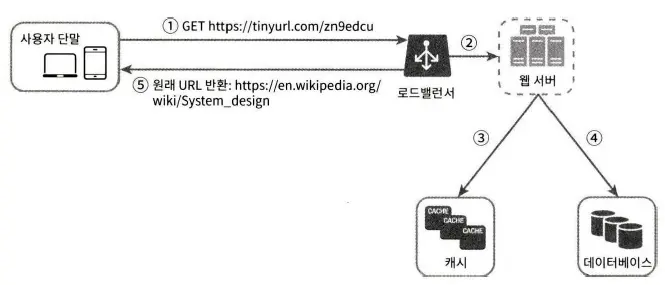

## 1. What is a Short URL?
- A short URL is a shortened version of the original URL that redirects to the original URL when accessed.
- Design considerations:
  - What is the traffic scale?
  - How long should the URL be?
  - Are there restrictions on characters to be used?
  - Can short URLs be deleted/updated in the system?

  

## 2. High-Level Design

### (1) API Endpoints
- Two API endpoints are needed for the URL shortener service:
  1. URL shortening endpoint (Parameter: original URL, Return: short URL)
  2. URL redirection endpoint (Return: original URL)

### (2) URL Redirection
- When you enter a short URL in the browser, the following happens:
  1. Returns Status Code 301 or 302
  2. Original URL is applied as location header value
- When implementing the API, hash tables can be considered as the most intuitive method (key: short URL, value: original URL)

#### 301 Permanently Moved
- Means HTTP request processing responsibility is permanently transferred to the URL in the location header value.
- `Browser caches this response.`
- Server load can be reduced because browser caching is applied.

#### 302 Found
- Means HTTP request processing responsibility is temporarily transferred to the URL in the location header value.
- Unlike 301, browsers do not cache this response.
- More precise traffic analysis is possible compared to 301 because requests come to the server every time.

### 3. URL Shortening Method
- Assuming a form like https://tinyurl.com/{hashvalue}
- The most important thing in URL shortening is finding a function f(x) that satisfies f(original url) = hashvalue.
  - Obviously, if the input URL changes, the hashvalue should also change.
  - hashvalue should be restorable to the original URL.

  

## Detailed Design

### 1. Data Model
- Small services might use memory hash tables, but they cannot support the service as it grows.
- Therefore, short URL - original URL pairs can be stored in RDB (Redis might be considered depending on scale)
- Main columns include id, shortURL, longURL.

### 2. Hash Function
- Hash function is used for original URL -> hashvalue conversion.
- The length of hashvalue can be determined based on character composition, data retention period, and expected traffic.
  - For example, assume character composition is numbers and uppercase/lowercase letters, retention period is 10 years, expected traffic is 100 million cases per day.
  - Available characters: find the minimum n that satisfies 62^n >= 100 million * 365 days * 10 years, this value becomes the length of hashvalue.

#### Hash Function Strategy

#### Collision Resolution After Hashing
- Hash functions will typically use existing functions (e.g., CRC32, MD5, SHA-1)
- Since all three functions have relatively long result values, they can be truncated to match the hashvalue length calculated above.
- However, this increases the probability of using the same hashvalue.
- This situation can be resolved through the following logic:
  1. Use hash function to create shortURL from longURL
  2. Check if shortURL exists in DB
  3. If not, store in DB; if exists, add predefined string to hashvalue until collision is resolved
- The above logic adds one DB query, and using `bloom filter` can be considered to minimize delay.

#### Base-62 Conversion
- Strategy of converting URL pair data ID to base-62 and using it as hashvalue (using base-62 because there were 62 available characters for hashvalue as assumed earlier)
- No possibility of collision but requires unique ID generator as prerequisite.
- When using base-62 conversion, it operates through the following logic:
  1. Query longURL in DB
  2. If exists, return shortURL retrieved from DB
  3. If not, generate new ID
  4. Convert generated ID to shortURL using base-62
  5. Store in DB and return

### 3. URL Redirection

- The feature of the above design is applying cache.
- If mostly read operations are performed and the system is designed so data modification/updates don't occur, there's no reason not to have cache.

### 4. Additional Discussion Points
- Rate limiting device
- Web server scaling
- Database scaling
- Data analysis solution
- Availability, data consistency, stability