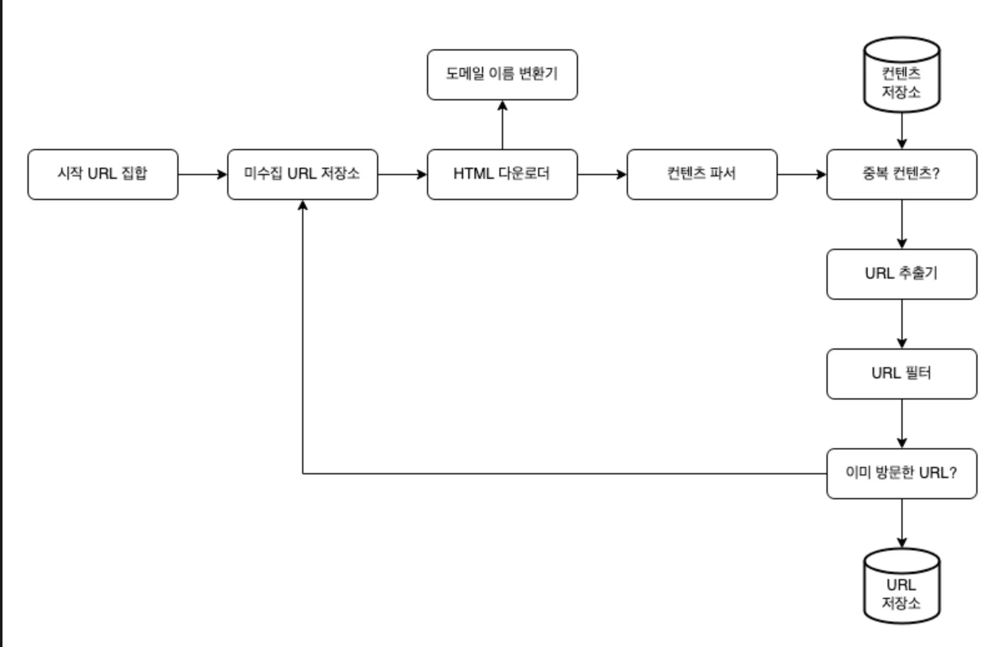
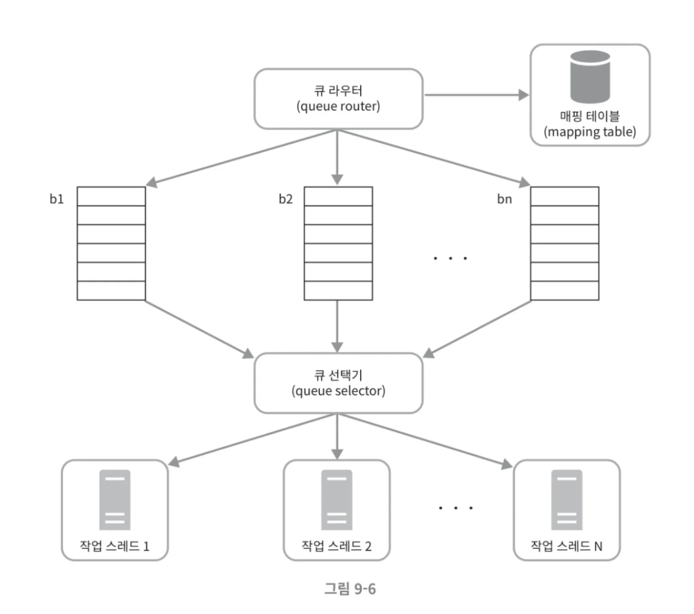
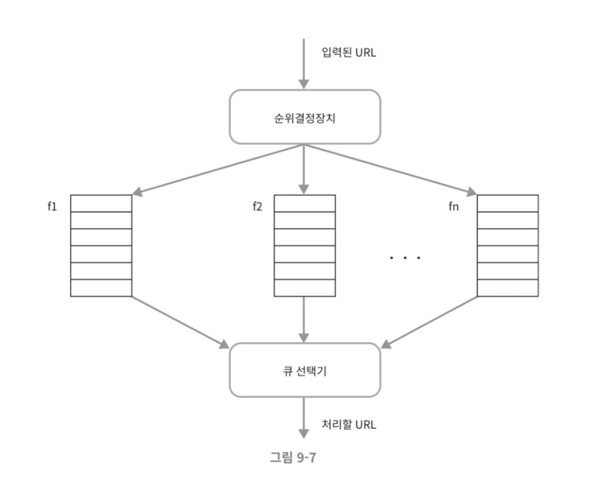
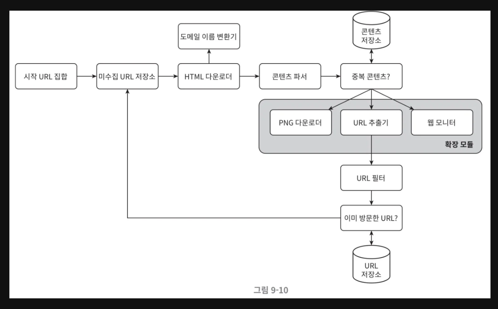

<br></br>

## 1. What is a Web Crawler?
- A program designed to find content uploaded or updated on the web
- Content can be in various formats (web page, pdf, image ...)
- Usage examples: Search engine indexing, web archiving, web mining, web monitoring

<br></br>

## 2. Design Considerations
- Purpose of web crawler
- Scale of web pages to be collected
- Whether to respond to changes in web page format
- Whether to store web pages and retention period
- Whether to handle duplicate content, etc...
- Scalability, reliability, number of requests to target web pages, scalability of collected content, etc...

<br></br>

## 3. High-Level Design


### (1) Seed URL Set
- Set of starting points where web crawler begins crawling
- Usually uses strategy of dividing entire URL space into small subsets (region, topic, etc...)

### (2) URL Frontier
- To manage crawling state, URLs are divided into URLs to download / downloaded URLs
- Component that stores and manages URLs to download among these is URL frontier

### (3) HTML Downloader
- Component that takes URL as parameter and downloads content

### (4) DNS Resolver
- Component that converts URLs to corresponding IPs

### (5) Content Parser
- Responsible for parsing and validating downloaded content
- Filters data in desired format
- Implementing content parser within crawling server slows crawling process, so can consider having it as separate component

### (6) Content Duplication Detection
- According to the book, about 29% of web content is duplicate
- Component that reduces duplicate content and data processing time by introducing appropriate data structures
- While string comparison is most intuitive method for HTML comparison, the book recommends hash value comparison for performance at large scale

### (7) Content Storage
- System that stores collected content
- Can be selected considering content type, size, access frequency, retention period, etc.
- The book chose storage using both disk and memory

### (8) URL Extractor
- Responsible for parsing HTML pages and extracting links
- For example, converts relative paths to absolute paths by adding domain

### (9) URL Filter
- Responsible for excluding specific content types, file extensions, URLs causing errors, URLs in access exclusion list from crawling targets

### (10) URL Seen?
- Component that filters already visited URLs based on URLs to download / downloaded URLs
- The book manages URLs to download / downloaded URLs through data structures
- Can reduce server load and prevent infinite loops through this component
- Bloom filter or hash table are widely used as data structures

### (11) URL Storage
- Storage that keeps already visited URLs

<br></br>

## 4. Detailed Design

### (1) DFS or BFS
- Web is like directed graph with pages (Node) and hyperlinks (Edge)
- Therefore, web crawling process is process of exploring directed graph
- Usually use BFS rather than DFS to gauge and control graph depth
- However, BFS has 2 problems:
  - Links from one page are usually on same server, causing server load
  - No priority between URLs, cannot prioritize processing order

### (2) URL Frontier
- URL frontier is place that stores URLs to download
- That is, implementing URL frontier well can reduce server load and solve BFS problems of no priority
- Considering stability and speed aspects, URL frontier has hybrid options of disk, memory, or mixing both

#### Politeness
- Sending too many requests in short time can load target server and may be considered DoS attack
- To create polite web crawler, should request only one page at a time for same website
  - Maintain relationship between target hostname and worker thread (worker thread has separate FIFO queue)


- Queue router separates by host and puts target urls in Queue
- Queue selector traverses queues to get urls and assigns them to designated worker threads per url
- Worker threads download transferred urls and maintain certain delay between tasks

#### Priority

- May need to determine priority based on measures like suitability for crawler purpose, traffic volume, update frequency and sequential crawling
- Can add priority determination device like above
- Priority determination device receives url and separates URLs into priority queues according to given conditions
- Queue selector returns url to process. Should be programmed to get values more frequently from higher priority queues

#### Freshness
- May need data re-collection due to web content changes
- Can attempt re-collection using web page change history or consider frequent re-collection of important pages using priority

### (3) HTML Downloader

#### Robots.txt
```
// https://finance.naver.com/robots.txt
User-agent: *
Disallow: /
User-agent: yeti
Disallow: /
Allow: /sise/
Allow: /research/
Allow: /marketindex/
Allow: /fund/
Allow: /template/head_js.naver
Disallow : /fund/news/
Disallow : /marketindex/news/
```
- Standard way for websites to communicate with crawlers
- This file contains list of pages allowed for collection
- Therefore, crawler should check rules defined in this file before collecting website
- Better to cache rather than download every time for performance

#### Performance Optimization Points

##### - Distributed Crawling
- Structure where URLs are distributed from URL frontier to 2 or more servers and multiple servers process simultaneously

##### - Domain Name Resolution Result Caching
- DNS request-response process is synchronous and one of crawler bottlenecks
- DNS processing usually takes 10ms to 200ms
- If one crawler thread performs this task, all others are blocked
- Therefore, performance can be improved by caching domain name-IP relationships and updating periodically

##### - Locality
- Method of distributing servers by region considering that collection is faster when closer to target server

##### - Short Timeout
- When response is slow or absent, waiting indefinitely can often cause crawler to stop working
- Therefore, should be able to skip such cases with short timeout

#### Robustness
- Consistent hashing: This enables server addition to distribute load
- Save crawling state and collected data: Good to save crawling state and collected data frequently to enable restart from that point in case of failure
- Exception handling: Should consider system to work even when exceptions occur. As always, need to consider exceptions that occur while operating crawler
- Data validation: Validation is important means to prevent system errors

#### Extensibility

- Cases may arise where crawler needs to collect new types of data as it expands
- The book suggests adding modules that can download new types
- This may require module to distinguish content

#### Problematic Content Detection and Avoidance
- Duplicate content: Can avoid duplicate content using hash or checksum
- Spider traps: Can avoid trap sites like www.spider.com/foo/foo/foo/foo... by limiting maximum URL length
  - No universal method, need to think about algorithms. Adding to exclusion targets each time such sites are found is also method
- Data noise: Need to consider ways to verify content without value

<br></br>

## 5. Additional Topics Worth Considering
- Server-side rendering: When websites create links on the fly, can be solved by applying server-side rendering before page parsing
- Unwanted page filtering: Good to have spam prevention component to filter unnecessary pages to save resources
- Database replication and sharding: Techniques for availability, scalability, reliability of data layer
- Horizontal scalability: Can consider developing stateless servers considering server addition for large-scale crawling
- Availability, consistency, reliability
- Data analysis solution