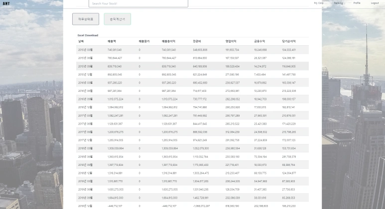

This Wednesday (6/2), with the conclusion of the exhibition, I put the final period on a graduation project that had been ongoing for a year. Looking back, I learned so much over the past year, and my graduation project was at the center of it all. Of course, I learned a lot technically and felt a sense of achievement, but **the excitement, frustration, anticipation, bewilderment, and pride I felt in the process of setting goals and working to achieve them left an even greater impression.** Not wanting to let this lingering feeling just pass by, I'd like to record this past year's journey in a long post.

## 4 Months into Computer Science Classes, Taking on the Graduation Project Challenge

After completing my first semester as a double major in the School of Software in the first semester of my junior year in 2020, I welcomed summer vacation. In my first semester as a double major, I was so busy learning Java, the language used in the Data Structures course, that I barely had time to focus on the actual data structures. Computer Architecture and Linear Algebra also felt challenging. On top of this, personal difficulties made it a struggle to complete the semester.

Even during vacation, there were mountains of things to learn. I wondered how to prepare for algorithms, and web development seemed to have so many things to master. For someone like me who found it difficult to learn even one programming language, it felt like a massive wall. That's when "Computer Capstone Design" caught my eye. I thought it was an opportunity to build a portfolio through coursework, and if I could do it well, it would be a chance to improve my skills.

However, there were several challenges as outlined below:

| Challenge | Details | Solution |
|-----------|---------|----------|
| **(1) Eligibility for double major students** | Administrative feasibility verification needed | Confirmed possible through administrative office inquiry |
| **(2) Team formation** | Team member recruitment or individual team option | Decided on individual team |
| **(3) Finding an advisor professor** | Finding a professor who would accept individual teams | Professor Scott agreed to supervise |

First, to verify (1), I contacted the administrative office and learned that while no double major student had participated before, it was administratively possible. Since double major students don't have graduation projects as a mandatory requirement, it seemed most simply didn't apply. Although it wasn't a big deal, I felt oddly pleased about being the "first" in something.

Issue (2) wasn't a major problem either, as I had decided to participate as an individual team. The reasons for this decision included having no acquaintances in the Software Department after spending a semester during COVID, feeling embarrassed about my skills to ask to join existing teams, but most importantly, I had a clear vision of the software I wanted to build and wanted to experience the entire development process solo. I believed this would help me understand both my role and teammates' roles in future collaborations.

The real challenge was (3). Contrary to my expectation of easy acceptance, I received about 5 rejections. Most professors emphasized collaboration through graduation projects and couldn't accept individual teams. As I continued searching for a professor, the application deadline approached. The administrative office mentioned that without professor approval, application would be difficult, but I didn't want to miss this good opportunity. Eventually, I called all the professors I hadn't contacted yet, as there wasn't time for emails. While I couldn't reach most professors, I connected with Professor Scott, who became my advisor for the entire year.

Professor Scott is truly someone I'm grateful for. When I explained over the phone that other professors had rejected me for being an individual team and briefly described the software I wanted to build, he responded with a very enthusiastic "That sounds great to me." His response was so enthusiastic that I was momentarily speechless, not knowing what to say next. Later, after the first semester, Professor Scott became the dean and had a busy schedule, but he continued to show interest in the project and always provided honest feedback.

## Computer Capstone Design 1: Topic Selection, Interim Presentation + Technology Learning

In the second semester of my junior year, Computer Capstone Design 1 began. There were no separate lectures; I just needed to schedule meetings with my professor to select a graduation project topic for the semester and submit an introduction video and report.

Since I had a fairly clear vision of my target software (graduation project topic), I could save considerable time. However, I lacked the implementation skills and needed to plan my technology learning.

For my one-year graduation project study plan, I first divided web development into the following four areas and planned what and how to learn in each:

| Study Area | Main Content | Chosen Technology/Method |
|------------|--------------|-------------------------|
| **(1) Frontend** | HTML, CSS, JavaScript basics | Nomad Coder clone coding |
| **(2) Backend** | Server development and API implementation | Python Django framework |
| **(3) Database** | DB design and management | "Database" major course |
| **(4) Others** | Financial statement data analysis | Related books and practical experience |

### (1) Frontend

I realized I needed to learn HTML and CSS first, so I took Nomad Coder's KakaoTalk clone coding course with Nico. I was also able to experience JavaScript through the individual project assignment in the Open Source Software Fundamentals class I took that semester. Looking back now after completing the project, I think I relied more on TailwindCSS (CSS framework) and Google's help than these two courses, but they were tremendously helpful in building foundations and eliminating my fear of HTML, CSS, and JavaScript.

**Related Projects:**
- [KakaoTalk Clone Coding](https://github.com/egg528/Toy_kokoaTalk)
- [Open Source Software Fundamentals Project](https://github.com/egg528/OSS_finalTask)

### (2) Backend

First, I considered what to learn - which language and framework to use for backend development. At that time, I was solving algorithms in Java and learning Spring, so I wanted to choose Java and the Spring framework. However, I judged that Python would be more suitable for handling financial statement data, so I selected the Python-based Django framework.

For Django learning, I chose Nomad Coder's Airbnb Clone coding course. Clone coding was fun from the KakaoTalk experience, and most importantly, the videos were divided into short segments, making it convenient for planning my studies. I started learning Django during winter break after the second semester ended, and I remember studying hard at night, reviewing and organizing everything on my blog.

However, I felt that review and organization alone weren't enough, so I created a mini project - a <Movie Discussion Website> that I wanted to build but didn't choose as my graduation project topic. Looking back, if I hadn't worked on this project, I probably would have forgotten what I learned from the clone coding course. Working on the mini project was definitely a good decision.

**Related Projects:**
- [Airbnb Clone Coding](https://github.com/egg528/airbnb_web)
- [Movie Discussion Website](https://blog.naver.com/rnjsdntjr26/222231683669)

### (3) Database

I tackled the database requirement through the "Database" major course. I felt that learning frontend and backend alone would require substantial study, and taking the course would likely generate additional learning needs. Based on the database concepts I studied then, I recently took the SQLD exam. However, the concepts I learned couldn't cover all real-world scenarios. I encountered many constraint errors while working on the project, and each time I received significant help from various blog users.

### (4) Others

Additionally, I thought I needed to study handling financial statement data. While I would mainly use indicators and items from past investment studies, I read two books hoping to gain new ideas.

**Data Analysis Project:**  
[Financial Data Analysis](https://github.com/egg528/FinanceDataAnalysis)

Along with technical learning, I created the mid-term report and introduction video that were required submissions for Computer Capstone Design 1. While the learning served as preparation for the overall deliverable, this semester's grade was evaluated based on the mid-term report and introduction video, so I couldn't neglect them even though they weren't software deliverables.

At this point, the professor gave us a hint to focus on "**the necessity of the software we're trying to build**," which helped me establish the direction for both the report and presentation video. He also mentioned that considering it's a web service, showing what features we'll implement through mockups would be more effective than a hundred words of explanation - this advice was incredibly helpful.

Based on the professor's guidance, I was able to write the report below. The software description mainly focused on mockups and features to be implemented. Particularly, clarifying the features to implement and prioritizing them based on importance was a great help in setting clear goals during the development process.

At the time, I was learning about development processes, integration strategies, and CI/CD pipelines in the Software Development Practice class, and I wanted to put what I learned to use, so I briefly included content about using CI/CD pipelines for automated deployment to facilitate future feature additions in the future plans section lol. In the end, I didn't use any of it at all... Since it was solo development, I didn't need integration strategies either.. I guess I just wanted to show off that I'd heard of such things... haha

**Mid-term Presentation Video:**
[Graduation Project Mid-term Presentation - Financial Statement Data Processing and Analysis Visualization Website for Individual Investors](https://www.youtube.com/watch?v=PR4RI2n3VL8)

## Development Begins!

After completing all the development and drawing the architecture diagram, the above figure emerged. To mention the distinctive parts, first of all, I used JavaScript's Ajax communication extensively. The reason was that there was too much data and graphs to handle on a single page, so there was a need to split the communication as needed. For example, when someone wants to know about Naver company, the web service I created provides quarterly financial statements and income statement data for 6 years, 6 years of stock price data, graphs and scatter plots for 10 items, etc. I wanted to provide all this information without page navigation, and I thought there would be operational issues if I didn't use Ajax to split and receive data as needed.

For the server, I used Elastic Beanstalk. While the existing AWS EC2 service reduced the effort required for server construction to 50% by taking responsibility up to OS installation, Elastic Beanstalk automatically builds many parts including OS, web server, and language. The video says it reduces the effort required for server construction to 10%. I'm not sure how they came up with the 10% figure, but I agree that it allows for simple server construction.

**Reference Video:**
[Deploy Code in Minutes Using AWS Elastic Beanstalk](https://youtu.be/AfRnvsRxZ_0)

The reason for configuring the database independently without building it on the server is that I'd like to say it was to ensure the site operation wouldn't stop even for a moment in situations where features are added after deployment and redeployment is necessary... but honestly, I just used RDS because it was too convenient... haha

Stock price data is fetched from Naver Finance every day at 5 PM and loaded into the database. I implemented it by adding it to the run registry so that the module automatically operates when the computer is turned on. Actually, I should have put this crawler on the server to be sure... but I ran out of time for the final deployment and ran it on my laptop. For financial statement data, the module needs to be executed manually, but considering it's only 4 times a year, I thought creating an always-running module would be inefficient.

Before starting development, the first thing I conceptualized was the database schema. With Django, since tables are automatically created when you make models, there was no need to create a detailed schema. However, to clarify what data was needed to develop the planned features and to draw the big picture of the project, I created the schema below. It was only after going through this work that it became clear how to implement which features.

## Feature Introduction

### (1) Main Screen

Since the main screen had to be displayed during the exhibition, I tried my best to make it look pretty... but nothing beats a good photo. I chose what I thought was a decent quality photo, but when the screen gets bigger, the photo naturally becomes pixelated. So I increased the transparency to make the pixelation less noticeable. However, I think this screen is usable because I can directly introduce the service to users. The reason is that just looking at this screen alone, it's hard to tell what kind of site it is.

I implemented an ANT logo in the upper left corner to return to the main page, and in the upper right corner, you can see login/logout, profile, company ranking features, and a button to go to my companies. The search bar in the center of the screen allows you to search for company names. I implemented it so you don't need to type exact words. For example, if you search for just "Samsung," all companies with "Samsung" in their names will be searched.

### (2) Company Detail Page

Since the company detail page has the most features, it would be better to organize it by splitting it up.

**1. Stock Price Chart and Add to My Companies**

**2. Balance Sheet and Income Statement**

**Key Feature Examples:**
- Company-specific balance sheet data visualization
- Clean UI using Bootstrap tables

**3. Corporate Financial Analysis**

**4. Other Features**
- Company search functionality
- My companies management
- Profile management

## Challenges Encountered

### (1) Financial Data Collection

**Introduction to DART OPEN API:**  
[Electronic Disclosure OPENDART System](https://opendart.fss.or.kr/intro/main.do)

During the planning phase, I thought obtaining financial data would be straightforward using the Electronic Disclosure OPEN API. Since it's data provided by the Financial Supervisory Service, a government agency, I assumed without doubt that it would be well-organized. However, financial data collection turned out to be the part I spent the most time pondering, and I still haven't found a perfect solution.

Actually, in the early stages of the project, while researching financial data DB construction, I saw that 10-year corporate financial data was being sold for several million won. At that time, I naively thought companies were buying such data because they were unaware of the DART OPEN API. But there was a different reason why organized financial data was being sold at high prices.

> **Major Problems with DART OPEN API**

**1. Financial Company Data Not Provided**

This problem is unavoidable. Due to their business model, financial companies have different financial statement items—essentially, the basic structure of their documents differs from general companies. Therefore, data for financial companies is not provided. If financial company information is needed, manual data entry would be the fastest approach since there aren't many of them.

**2. Item Names and Item Codes Inconsistency Issues**

This is the most critical problem. For example, let's say there's an item called "revenue." If all companies used "revenue" for this item, there would be no problem using the data—you'd just need to find the value corresponding to the string "revenue."

> **Core Problem**: Despite being the same item, the item names vary from company to company and year to year.

Even if there were item codes, this wouldn't be a problem since you could identify items by code. But item codes can also change year by year, and there are cases where they differ between companies.

I contacted the Financial Supervisory Service to understand the cause of this problem.

> **Root Cause of the Problem**: While there are standards for item names and item codes, they are recommendations rather than mandatory requirements.

I personally have questions about this issue. Why aren't item names standardized? Standardizing item names wouldn't create additional burden for companies preparing financial statements. Whether item names are standardized or not, they still need to be written. Moreover, standardizing item names—having all companies denote revenue as "revenue"—wouldn't change the interpretation of items or create confusion.

I considered inquiring about this as well, but I figured it wasn't something the staff could answer, so I let it go. There must be reasons I'm unaware of... I'm really curious...

To fundamentally solve this problem, financial statement preparation guidelines would need to be changed. Since this is beyond my capabilities, I started looking for other methods. So how do companies collect financial information?

**Alternative Data Providers**

| Company | Service | Features |
|---------|---------|----------|
| **FnSpace** | [Financial Data Service](http://www.fnspace.com/) | Leading company in financial data field |
| **SomeTrend Data+** | [Financial Data API](https://data.some.co.kr/financial/fsApi) | Uses proprietary modules + DART API |

These two companies are representative sellers of financial data. Through inquiry, I learned that SomeTrend collects financial data using their proprietary modules and the Dart Open API. Also, seeing that they developed their system based on FnSpace's methodology, it seems FnSpace and FnGuide are the leading companies in financial data.

Anyway, since the modules aren't open source and I felt I lacked the time and skills to implement them directly, I used a slight workaround. While I couldn't collect data from all companies, this method could collect data from most companies.

For example, I selected 100 companies, visually checked how they displayed revenue, and extracted the most commonly used strings to use for data separation. "Revenue (매출액)" was most common, followed by "Revenue (Income) (매출액(수익))", and some places even had "1. Revenue (1. 매출액)".

The disadvantages of this method are that it cannot collect data from all companies and cannot collect all items. Therefore, I could only collect core items (items with relatively standardized names) from most companies.

### (2) Correlation Analysis and Stock Price Data Calculation Method

While conducting correlation analysis using financial data and stock price data as variables, the part I pondered most was "**How should stock price data be used?**" Financial data had 4 points per year while stock price data had 300 points. I wondered how to match these and used the following approach.

**Correlation Analysis Data Matching Method**

Applied methodology to solve the matching problem between financial data (4 points per year) and stock price data (300 points per year).

> **Reference Material**: [Analysis of Financial Statement Disclosure Timing and Stock Price Movements](https://m.blog.naver.com/sehyunfa/221672212122)

## Concluding the Graduation Project...

**Final Project Repository:**  
[StockWeb - Financial Statement Analysis and Visualization Website](https://github.com/egg528/StockWeb)

Looking back over the past year after completing the graduation exhibition and writing this reflection, I feel a mixture of pride and regret. While I did manage to deploy the project, it still has too many shortcomings to become a real service. If multiple users were to actually use it, I wonder whether the backend logic could handle the load, what kind of server failures might occur, and there are still countless unexpected errors of all kinds that I haven't addressed yet. This means there's still insufficient testing.

Since it feels too valuable to just end as a graduation project, I'm planning to add code comments, improve efficiency, and conduct testing going forward. I remember seeing in a YouTube video that continuously improving a single project is how you develop your skills. The things I plan to work on in the future can be summarized as follows:

### Future Improvement Plans

- [ ] **Writing comments** - Enhance code readability
- [ ] **Improving logic efficiency by feature** - Performance optimization
- [ ] **Testing** - Ensure stability
- [ ] **Regression analysis functionality** - Add new analysis features

While there are certainly many areas that need improvement and things I regret, I feel proud that I set a goal and created a tangible result.

> **One Year of Growth**: If someone asked whether I've grown compared to when I started this graduation project a year ago, I can say without hesitation that I've grown and learned so much.

Most importantly, I'm truly grateful to Professor Scott, who enabled me to start this graduation project and continued to show interest until the final result was produced... ㅠㅠ Once grades are finalized, I need to hurry and visit to express my gratitude in person... ㅠㅠ

*After completing the graduation exhibition on June 2, 2021*

---

**Key Technology Stack**

| Field | Technology | Details |
|-------|------------|----------|
| **Frontend** | HTML, CSS, JavaScript, TailwindCSS | Responsive web interface |
| **Backend** | Python, Django | RESTful API server |
| **Database** | PostgreSQL (AWS RDS) | Relational database |
| **Infrastructure** | AWS Elastic Beanstalk | Cloud deployment and management |
| **Data Source** | DART Open API, Naver Finance API | Financial data collection |

**Project Links:**
- [Final Project](https://github.com/egg528/StockWeb)
- [Midterm Presentation Video](https://www.youtube.com/watch?v=PR4RI2n3VL8)