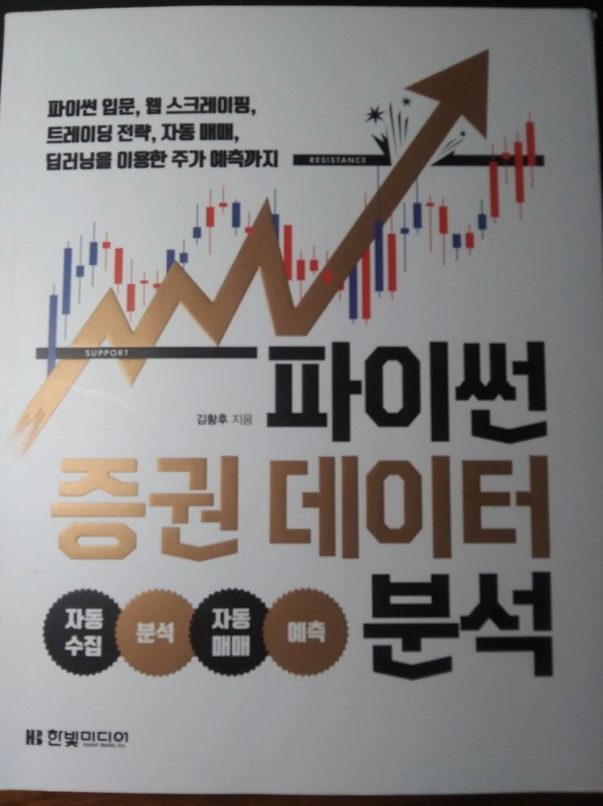
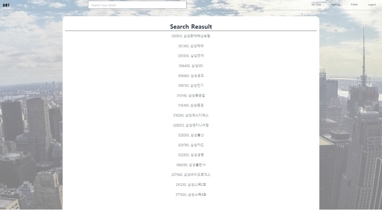
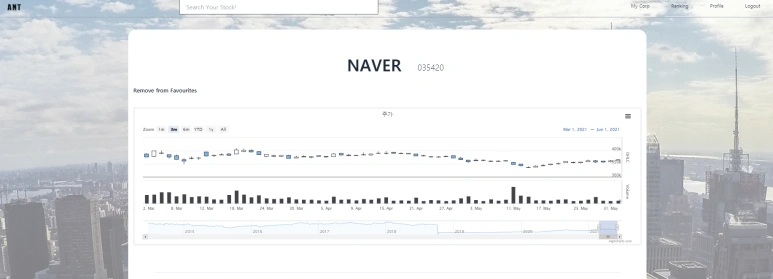
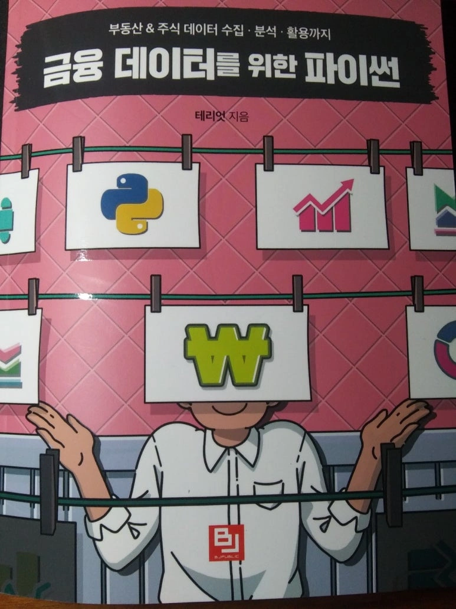

이번 주 수요일(6/2) 전시회를 끝으로 1년간 진행된 졸업작품의 마침표를 찍었다. 돌이켜보면 지난 1년간 참 많은 것을 배웠고 그 중심에는 졸업작품이 있었다. 물론 기술적인 면에서도 많은 것을 학습했고 성취감을 느꼈지만, **무언가 목표를 정하고 이를 성취하기 위한 과정에서 느낀 설렘, 좌절감, 기대감, 막막함, 뿌듯함이 더 큰 여운을 남긴다.** 이 여운을 그냥 보내기 아쉬워 지난 1년간의 과정을 긴 글로 남겨보려 한다.

  

## 컴공 수업 4개월차, 졸업 작품 도전

2020년 3학년 1학기 소프트웨어학부 다중전공 첫 학기를 보내고 여름 방학을 맞이했다. 다중전공 첫 학기에 들었던 자료구조론 수업에서는 자료구조보다는 수업에서 사용되는 Java 언어를 학습하기에 급급했고, 컴퓨터구조와 선형대수 또한 어렵게 느껴졌다. 여기에 개인적으로 힘든 일까지 겹쳐 힘겹게 한 학기를 마쳤다.

방학에도 배워야 할 것들은 산더미 같았다. 알고리즘은 어떻게 준비해야 하며, 웹에도 배워야 할 것들이 참 많아 보였다. 언어 하나 학습하기도 어려웠던 나에게는 거대한 벽처럼 느껴졌다. 이때 눈에 들어온 게 "컴퓨터캡스톤디자인"이었다. 학교 수업을 통해 포트폴리오를 만들 수 있는 기회이자, 잘만 해낸다면 실력을 키울 수 있는 기회라 생각했다.

하지만 아래와 같은 문제가 있었다.

| 해결 과제 | 상세 내용 | 해결 방법 |
|-----------|-----------|----------|
| **(1) 다전공생 참가 가능 여부** | 행정 상 가능 여부 확인 필요 | 행정실 문의를 통해 가능함을 확인 |
| **(2) 팀** | 팀원 구성 또는 개인 팀 선택 | 개인 팀으로 결정 |
| **(3) 지도 교수님** | 개인 팀을 받아줄 교수님 찾기 | Scott 교수님께서 수락 |

우선 (1)번을 확인하기 위해 행정실에 연락했고 과거에 다전공생이 참가한 적은 없지만 행정 상으로는 가능하다는 답변을 들을 수 있었다. 아마도 다전공생의 경우 졸업필수요건에 졸업작품이 없기 때문에 다들 신청하지 않은듯 싶었다. 큰일은 아니지만 무언가의 "처음"이라는 말에 괜히 기분이 좋았던 것 같다.

(2)번도 크게 문제가 되지 않았다. 이유는 개인 팀 참가를 결심했기 때문이다. 개인 팀 참가를 결심한 이유를 나열해보자면 코로나와 함께 한 학기를 보낸 시점에서 소프트웨어학부에 아는 사람도 없었고, 아는 사람이 있다고 한들 팀에 껴달라기에는 민망한 실력 등이 있었지만 가장 큰 이유는 명확히 만들고 싶은 SW가 있었고 혼자 프로젝트를 진행하며 전 과정을 경험하고 싶었다. 그래야 나중에 협업을 하더라도 나와 팀원들의 역할을 이해할 수 있을 것이라 생각했다.

정말 문제는 (3)번에 있었다. 단번에 응해주실 거라는 생각과는 반대로 거절의 답변만 5번 정도 받은 것 같다. 교수님들 중 대다수는 졸업작품을 통한 협업을 중시하셨고, 개인 팀은 받을 수 없다는 것이 그 이유였다. 이렇게 교수님을 찾다보니 어느새 신청 마지막 날이 다가왔다. 행정실에서 교수님이 응하지 않으시면 신청이 어렵다는 답변을 들었지만 좋은 기회를 그냥 놓치고 싶지는 않았다. 결국 연락해보지 않은 교수님들에게 모두 전화를 돌렸다. 메일을 드리기엔 시간이 없었기 때문이다. 대다수의 교수님들과는 연락이 닿지 않았지만, Scott 교수님과 연락이 됐고 Scott 교수님에게 1년간 지도를 받을 수 있었다.

교수님은 정말 감사한 분이시다. 전화를 통해 다른 교수님들에게 개인 팀이란 이유로 거절을 받았음을 알리고, 내가 만들고 싶은 SW에 대해 간략히 설명드리자 너무도 흥쾌히 "저는 좋습니다"라는 답변을 주셨다. 너무 흥쾌히 답변을 주셔서 잠깐 뭐라 말을 해야할지 몰라 벙쪘던 기억도 생생하다. 나중 일이지만 1학기 이후 교수님은 학장이 되셔서 바쁜 일정을 소화하게 되셨지만 그 와중에도 프로젝트에 지속적인 관심을 가져주셨고 항상 솔직한 피드백을 주셨다.

  

## 컴퓨터캡스톤디자인1, 주제선정 및 중간발표 + 기술 공부

3학년 2학기, 컴퓨터캡스톤디자인1 수업이 시작되었다. 따로 강의가 있지 않았고 교수님과 미팅을 잡아 1학기 동안 졸업작품 주제를 선정하고 소개 영상과 리포트를 제출하면 됐다.

나는 목표하는 SW 즉, 졸업작품 주제를 꽤 명확하게 가진 입장이었기에 시간을 많이 아낄 수 있었다. 하지만 나에게는 구현할 능력이 없었고, 기술 공부 계획을 짜야 했다.

1년간의 졸업작품 공부 계획을 위해 우선 웹을 크게 아래와 같이 나눴다. 이후 4가지 영역에서 무엇을 어떻게 학습할지 계획했다.

| 학습 영역 | 주요 내용 | 선택한 기술/방법 |
|-----------|-----------|------------------|
| **(1) 프론트엔드** | HTML, CSS, JavaScript 기초 | Nomad Coder 클론 코딩 |
| **(2) 백엔드** | 서버 개발 및 API 구현 | Python Django 프레임워크 |
| **(3) 데이터베이스** | DB 설계 및 관리 | 전공 수업 "데이터베이스" 수강 |
| **(4) 기타** | 재무제표 데이터 분석 | 관련 도서 학습 및 실습 |

### (1) 프론트

우선 HTML과 CSS학습이 필요하다는 걸 알았고 Nomad coder 니코쌤의 kokoa톡 클론 코딩을 수강했다. 또한 2학기 들었던 오픈소스SW기초 수업의 개인 프로젝트 과제를 활용해 JavaScript를 접해볼 수 있었다. 프로젝트를 마친 지금 생각해보면 두 과정 보다는 TailwindCSS(CSS framework)와 Google의 도움을 더 많이 받았지 않나 싶지만, 기초를 다질 수 있었다는 점과 HTML, CSS, JS에 대한 두려움을 없앨 수 있었다는 점에서 큰 도움이 됐다.

**관련 프로젝트:**
- [kokoa톡 클론 코딩](https://github.com/egg528/Toy_kokoaTalk)
- [오픈소스SW기초 프로젝트](https://github.com/egg528/OSS_finalTask)

### (2) 백엔드

우선 무엇을 배울지 즉, 백엔드로 어떤 언어와 프레임워크를 활용할지 고민했다. 이당시 Java 언어로 알고리즘을 풀고 있었고, Spring도 배우던 시기라 Java와 Spring 프레임워크를 선택하고 싶었다. 하지만 재무제표 Data를 다루기에는 Python이 더욱 적합할 것이라 판단했고 Python 기반의 Django 프레임워크를 선택하게 됐다.

Django를 학습은 Nomad Coder 니코쌤의 Airbnb Clone 코딩을 선택했다. kokoa톡 클론 코딩을 통해 클론 코딩이 재미있기도 했고 무엇보다 영상이 짧게 나뉘어있어 학습을 계획하기에 편리하다는 점이 가장 좋았다. Django를 배우기 시작한 건 2학기가 끝나고 겨울방학 때인데 이때 밤에 복습하고 블로그에 정리도 하며 열심히 배웠던 기억이 있다.

하지만 복습과 정리만으로는 모자라다 느꼈고 졸업작품 주제로 선택하지는 않았지만 만들어보고 싶었던 <영화 토론 웹사이트>를 미니 프로젝트로 만들어봤다. 지금 생각해보면 이 프로젝트를 진행하지 않았다면 클론 코딩 때 배웠던 내용들을 곧바로 까먹지 않았을까 싶다. 그만큼 미니 프로젝트를 진행해봤던 건 좋은 선택이었다.

**관련 프로젝트:**
- [Airbnb 클론 코딩](https://github.com/egg528/airbnb_web)
- [영화 토론 웹사이트](https://blog.naver.com/rnjsdntjr26/222231683669)

### (3) DB

DB는 "데이터베이스" 전공 수업으로 해결했다. 이미 프론트와 백엔드 학습만으도로 많은 학습이 필요할 것 같았고 수업을 듣고 나면 추가적으로 학습해야할 것들이 생길 것 같았다. 이때 공부한 DB 개념을 바탕으로 얼마전 SQLD 시험도 치뤘다. 하지만 학습한 개념만으로 실전의 모든 경우를 커버할 수는 없었다. 프로젝트를 진행하며 각종 제약 오류를 많이 겪었다. 마찬가지로 그때마다 각종 블로그 유저분들의 도움을 많이 받았다.

### (4) 기타

추가적으로 재무제표 데이터를 다루는 공부가 필요하다 생각했다. 과거 투자 스터디를 진행하며 사용했던 지표나 항목들을 주로 사용할 것이었지만, 그래도 혹시나 새로운 아이디어들을 얻을 수 있을까 하는 마음에 책 2권을 읽었다.

**데이터 분석 프로젝트:**  
[재무 데이터 분석](https://github.com/egg528/FinanceDataAnalysis)

기술 학습과 더불어 컴퓨터캡스톤디자인1 제출물인 중간보고서와 소개 영상을 만들었다. 학습이 전체 결과물을 위한 준비였다면 당장 이번 학기 수업 성적은 중간보고서와 소개영상으로 평가됐기에 SW 결과물이 아니라도 소홀히 할 수 없었다.

이때 교수님께서 "**만들려는 SW의 필요성**"을 위주로 작성하라 힌트를 주셔서 보고서와 발표영상의 방향성을 잡을 수 있었다. 또한 웹 서비스라는 점을 고려했을 때 100마디 말보다는 목업으로 어떤 기능을 구현할 것인지 보여주는 점이 효과적일 것이란 말씀도 큰 도움이 되었다.

교수님의 말씀을 바탕으로 아래의 보고서를 작성할 수 있었다. SW에 대한 설명은 크게 목업과 구현할 기능이 위주였다. 특히 구현할 기능을 명확히하고 중요도를 기준으로 순서를 정한 것은 개발 과정에서 목표를 명확히 하는데에 큰 도움을 줬다.

당시 소프트웨어개발실무 수업에서 개발프로세스를 비롯해 통합 전략과 CI/CD 파이프라인 등을 배웠는데, 학습한 걸 써먹고 싶어서 향후 계획에 CI/CD 파이프라인을 사용해 차후 기능 추가를 위한 자동화된 CI/CD 파이프라인 내용을 간략히 적어놨다 ㅋㅋㅋㅋㅋ  결과적으론 전혀 이용하지 않았다... 혼자하는 개발이라 통합 전략도 필요하지 않았다.. 그냥 저런 거 들어본 적 있다고 자랑한 걸로...ㅎㅎ

**중간발표 영상:**
[졸업작품 중간발표 - 개인투자자를 위한 재무제표 데이터 가공 및 분석 시각화 웹 사이트](https://www.youtube.com/watch?v=PR4RI2n3VL8)

  

## 개발 시작!

개발을 모두 끝마치고 구성도를 그려보니 위와 같은 그림이 나왔다. 특징적인 부분만 말하자면 우선 JavaScript의 Ajax 통신을 정말 많이 사용했다. 그 이유는 한 페이지에서 다뤄야 하는 데이터, 그래프가 너무 많아 필요에 따라 통신을 분할할 필요가 있었다. 예를 들어 네이버 회사에 대해 알고싶다고 했을 때 제작한 웹 서비스는 분기별 재무상태표와 손익계산서 6년 데이터와, 6년치 주가 데이터, 10개 항목에 대한 그래프와 산점도 등을 제공한다. 이 모든 정보를 페이지 이동 없이 제공하고 싶은데 Ajax를 이용해 필요에 따라 데이터를 분할해 받지 않으면 동작에 문제가 있을 것이라 생각했다.

서버의 경우 Elastic Beanstalk을 사용했다. 기존의 AWS EC2 서비스가 OS 설치까지 책임지며 서버 구축에 필요한 노력을 50%로 줄였다면 Elastic Beanstalk은 OS, Webserver, 언어 등 많은 부분이 자동적으로 구축된다. 영상에서는 서버 구축에 필요한 노력을 10%로 줄여준다고 한다. 어떻게 10%라는 수치가 나온 건지는 모르겠지만 간단히 서버를 구축할 수 있다는 점에는 동의한다.

**참고 영상:**
[AWS Elastic Beanstalk 활용하여 수 분만에 코드 배포하기](https://youtu.be/AfRnvsRxZ_0)

서버에 DB를 구축하지 않고 독립적으로 구성한 이유는 배포 이후에 기능이 추가되어 재배포해야하는 상황에서 사이트 운영이 잠시도 멈추지 않게 하기 위해서라 말하고 싶지만.. 그냥 RDS가 너무 편리해서 사용했다..ㅎㅎ

주가 데이터는 매일 오후 5시 naver금융에서 정보를 가져와 DB에 적재된다. run 레지스트리에 추가해 컴퓨터를 켜면 자동적으로 해당 모듈이 동작하게 구현했다. 사실 이 크롤러를 서버에 올려야 확실한데.. 마지막 배포에 쓸 시간이 부족해 노트북에서 동작시켰다. 재무제표 데이터의 경우 수동으로 모듈을 실행해야 하는데 연 4회라는 점을 생각했을 때 항상 동작하는 모듈을 만드는 것이 비효율적이라 생각했다.

개발을 시작하기 전 가장 먼저 구상한 건 DB 스키마였다. Django의 경우 model을 만들면 자동으로 DB 테이블이 생성되기 때문에 스키마를 구체적으로 만들 필요는 없었다. 하지만 계획한 기능을 개발하기 위해서 어떤 Data가 필요한지 명확히 하고, 프로젝트의 큰 그림을 그려보기 위해 아래 스키마를 만들어 봤다. 실제로 이 작업을 거친 후에서야 비로소 어떤 기능을 어떻게 구현해야할지 명확해졌다.

  

## 기능 소개

### (1) 메인 화면

전시회가 진행되는 동안 메인 화면을 띄워놔야 하기에 예쁘게 꾸미려고 최대한 노력했는데.. 사진만한 것이 없었다. 괜찮은 화질의 사진을 고른다고 골랐지만 화면이 커지면 사진은 자연스레 깨질 수밖에 없다. 때문에 투명도를 높여 깨진 티가 나지 않도록 했다. 다만 이 화면은 내가 이용자에게 서비스를 직접 소개할 수 있기에 사용할 수 있다고 생각한다. 이유는 이 화면만 봐서는 뭐하는 사이트인지 알기 힘들기 때문이다.

왼쪽 상단에는 ANT라는 로고를 둬 메인 페이지로 돌아올 수 있도록 구현했고, 오른쪽 상단을 보면 로그인/로그아웃, 프로필, 기업랭킹 기능, 내 기업으로 가는 버튼이 있다. 화면 가운데의 검색창에는 기업 이름을 검색할 수 있다. 정확한 단어를 칠 필요는 없도록 구현했다. 예를들어 "삼성"만 검색한다면, "삼성"이 이름에 포함된 모든 기업이 검색된다.

### (2) 기업 상세 페이지

기업 상세 페이지의 경우 기능이 가장 많은 페이지여서 분할해 정리하는 것이 좋을 것 같다.

**1. 주가 그래프 및 내 기업 추가**

**2. 재무상태표와 손익계산서**

**주요 기능 예시:**
- 기업별 재무상태표 데이터 시각화
- Bootstrap 테이블을 활용한 깔끔한 UI

**3. 기업 재무 분석**

**4. 그 외 기능들**
- 기업 검색 기능
- 나의 기업 관리
- 프로필 관리

  

## 어려웠던 점

### (1) 재무 데이터 수집

**DART OPEN API 소개:**  
[전자공시 OPENDART 시스템](https://opendart.fss.or.kr/intro/main.do)

기획 당시 전자공시 OPEN API를 이용해 재무 데이터를 어렵지 않게 얻을 수 있을 것이라 생각했다. 정부 기관인 금융감독원에서 제공하는 데이터이니 아무런 의심 없이 잘 정리되어 있을 것이라 생각했다. 하지만 프로젝트에서 가장 오랜 시간을 고민했고, 아직까지도 완벽한 해결책을 찾지 못한 파트가 바로 재무 데이터 수집이다.

사실 프로젝트 초반에 재무 데이터 DB 구축에 대해 알아보며 10년 기업 재무 데이터가 몇 백만원에 팔리고 있는 걸 봤다. 그당시 나는 바보같이도 DART OPEN API를 모르는 기업들이 저런 데이터를 사는 거라 생각했다. 하지만 정돈된 재무 데이터가 비싼 가격에 팔리는 이유는 따로 있었다.

> **DART OPEN API의 주요 문제점**

**1. 금융 기업 데이터 미제공**

이 문제점은 어쩔 수 없다. 금융 기업의 경우 비지니스 모델 상 일반 기업과는 재무제표의 항목들 즉, 문서의 기본적인 구조가 다르다. 때문에 금융 기업의 경우 데이터가 제공되지 않는다. 만약 금융 기업 정보가 필요하다면 수가 많지 않으니 수작업으로 데이터를 입력하는 것이 가장 빠를 것이다.

**2. 항목 명, 항목 코드 불일치 문제**

이 문제가 가장 핵심적인 문제점이다. 예를 들어 매출액이라는 항목이 있다고 하자. 만약 모든 기업이 해당 항목을 매출액으로 사용하면 데이터를 이용하는데 문제가 없다. 문자열 "매출액"에 해당하는 값을 찾으면 된다.

> **핵심 문제**: 같은 항목임에도 불구하고 항목명이 기업마다, 연도마다 제각각이다.

그래도 항목 코드가 있다면 문제가 되지 않는다. 코드로 식별하면 되기 때문이다. 하지만 항목 코드 또한 연도별로 코드 명이 변경될 수 있고, 기업마다 다른 경우도 존재한다.

금융감독원에 문의해 이 문제점에 대한 원인을 알게 되었다.

> **문제의 근본 원인**: 항목명, 항목 코드에 대한 기준은 있으나 강제가 아닌 권장이기 때문이다.

이 문제점에 대해서는 개인적으로 의문이 남는다. 항목명을 왜 통일하지 않는 것일까. 항목명을 통일한다고 기업이 재무제표를 작성하는 데 더 부담을 느낄 일은 없다. 어짜피 통일된 항목 명이든, 통일되지 않은 항목 명이든 작성은 해야하기 때문이다. 또한 항목명을 통일했다고 즉, 모든 기업이 매출액을 "매출액"으로 표기한다고 해서 항목에 대한 해석이 달라지거나 혼란이 생길 일도 없다.

이 점에 대해서도 문의해보려 했으나 직원분께서 답해주실 수 있는 영역도 아닐 것 같아 마음을 접었다. 분명 내가 모르는 이유가 존재할 것 같은데.. 정말 궁금하다..

이 문제점을 근본적으로 해결하기 위해서는 재무제표 작성 지침을 바꿔야 한다. 내가 할 수 없는 영역이기에 다른 방법을 찾기 시작했다. 그렇다면 기업들은 어떻게 재무 정보를 수집하고 있을까?

**대안 데이터 제공업체**

| 업체명 | 서비스 | 특징 |
|--------|--------|------|
| **FnSpace** | [금융 데이터 서비스](http://www.fnspace.com/) | 금융 데이터 분야 선두 기업 |
| **SomeTrend Data+** | [재무 데이터 API](https://data.some.co.kr/financial/fsApi) | 자체 모듈 + DART API 활용 |

위의 두 기업이 대표적으로 재무 데이터를 판매한다. 문의를 통해 알게된 사실로 SomeTrend에서는 자체적인 모듈과 Dart Open API를 활용해 재무 데이터를 수집하고 있다고 한다. 또한 FnSpace가 사용하는 방식을 기초로 제작했다는 걸 보니 FnSpcace, FnGuide가 금융 데이터 관련해서는 가장 선두에 있는 기업이 아닌가 싶다.

각설하고 모듈이 오픈소스로 나와있는 것도 아니고, 직접 구현하기에는 시간과 실력이 모자라다고 생각했다. 때문에 약간의 편법을 썼다. 모든 기업의 데이터를 수집할 수는 없지만 대부분의 기업 데이터를 수집할 수 있는 방법이다.

예를 들어 기업 100곳을 선택해 매출액을 표시한 방식을 육안으로 확인하고, 가장 많이 사용된 몇 가지 문자열을 추려 데이터를 분리하는데에 사용했다. 우선 항목명 "매출액"이 가장 많았고, '매출액(수익)", 몇 곳은 "1.          매출액"인 곳도 있었다.

이 방식의 단점은 모든 기업 데이터를 수집할 수 없다는 점과, 모든 항목을 수집할 수 없다는 점이다. 때문에 대부분의 기업의 핵심 항목(항목명이 그나마 통일된 항목들)들만 수집할 수 있었다.

### (2) 상관 분석, 주가 데이터 산정 방식

재무 데이터와 주가 데이터를 변수로 상관 분석을 진행하며 가장 많이 고민한 부분은 "**주가 데이터를 어떻게 사용해야할까?**" 재무 데이터는 연 4개인 반면 주가 데이터는 300개가 됐다. 이를 어떻게 매칭시켜야하나 고민하다 아래와 같은 방식을 사용했다.

**상관분석 데이터 매칭 방식**

재무 데이터(연 4개)와 주가 데이터(연 300개)의 매칭 문제를 해결하기 위한 방법론을 적용했다.

> **참고 자료**: [재무제표 공시 시점과 주가 움직임 분석](https://m.blog.naver.com/sehyunfa/221672212122)

  

## 졸업 작품을 끝마치며...

**최종 프로젝트 저장소:**  
[StockWeb - 재무제표 분석 및 시각화 웹 사이트](https://github.com/egg528/StockWeb)

졸업 전시회를 마치고 1년을 돌이켜보며 글을 쓰고 나니 뿌듯함과 아쉬움이 공존한다. 배포까지 했다지만 실제 서비스로 이어지기에는 부족함이 너무 많다. 다수의 사용자가 이용한다면 백엔드 로직이 이를 감당할 수 있을지, 서버에서는 어떤 장애가 생길지.. 또 예상치 못한 온갓 종류의 에러들을 아직 처리하지 못했다. 그만큼 테스트가 부족하다는 뜻이다.

그냥 졸업 작품으로 끝내기 아쉬운 마음이 있어 앞으로 코드에 주석 작업과 효율성 개선, 테스트를 진행해볼 생각이다. 예전에 유튜브 영상에서도 한 프로젝트를 지속적으로 개선하면서 실력이 는다고 했던 것 같다. 앞으로 진행해볼 것들을 정리하면 우선적으로 아래와 같다.

### 향후 개선 계획
- **기능별 로직 효율성 개선** - 성능 최적화
- **테스트** - 안정성 확보
- **회귀분석 기능** - 새로운 분석 기능 추가

분명 개선해야할 점도 많고 아쉬움도 남지만, 어떠한 목표를 정하고 결과물을 만들어냈다는 점에서 뿌듯함을 느낀다.

> **1년간의 성장**: 졸업 작품을 시작할 때보다 성장한 것 같냐고 묻는다면 고민 없이 성장했다 말할 수 있을 정도로 많은 것을 배웠다.

무엇보다도 졸업작품을 시작할 수 있게 해주시고 또 결과물이 나올 때까지 지속적으로 관심을 주신 Scott교수님께 정말 감사하다..ㅠㅠ 성적 산출이 끝나면 얼른 감사인사 드리러 가야지..ㅠㅠ

*2021년 6월 2일 졸업작품 전시회를 마치고*

---

**주요 기술 스택**

| 분야 | 기술 | 상세 |
|------|------|------|
| **Frontend** | HTML, CSS, JavaScript, TailwindCSS | 반응형 웹 인터페이스 |
| **Backend** | Python, Django | RESTful API 서버 |
| **Database** | PostgreSQL (AWS RDS) | 관계형 데이터베이스 |
| **Infrastructure** | AWS Elastic Beanstalk | 클라우드 배포 및 관리 |
| **Data Source** | DART Open API, Naver Finance API | 재무 데이터 수집 |

**프로젝트 링크:**
- [최종 프로젝트](https://github.com/egg528/StockWeb)
- [중간발표 영상](https://www.youtube.com/watch?v=PR4RI2n3VL8)