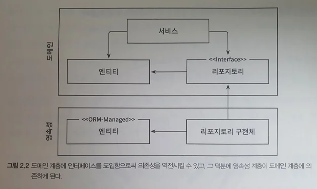

## 의존성 역전하기

### 1. 단일 책임 원칙

- 정의: 컴포넌트를 변경하는 이유는 오직 하나뿐이어야 한다.
- 의존성을 많이 가질 수록 다른 컴포넌트의 변경에 반응해야 한다.
- 이렇게 된다면 점차 변경에 드는 비용이 늘어난다.
  - 부수효과: 하나의 변경이 다른 기능을 망가뜨리는...

### 2. 의존성 역전 원칙

- 3계층 구조에서 의존 방향은 항상 아래를 향한다.
- 즉, 상위 계층의 변경이 더 자주 일어난다.(하위 계층 변화에 의한)
- `하지만 영속성 계층 변화 -> 도메인 계층 변화를 맊고 싶다면?`
- 
  - 도메인 계층에 인터페이스를 두고
  - 구현체를 영속성에 두어 두 계층의 순환 참조를 맊으면서 의존성을 제거한다.
- 생각
  - 도메인 계층에 인터페이스를 두고, 영속성 계층에 구현체를 둔다. (리포지토리)
  - 이렇게 하면 영속성의 변화가 도메인에 영향