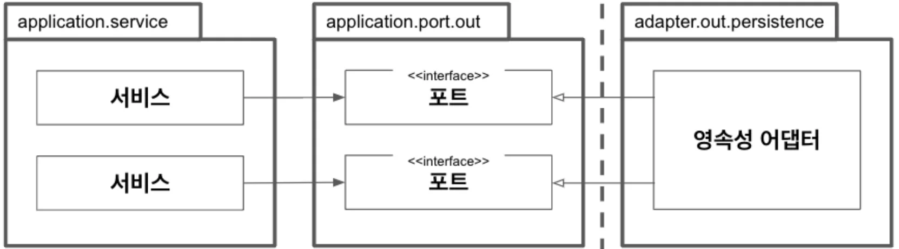

## Implementing Persistence Adapters

### 1. Dependency Inversion

- The persistence adapter is a driven (outgoing) port.
- The service layer no longer depends on the persistence layer.
- As long as the port contract is satisfied, persistence code can be freely modified without affecting the core.

### 2. Persistence Adapter Responsibilities
```
1. Receive input
2. Map input to database format
3. Send input to database
4. Map database output to application format
5. Return output
```
- In the current structure, input models need to be converted to database models. If this process feels unnecessary, consider a strategy without mapping (Chapter 8).
- The important point is that input/output models don't exist in the persistence layer but in the core, so the core is not affected by technological changes in the persistence layer.

### 3. Port Interface & Persistence Adapter Implementation

#### Defining the Port Interface
```java
public interface LoadAccountPort {
    Account loadAccount(AccountId accountId, LocalDateTime baselineDate);
}

public interface UpdateAccountStatePort {
    void updateActivities(Account account);
}
```

#### Implementing the Persistence Adapter
```java
@Repository
public class AccountPersistenceAdapter implements LoadAccountPort, UpdateAccountStatePort {
    
    private final AccountRepository accountRepository;
    private final ActivityRepository activityRepository;
    private final AccountMapper accountMapper;
    
    @Override
    public Account loadAccount(AccountId accountId, LocalDateTime baselineDate) {
        AccountJpaEntity account = accountRepository.findById(accountId.getValue())
            .orElseThrow(() -> new AccountNotFoundException(accountId));
            
        List<ActivityJpaEntity> activities = activityRepository
            .findByOwnerSince(accountId.getValue(), baselineDate);
            
        Long withdrawalBalance = activityRepository
            .getWithdrawalBalanceUntil(accountId.getValue(), baselineDate);
            
        Long depositBalance = activityRepository
            .getDepositBalanceUntil(accountId.getValue(), baselineDate);
            
        return accountMapper.mapToDomainEntity(
            account,
            activities,
            withdrawalBalance,
            depositBalance);
    }
    
    @Override
    public void updateActivities(Account account) {
        for (Activity activity : account.getActivityWindow().getActivities()) {
            if (activity.getId() == null) {
                activityRepository.save(accountMapper.mapToJpaEntity(activity));
            }
        }
    }
}
```

### 4. Database Entity vs Domain Entity

#### JPA Entities (Database Layer)
```java
@Entity
@Table(name = "account")
public class AccountJpaEntity {
    
    @Id
    @GeneratedValue
    private Long id;
    
    // Database-specific annotations and constraints
    // No business logic
}

@Entity
@Table(name = "activity")
public class ActivityJpaEntity {
    
    @Id
    @GeneratedValue
    private Long id;
    
    @ManyToOne
    @JoinColumn(name = "owner_account_id")
    private AccountJpaEntity ownerAccount;
    
    @ManyToOne
    @JoinColumn(name = "source_account_id")
    private AccountJpaEntity sourceAccount;
    
    @ManyToOne
    @JoinColumn(name = "target_account_id")
    private AccountJpaEntity targetAccount;
    
    // Database fields
}
```

#### Domain Entities (Core Layer)
```java
public class Account {
    private final AccountId id;
    private final Money baselineBalance;
    private final ActivityWindow activityWindow;
    
    // Business logic methods
    public boolean withdraw(Money money, AccountId targetAccountId) {
        if (!mayWithdraw(money)) {
            return false;
        }
        
        Activity withdrawal = new Activity(
            this.id,
            this.id,
            targetAccountId,
            LocalDateTime.now(),
            money);
            
        this.activityWindow.addActivity(withdrawal);
        return true;
    }
    
    private boolean mayWithdraw(Money money) {
        return Money.add(
            this.calculateBalance(),
            money.negate())
            .isPositiveOrZero();
    }
}
```

### 5. Mapping Strategy

#### Entity Mapper
```java
@Component
public class AccountMapper {
    
    public Account mapToDomainEntity(
            AccountJpaEntity account,
            List<ActivityJpaEntity> activities,
            Long withdrawalBalance,
            Long depositBalance) {
            
        Money baselineBalance = Money.subtract(
            Money.of(depositBalance),
            Money.of(withdrawalBalance));
            
        return Account.withId(
            new AccountId(account.getId()),
            baselineBalance,
            mapToActivityWindow(activities));
    }
    
    public ActivityJpaEntity mapToJpaEntity(Activity activity) {
        return new ActivityJpaEntity(
            activity.getId() == null ? null : activity.getId().getValue(),
            activity.getTimestamp(),
            activity.getOwnerAccountId().getValue(),
            activity.getSourceAccountId().getValue(),
            activity.getTargetAccountId().getValue(),
            activity.getMoney().getAmount().longValue());
    }
    
    private ActivityWindow mapToActivityWindow(List<ActivityJpaEntity> activities) {
        List<Activity> mappedActivities = activities.stream()
            .map(this::mapToDomainEntity)
            .collect(Collectors.toList());
            
        return new ActivityWindow(mappedActivities);
    }
}
```

### 6. Transaction Management

Transactions should be managed at the use case level:

```java
@Service
@Transactional
public class SendMoneyService implements SendMoneyUseCase {
    
    private final LoadAccountPort loadAccountPort;
    private final UpdateAccountStatePort updateAccountStatePort;
    
    @Override
    public boolean sendMoney(SendMoneyCommand command) {
        // Load entities
        Account sourceAccount = loadAccountPort.loadAccount(command.getSourceAccountId());
        Account targetAccount = loadAccountPort.loadAccount(command.getTargetAccountId());
        
        // Perform business operation
        if (!sourceAccount.withdraw(command.getMoney(), command.getTargetAccountId())) {
            return false;
        }
        
        targetAccount.deposit(command.getMoney(), command.getSourceAccountId());
        
        // Save changes (within the same transaction)
        updateAccountStatePort.updateActivities(sourceAccount);
        updateAccountStatePort.updateActivities(targetAccount);
        
        return true;
    }
}
```

### 7. Benefits of This Approach

#### 1. **Technology Independence**
- Can switch from JPA to MyBatis, MongoDB, or any other persistence technology
- Core domain logic remains unchanged

#### 2. **Improved Testability**
```java
@Test
public void testSendMoney() {
    // Mock persistence ports
    LoadAccountPort loadAccountPort = mock(LoadAccountPort.class);
    UpdateAccountStatePort updateAccountStatePort = mock(UpdateAccountStatePort.class);
    
    // Setup test data
    Account sourceAccount = givenAccountWithBalance(Money.of(100));
    Account targetAccount = givenAccountWithBalance(Money.of(0));
    
    when(loadAccountPort.loadAccount(any(), any())).thenReturn(sourceAccount, targetAccount);
    
    // Test use case without database
    SendMoneyService service = new SendMoneyService(loadAccountPort, updateAccountStatePort);
    boolean result = service.sendMoney(createSendMoneyCommand(Money.of(50)));
    
    assertTrue(result);
    verify(updateAccountStatePort, times(2)).updateActivities(any());
}
```

#### 3. **Clear Separation of Concerns**
- Persistence adapter handles only data conversion and storage
- Domain entities contain business logic
- Use cases orchestrate the workflow

### 8. Common Pitfalls

#### 1. **Rich JPA Entities**
```java
// ❌ Avoid: Business logic in JPA entities
@Entity
public class AccountJpaEntity {
    public boolean withdraw(BigDecimal amount) {
        // Business logic mixed with persistence concerns
    }
}

// ✅ Good: Separate domain and persistence entities
@Entity
public class AccountJpaEntity {
    // Only persistence-related fields and annotations
}

public class Account {
    // Business logic methods
}
```

#### 2. **Leaky Abstractions**
```java
// ❌ Avoid: Exposing persistence details
public interface LoadAccountPort {
    AccountJpaEntity loadAccount(Long id); // JPA entity leaked
}

// ✅ Good: Clean domain interface
public interface LoadAccountPort {
    Account loadAccount(AccountId accountId, LocalDateTime baselineDate);
}
```

## Conclusion

Implementing persistence adapters with proper dependency inversion creates a flexible and maintainable persistence layer. Key principles:

- **Domain entities contain business logic**, not persistence entities
- **Mappers handle conversion** between domain and persistence models
- **Ports define contracts** that persistence adapters implement
- **Transactions are managed** at the use case level
- **Technology independence** is achieved through abstraction

This approach enables easy testing, technology switching, and maintains clear separation between business logic and persistence concerns.