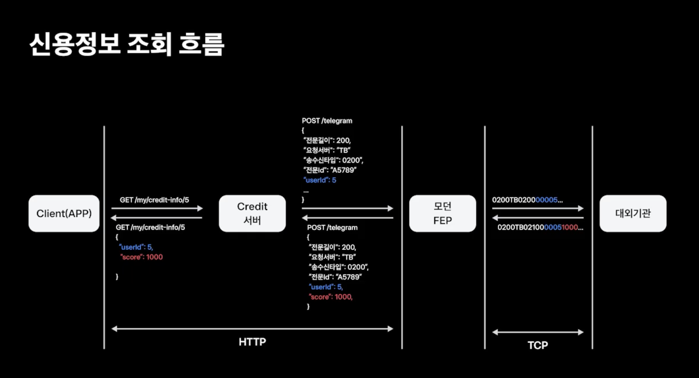
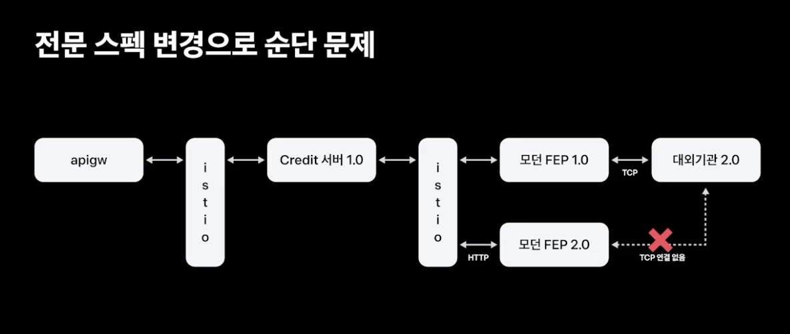
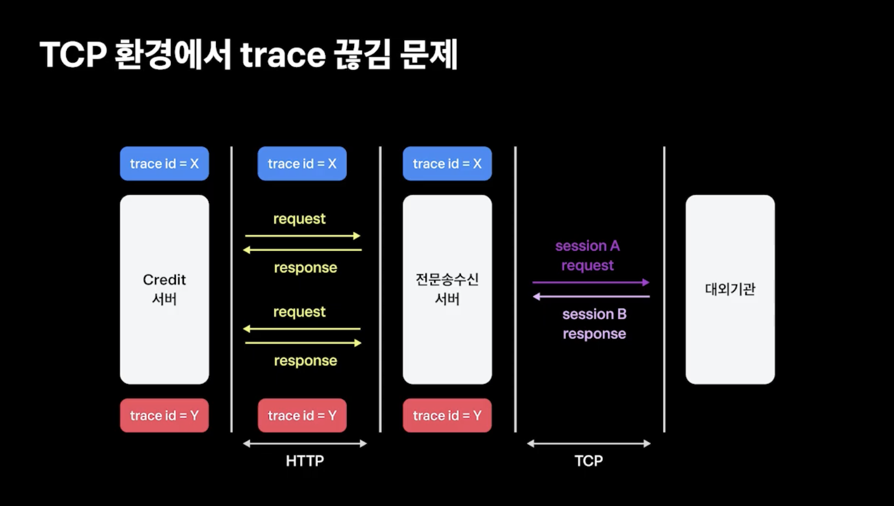
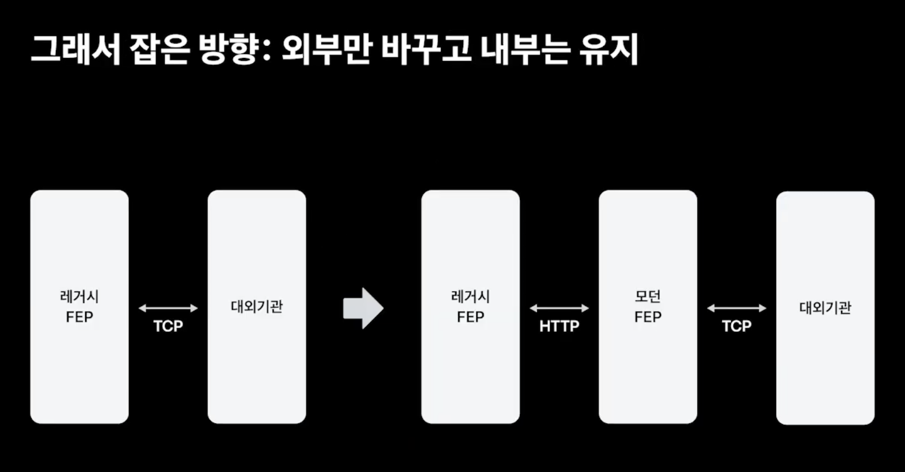

## 1. 모던 FEP 이후 구조 개선과 통합의 여정

    
내용 보기

- 모던 FEP의 2가지 역할
    - HTTP to TCP
    - JSON to 전문통신

### 문제 1

- 대외 기관과 연결할 수 있는 세션 수에 제한이 있다
- 때문에 신규 버전을 카나리 배포 전략으로 올릴 경우 신규 버전이 세션을 얻을 수 없다.

### 해결책 1
- 배포 전략 롤링 업데이트로 변경했다.
- 하지만 짧은 시간이지만 요청을 처리할 수 없는 공백이 생긴다.
- 공백을 최소화 할 수 있는 방법으로 '전문 변환 서버', '전문송수신 서버' 분리
- 대부분의 코드 변경은 전문 변환 부분이기 때문에 서버를 분리하여 롤링 업데이트가 필요한 배포 수를 줄였다.

### 문제 2 & 해결책 2
- 해결책 1로 인해 관리해야 할 서버가 2개로 늘었다.
- `전문 변환 서버`의 기능은 전문 분석과 전달인데 이는 라이브러리로도 커버가 가능한 영역이다.
- `전문 변환 서버` -> 라이브러리로 제공

### 문제 3

- trace id를 통해 단일 요청의 전체 흐름을 파악할 수 있다.
- 하지만 전문 통신은 비동기로 처리되고 있어 request와 response의 trace id가 다르게 인식되고 있었다.

### 해결책 3
- 요청을 보낼 때 trace id를 저장하고 응답이 오면 이전 trace id롤 가져와 update
- 이때 key값은 전문에 포함된 요쳥 시각 + 전문 요청 번호를 활용한다.

### 문제 4 & 해결책 4

- 아직 전환되지 못한 요청을 받고 있는 레거시 FEP를 어떻게 해야할까?
- 모던 FEP로 요청을 우회시키는 Proxy 역할로 전환하여 사용자는 변화를 느끼지 않지만 내부적으로 관리 포인트를 한 곳으로 줄였다.

  
