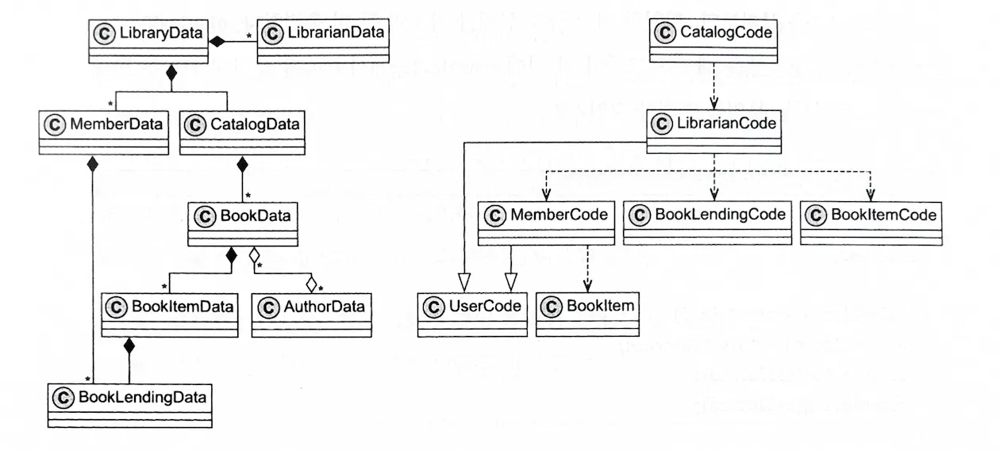

이번에 읽은 "데이터 지향 프로그래밍" 책의 1장에서 다룬 객체지향 프로그래밍의 복잡성에 대해 정리해보고자 한다.

## 책의 구성

처음 책을 구매했을 때 제목만 보고 딱딱한 내용을 생각했지만 재밌는 구성을 가지고 있었다. 사업가인 클라핌과 개발자인 테오가 등장하고 클라핌이 테오에게 **통합 도서관 관리 시스템** 개발을 요청한다. 테오는 요구사항을 만족하는 시스템을 구축하고 그 과정에서 OOP의 단점을 마주하며 해결해나가는 구성을 가진다.

대화 형식으로 진행되다 보니 딱딱하지 않고 내용에 더 집중이 잘 되는 것 같아 구성이 참 마음에 들었다.

  

## OOP 설계와 UML

테오는 개발에 들어가기에 앞서 시스템의 UML 도식을 구성한다. UML 도식에는 **포함**, **연관**, **상속**, **사용** 4가지 관계가 존재한다.

예시를 몇가지 적어보면:
- Library는 Member를 포함한다. 만약 Library가 사라지면 Member도 모두 사라지게 될 것이다.
- 반면 Book과 Author는 연관관계이다. Book이 사라져도 Author는 남을 수 있고 반대도 성립한다.
- Librarian과 Member는 User를 상속하여 코드의 중복을 방지한다.

  

## OOP가 복잡도를 증가시키는 4가지 이유

책에서는 OOP가 복잡도를 증가시키는 4가지 주요 이유를 제시한다:

### 1. 코드와 데이터가 섞여 있다

UML 다이어그램이 복잡해지는 이유 중 하나는 코드와 데이터가 결합되어 있기 때문이다. 저자는 이를 데이터 관계와 코드 관계로 분리하여 다이어그램을 단순화할 수 있다고 제안한다.

### 2. 객체가 변경 가능하다

가변 객체는 예측 불가능성을 만들어낸다. 특히 멀티스레드 환경에서는 객체의 상태가 예기치 않게 변경될 수 있어 디버깅을 어렵게 만든다.

### 3. 직렬화의 어려움

JSON과 객체 형식 간의 변환에서 어려움이 발생한다. OOP에서는 직렬화/역직렬화를 위해 광범위한 클래스와 코드 작성이 필요하다.

### 4. 복잡한 클래스 계층 구조

User/Member/Librarian 클래스 구조를 예시로 들며, 새로운 기능(예: VIP Member)을 추가할 때 상속 구조가 어떻게 복잡해지는지 보여준다. 메서드가 특정 클래스에 고정되어 있어 구조적 문제를 야기한다.

  

## 마무리

이 책의 1장을 통해 우리가 당연하게 생각했던 객체지향 프로그래밍의 복잡성에 대해 다시 생각해볼 수 있었다. 특히 대화 형식의 구성이 딱딱할 수 있는 개념들을 이해하기 쉽게 만들어주는 것 같다.

다음 장에서는 이러한 OOP의 문제점들을 데이터 지향 프로그래밍으로 어떻게 해결할 수 있는지 살펴보게 될 것이다.