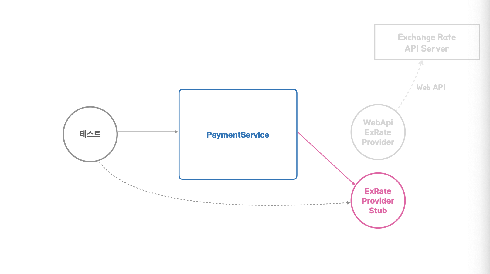

Kotlin + Spring을 사용하는 팀으로 이동했다. 첫 회사에서 Spring을 사용하긴 했지만 오랜만이기도 하고 언어도 낯설었다. 
이전과 다르게 AI를 활용해 개발을 하기 때문에 작업을 해나가는 건 이전보다 어려움이 적었다. 
하지만 당연하게 동작 원리에 대한 파악도 필요하기 때문에 토비 시리즈 강의를 결제했고 그중 첫 강의이다.
과거 Spring 강의들을 들으며 학습했던 내용들이지만 이 강의는 듣길 잘 했다는 생각이 든다.
잘 구성된 강의를 들으면 강사가 왜 이런 순서로 내용을 구성했는지 느껴질 때가 있다. 
첫 섹션에서 말한 것들이 반복되면서 발전하는 순서로 진행되니 학습하는 사람 입장에서는 자연스럽게 핵심 개념들에 반복 노출되고 응용된 개념에 다가가기 쉽다.
토비의 스프링 6를 들으며 이런 느낌을 받았다.


## 1. 오브젝트와 의존관계

> 결합도를 낮춰 변경에 용이한 코드 — 그걸 도와주는 도구가 IoC Container다.

이 섹션은 Spring의 IoC Container를 설명한다.
다만 처음부터 IoC Container에 대해 설명하지 않고 Spring이 전혀 없는 Java 코드에서 디자인 패턴을 적용하고 SOLID 원칙을 고려해 코드를 개선해 나간다.
개선을 쭉 진행하다가 어느 순간 완성형 코드에 다가가면 IoC Container가 이 모든 걸 쉽게 도와주는 도구라는 걸 알려준다.

Spring IoC Container를 통해 얻는 효과가 한가지는 아니지만 핵심은 결합도를 낮춰 변경에 용이한 코드를 만드는 것이다.
IoC Container는 다양한 설정 정보를 바탕으로 클래스들을 조합해서 제공한다. 덕분에 각 클래스들은 자신이 의존하고 있는 클래스를 바꿔야 하는 상황에서 자신의 코드를 직접 수정하지 않아도 된다.
설정 정보를 수정해 어떤 클래스를 주입할 것인지만 정하면 되고, 설정 정보 한 곳을 수정하여 여러 곳의 변화를 만들어낼 수 있다. 즉, 단일 수정 포인트를 만들어낸다.

하지만 IoC Container가 주는 이점이 Spring을 사용한다고 그냥 따라오지는 않는다.
Application에서 변경이 생길 수 있는 곳들을 추려야 하며 인터페이스와 구현체로 분리를 해둬야 IoC Container의 이점을 그대로 누릴 수 있다.
이러한 관점은 자연스럽게 관심사의 분리, 상속과 합성, 팩토리 메서드 패턴, 템플릿 메서드 패턴, 전략 패턴, DIP와 같은 개념들이 소개된다.

이후 강의에서도 결국 Spring의 핵심은 IoC Container이다. 느슨한 결합을 만들어 변경에 용이한 Application을 구축하는 것.
기술의 변경이던, 로직의 변경이던 코드 변경을 최소화하는 방향으로 Application을 설계하고 이 방향에 맞게 Spring을 활용하는 것이 중요해 보인다.

---

## 2. 테스트

> 느슨한 결합은 테스트에서 빛을 발한다.



오브젝트와 의존관계에서 강조했던 느슨한 결합과 변경에 용이한 Application을 Spring을 활용해 잘 구축했다면 테스트에서 큰 이점을 가져갈 수 있다.
IoC가 의존 관계 주입을 담당해주기 때문에 테스트에서 내가 정말 확인하고자 하는 것만 확인할 수 있는 구조를 만들기 쉽다.
사진을 예로 들어 PaymentService의 로직을 테스트 하고 싶다면 ExRate를 제공하는 클래스는 항상 성공하는 Stub으로 주입하여 테스트 실패의 원인을 PaymentService 로직으로 제한할 수 있다.
이건 하나의 예시이지만 결국 내가 정말 테스트 하고자 하는 부분만 진짜 로직으로 남길 수 있다는 점이 핵심이다.

추가로 학습 테스트라는 재미있는 개념을 소개해주시는데 직접 만들지 않은 코드나 라이브러리, 레거시 시스템에 대해 사용 방법을 익히고 동작을 확인하는 테스트를 뜻한다.
예를 들어 Java에서 제공하는 Clock을 프로젝트에서 사용할 일이 생겼다면 해당 라이브러리에서 제공하는 기능들을 테스트하는 코드를 작성해 두는 거다.
이렇게 작성해둔 코드는 버전을 올렸을 때 호환성 체크로도 활용될 수 있고 다른 팀원들이 라이브러리를 이해하는 것에도 도움을 준다.
새로운 라이브러리를 사용하는 시점에 나의 이해와 팀원들의 이해 그리고 버전 변경 시의 안정성을 함께 챙길 수 있는 좋은 테스트라는 생각이다.

---

## 3. 템플릿

> 변하지 않는 로직은 템플릿으로 고정하고, 변하는 부분은 전략으로 추려낸다.

이 섹션에서는 변경에는 닫혀 있으면서도 확장에는 열려있는 구조에 대해 설명한다.
핵심은 변경되지 않는 로직을 템플릿으로 고정하고 변경되는 부분을 전략으로 추려내 원하는 전략으로 템플릿을 통해 전체 로직을 이용할 수 있게 만드는 것이다.
예시 코드를 리팩토링하며 위 코드를 만족할 수 있는 여러 방식들을 보여준다. 결국 필요한 전략을 템플릿에 전달만 하면 되는 것이고 이를 달성하는 데에는 여러 방식이 있을 것이다.
그리고 더 나아가 매번 템플릿에 전략을 주입할 필요 없이 디폴트 전략을 내부적으로 가지고 있고 변경이 필요할 때만 파라미터를 활용해 변경할 수 있다면 더욱 편할 것이다.

코드가 어느 정도 다듬어진 후 이 구성을 Spring을 활용해 진행해보면 Spring이 어떤 구조를 원했는지 감이 온다.
사용자가 구성한 여러 Bean 혹은 프레임워크에서 제공하는 다양한 Bean들을 활용해 변하는 영역을 잘 분리해둔다면 변경은 필요 없으면서도 확장에는 열려있는 구조를 얻을 수 있다.
또한 Spring에서는 Template에 해당하는 컴포넌트들도 여럿(RestTemplate, JdbcTemplate 등등) 제공한다.
이 템플릿들 또한 내부적으로 전략에 해당하는 파트가 존재하고 이를 변경하여 활용할 수 있다. 물론 Default 전략은 항상 들어가 있어 매개변수 없이도 대개 간편하게 생성하여 사용할 수 있다.

용어는 중요하지 않다. 변하는 곳과 변하지 않는 곳이 있고 변하는 곳은 필요에 맞게 교체가 필요하다. 이 교체 작업에서 실제 코드가 변하지 않게 해주는 게 결국 Spring의 IoC Container이다.
변하는 것과 변하지 않는 것을 기준으로 컴포넌트 단위를 생각해보는 것도 Spring 프레임워크로 앱을 개발할 때 괜찮은 기준이 될 수 있을 것 같다.

---

## 4. 예외

> 예외를 전환해주는 덕분에 기술이 바뀌어도 예외 처리 코드는 그대로다.

Spring은 여러 기술들에서 throw하는 예외들을 있는 그대로 throw하지 않고 커스텀 예외로 재정의해 throw하곤 한다.
Spring이 예외를 전환하여 처리하면서 얻을 수 있는 이점은 하위 기술이 변경되어 예외가 바뀌더라도 동일한 성격의 예외는 동일한 Spring 커스텀 예외로 전환해준다는 점이다.
Spring의 예외 전환 처리 덕분에 기술이 변경되어도 Application단의 예외 처리 로직은 변경이 불필요해진다.

---

## 5. 서비스 추상화

> 매일 쓰는 @Transactional 한 줄 뒤에는 서비스 추상화(어댑터)와 프록시 패턴이 함께 들어있다.

이 섹션은 서비스란 무엇인가에 대한 정의부터 시작한다.
서비스는 @Service를 기계적으로 붙이는 대상이 아니라 비즈니스 로직의 시작점인 애플리케이션 서비스, 도메인 모델로 담을 수 없는 로직을 가진 도메인 서비스,
트랜잭션/메일/캐시처럼 기술을 제공하는 인프라 서비스로 구분된다.
그리고 서비스 추상화의 대상이 되는 건 이 중 인프라 서비스이다. 애플리케이션 서비스는 가능한 인프라 기술에 의존하지 않아야 하기 때문이다.

강의는 JPA 구현체 Repository와 JpaTransactionManager에 직접 의존하던 서비스에서 인프라 의존을 한 겹씩 벗겨낸다.

```java
@Service
public class OrderService {
    private final OrderRepository orderRepository;              // EntityManager를 쓰는 구체 클래스
    private final JpaTransactionManager jpaTransactionManager;  // JPA 전용 트랜잭션 매니저
    ...
}
```

먼저 Repository는 DIP를 적용해 인터페이스 의존으로 바꾼다.
OrderRepository는 내가 만든 클래스이기 때문에 인터페이스를 추출하고 JPA 구현은 구현체로 내리면 된다.
의존 방향이 역전되어 하위 모듈(JPA 구현)이 상위 모듈이 정의한 추상(인터페이스)에 의존하게 되고, 이후 JDBC 구현체로 갈아끼워도 서비스 코드는 변하지 않는다.

```java
public interface OrderRepository {
    void save(Order order);
}

public class JpaOrderRepository implements OrderRepository {
    @PersistenceContext
    private EntityManager em;

    public void save(Order order) { em.persist(order); }
}
```

트랜잭션은 문제의 성격이 다르다. 기술마다 이미 존재하는 남의 API(JPA의 EntityTransaction, JDBC Connection의 commit/rollback)라 시그니처도 사용법도 제각각이고, 인터페이스 추출로는 해결되지 않는다.
그래서 스프링은 트랜잭션 시작 → 커밋/롤백이라는 공통 개념만 뽑아 PlatformTransactionManager 인터페이스로 정의하고, JpaTransactionManager나 DataSourceTransactionManager 같은 기술별 매니저가 어댑터 역할을 해준다.
겉모습은 동일한 인터페이스지만 내부에서는 각자의 기술 API를 호출하는 것이다. 덕분에 기술을 바꿔도 서비스 코드는 변하지 않는다.

```java
@Service
public class OrderService {
    private final OrderRepository orderRepository;                 // 인터페이스 의존 (DIP)
    private final PlatformTransactionManager transactionManager;   // 추상화 의존 (어댑터)
    ...
}
```

그런데 여기서 멈추지 않는다. 추상화된 인터페이스를 쓰더라도 TransactionTemplate 코드가 서비스에 남아있는 것 자체가 관심사의 분리 위반이라는 것이다.

```java
public Order createOrder(String no, BigDecimal total) {
    Order order = new Order(no, total);

    // Order 로직 사이에 트랜잭션이라는 다른 관심사가 끼어 있다
    return new TransactionTemplate(transactionManager).execute(status -> {
        orderRepository.save(order);
        return order;
    });
}
```

그래서 프록시 패턴을 적용한다. OrderService 인터페이스를 추출하고, 트랜잭션 코드는 같은 인터페이스를 구현한 프록시가 대신 들고 있게 한다.
프록시는 트랜잭션 경계만 관리하고 실제 로직은 타깃에게 위임하기 때문에, 서비스에는 순수한 Order 로직만 남는다.

```java
public class OrderServiceTxProxy implements OrderService {
    private final OrderService target;  // 실제 로직을 가진 OrderServiceImpl
    private final PlatformTransactionManager transactionManager;

    @Override
    public List<Order> createOrders(List<OrderReq> reqs) {
        return new TransactionTemplate(transactionManager).execute(status ->
                target.createOrders(reqs)  // 트랜잭션 경계 안에서 타깃에게 위임
        );
    }
}
```

그리고 이 프록시를 스프링이 AOP로 자동 생성해주는 것이 바로 @Transactional이라는 결론이다.
@EnableTransactionManagement를 켜고 @Transactional을 붙이면, 위에서 손으로 만든 OrderServiceTxProxy 같은 프록시를 스프링이 대신 만들어 빈으로 등록해주는 것이다.

```java
@Service
public class OrderServiceImpl implements OrderService {
    private final OrderRepository orderRepository;  // 트랜잭션 코드가 사라졌다

    @Transactional
    public List<Order> createOrders(List<OrderReq> reqs) {
        return reqs.stream().map(req -> createOrder(req.no(), req.total())).toList();
    }
}
```

결국 매일 쓰는 @Transactional 한 줄 뒤에는 서비스 추상화(어댑터)와 프록시 패턴이 함께 들어있는 셈이다.
돌아보면 이 섹션은 앞의 내용들이 모두 모이는 지점이다. 변경 지점을 인터페이스로 분리하는 IoC의 원리가 기술 계층에 적용된 게 서비스 추상화이고, 템플릿 섹션에서 배운 템플릿/콜백이 TransactionTemplate으로 실제 등장했다가 프록시 뒤로 숨는다.
변하는 것을 분리한다는 같은 원리가 로직에서 기술로, 기술에서 관심사로 점점 큰 스케일로 적용되는 과정이 곧 Spring이 만들어진 과정이라는 생각이 든다.
