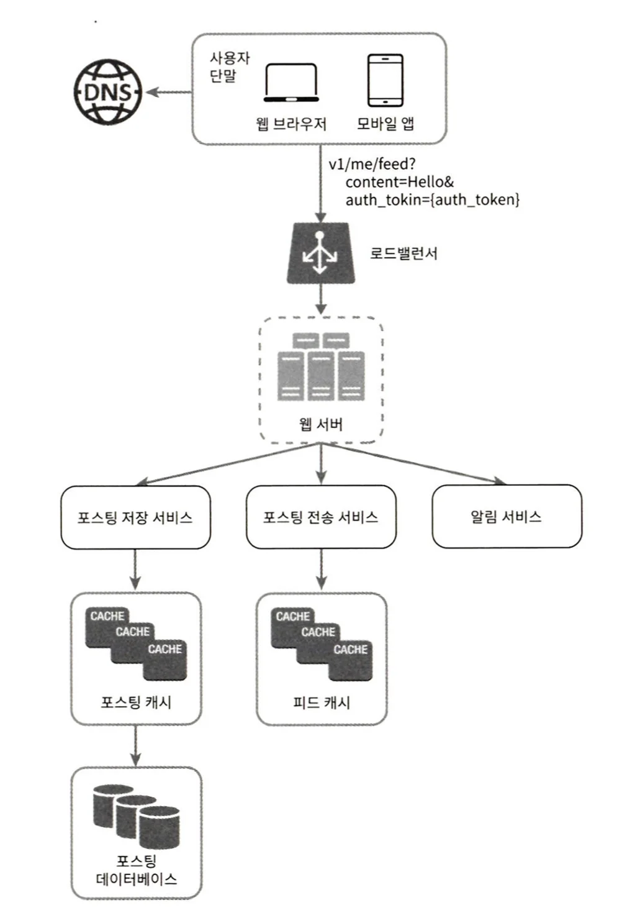
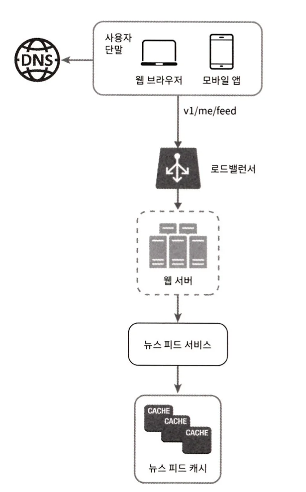

## 1. What is a News Feed System?
- Think of the main pages of Facebook, Instagram, and Twitter
- Refers to pages where continuously updated stories, photos, and videos are posted

  

## 2. Design Considerations
- Supported platforms: Mobile app or web or both
- Important features: New stories should be able to be posted / Users should be able to see stories posted by friends
- News feed order: Reverse chronological order / Topic score-based sorting, etc.
- Maximum number of friends per user
- Traffic scale
- Types of resources that can be posted to feed: Media files like images, videos, etc.

  

## 3. High-Level Design of News Feed System

### (1) Feed Publishing
- User posts a story -> Stored in cache and DB, and also sent to friends' news feeds

#### News Feed API
- Means used by clients to communicate with server
- Basically need publishing and reading APIs using POST and GET methods

#### Basic Structure

- When posting new content, the following tasks are performed:
  - Storage service saves data to DB and cache
  - Delivery service pushes new post to friends' news feeds
  - Notification service notifies friends that new post has been uploaded

### (2) News Feed Generation

- In the above structure, the core components are the news feed service and news feed cache
  - News Feed Cache: Stores feed IDs needed when rendering news feed
  - News Feed Service: Provides news feed using news feed cache

  

## 4. Detailed Design

- Web server includes `authentication` and `rate limiting` functions
  - Can also consider functionality to prevent spam or harmful content from being posted
- Post delivery service is responsible for delivering user posts to feeds of users who are friends
  - Write-time fanout: Update news feed at the time of new post recording
    - Real-time updates are possible, and feed reading time is reduced (since feed is already updated)
    - Posting time for users with many friends can take long (hotkey), and feeds of users who don't use the service frequently are also updated
  - Read-time fanout: Update news feed at the time of reading the feed
    - When there are many inactive users, unnecessary computing resources are not consumed
    - Number of friends doesn't affect posting speed
    - However, it takes a lot of time to read news feed

### (1) Detailed Design of Post Delivery Service
- Basically use write-time fanout to make feed reading speed faster
- However, for users with very many followers, apply read-time fanout to prevent system overload
- Also solve hotkey problem by evenly distributing requests and data through consistent hashing

#### Operation Sequence
- Select friend ID list from DB (Graph DB recommended)
- Select friend information from user information cache / Filter friends according to user settings (feed ignore settings)
- Insert friend list and new story post ID into message queue
- Fanout worker server selects message queue data
- Insert news feed data into news feed cache <Post ID, User ID>
  - Considering capacity, only store IDs in cache
  - News feed cache structure is not clearly understood, this would require searching for keys by value
  - Could use sorted set per user
  - key: User ID, values: Post IDs

### (2) Detailed Design of Feed Reading
- User sends feed reading API request
- Load balancer sends request to one of the web servers
- Web server calls news feed service
- News feed service gets post ID list from news feed cache
- Gets user names, photos, content, etc. to display in news feed from cache to complete full news feed and return as json format

  

## 5. Additional Topics Worth Considering
- Database scaling
  - Vertical scaling vs horizontal scaling
  - SQL vs NoSQL
  - Master-slave replication
  - Read replica operations
  - Consistency model
  - Database sharding
- How to operate web layer statelessly
- Data caching strategy
- Multi-data center support strategy
- Using message queues to reduce coupling
- Monitoring core metrics