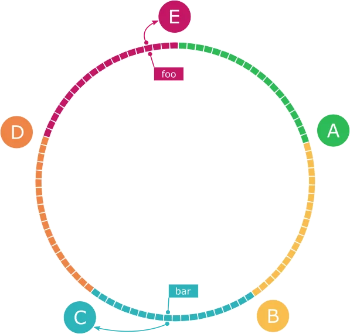

안정 해시(consistent hashing)는 해시 테이블 크기가 조정될 때 평균적으로 k/n개의 키만 재배치하는 해시 기법입니다. 여기서 k는 키의 개수이고, n은 슬롯의 개수입니다. 이와는 달리 대부분의 전통적 해시 테이블은 슬롯의 수가 바뀔 때 거의 대부분 키를 재배치합니다.

  

## 해시 키 재배치(rehashing) 문제

N개의 캐시 서버가 있다고 하면, 부하를 균등하게 나누는 보편적 방법은 해시 함수를 사용하는 것입니다:

**serverIndex = hash(key) % N**

이 방법은 서버 풀(server pool)의 크기가 고정되어 있을 때, 그리고 데이터 분포가 균등할 때는 잘 동작합니다. 하지만 서버가 추가되거나 기존 서버가 삭제되면 문제가 생깁니다.

예를 들어 1번 서버가 장애를 일으켜서 동작을 중단했다고 해봅시다. 이제 서버 풀의 크기는 3이 됩니다. 키에 대한 해시 값은 바뀌지 않지만 서버 인덱스 값은 달라집니다: hash % 3. 그 결과로 key0는 서버 1에서 서버 0으로, key1은 서버 2에서 서버 1으로 재배치됩니다.

이와 같은 문제를 해결하기 위해 안정 해시가 등장했습니다.

  

## 안정 해시

### 해시 공간과 해시 링

해시 함수 f로는 SHA-1을 사용한다고 하고, 그 함수의 출력 값 범위는 x0, x1, x2, x3, ..., xn과 같다고 합시다. SHA-1의 해시 공간 범위는 0부터 2^160 - 1까지입니다. 즉, x0는 0, xn은 2^160 - 1이며, 나머지 해시 값들은 그 사이의 값들을 가집니다.

이 해시 공간을 구부려서 양 끝을 이으면 해시 링(hash ring)이 만들어집니다.

### 해시 서버

해시 함수 f를 사용하여 서버 IP나 이름을 이 링 위의 어떤 위치에 대응시킬 수 있습니다.

위 그림에서 4개의 서버를 해시 링 위에 배치했습니다:
- 서버 0: f("서버0") = s0
- 서버 1: f("서버1") = s1  
- 서버 2: f("서버2") = s2
- 서버 3: f("서버3") = s3

### 해시 키

키 또한 같은 해시 함수를 사용하여 해시 링 위에 배치합니다.

### 서버 조회

어떤 키가 저장되는 서버는, 해당 키의 위치로부터 시계 방향으로 링을 탐색해 나가면서 만나는 첫 번째 서버입니다.

- key0은 서버 0에 저장됩니다
- key1은 서버 1에 저장됩니다  
- key2는 서버 2에 저장됩니다
- key3은 서버 3에 저장됩니다

### 서버 추가

새로운 서버 4가 추가된다고 했을 때, key0만 서버 4로 재배치됩니다. key1, key2, key3은 같은 서버에 남아 있습니다.

### 서버 제거  

서버 1이 삭제된다고 했을 때, key1만 서버 2로 재배치됩니다. 다른 키들은 영향을 받지 않습니다.

  

## 안정 해시 알고리즘의 두 가지 문제

### 기본 절차

안정 해시 알고리즘은 다음과 같습니다:

1. 서버와 키를 균등 분포 해시 함수를 사용해 해시 링에 배치한다
2. 키의 위치에서 링을 시계 방향으로 탐색하다가 만나는 최초의 서버가 키가 저장될 서버다

이 접근법에는 두 가지 문제가 있습니다:

### 첫 번째 문제: 서버가 추가되거나 삭제되는 상황을 감안하면 파티션의 크기를 균등하게 유지하는 게 불가능

해시 링에서 서버 1과 서버 3이 삭제되면, 서버 0과 서버 2만 남게 됩니다. key0과 key1은 서버 0이 처리하고, key2와 key3은 서버 2가 처리합니다. 서버 0은 전체 해시 공간의 50%를 처리하고, 서버 2는 나머지 50%를 처리하게 됩니다.

### 두 번째 문제: 키의 균등 분포를 달성하기가 어려움

서버가 해시 링 위에 균등하게 배치되지 않으면, 어떤 서버는 아주 작은 해시 공간을 할당받고, 다른 서버는 아주 큰 해시 공간을 할당받는 상황이 벌어질 수 있습니다.

  

## 가상 노드

가상 노드(virtual node) 또는 복제(replica)라 불리는 기법은 이 문제를 해결하는 데 사용됩니다.

### 가상 노드의 동작 원리

실제 노드 또는 서버를 가리키는 노드가 여러 개 있을 수 있으며, 이를 가상 노드라고 부릅니다.

위 그림에서 서버 0과 서버 1은 3개씩의 가상 노드를 갖습니다. 3이라는 숫자는 임의로 정한 것이며, 실제 시스템에서는 훨씬 큰 값이 사용됩니다. 서버 0을 링에 배치하기 위해 s0 하나만 쓰는 대신, s0_0, s0_1, s0_2의 세 개 가상 노드를 사용합니다. 마찬가지로 서버 1을 링에 배치할 때도 s1_0, s1_1, s1_2를 사용합니다.

각 서버는 하나가 아닌 여러 개 파티션을 관리해야 합니다.

키의 위치로부터 시계 방향으로 링을 탐색하다 만나는 최초의 가상 노드가 해당 키가 저장될 서버를 결정합니다. 위 그림에서 k0이 저장되는 서버를 알아내려면 k0의 위치로부터 링을 시계 방향으로 탐색하다가 만나는 최초의 가상 노드인 s1_1을 찾습니다. 따라서 k0는 s1_1이 나타내는 서버인 서버 1에 저장됩니다.

### 가상 노드의 개수

가상 노드의 개수를 늘리면 키의 분포는 점점 더 균등해집니다. 표준편차가 작아져서 데이터가 고르게 분포되기 때문입니다. 표준편차는 데이터가 어떻게 퍼져 나갔는지를 보이는 척도입니다. 온라인 연구 결과에 따르면 가상 노드의 개수를 100~200개로 정하면 표준편차 값이 평균의 5%(가상 노드가 200개인 경우)에서 10%(가상 노드가 100개인 경우) 사이가 됩니다.

가상 노드의 개수를 더 늘리면 표준편차 값은 더 떨어집니다. 그러나 가상 노드 데이터를 저장할 공간은 더 많이 필요하게 됩니다. 이는 타협적 결정(tradeoff)이 필요한 부분입니다.

  

## 재배치할 키 결정

서버가 추가되거나 제거될 때 데이터 일부는 재배치되어야 합니다. 어느 범위의 키들이 재배치되어야 하는지 알아봅시다.

### 서버 추가

새 서버 4가 s4에 추가되었다고 합시다. 이 변경으로 영향받는 키의 범위는 s4(새로 추가된 노드)부터 그 반시계 방향에 있는 첫 번째 서버 s3까지입니다. 즉, s3부터 s4 사이에 있는 키들을 서버 4로 재배치해야 합니다.

### 서버 제거  

서버 1(s1)이 삭제되면 s1(삭제된 노드)부터 그 반시계 방향에 있는 첫 번째 서버인 s0 사이에 있는 키들이 s2로 재배치되어야 합니다.

  

## 안정 해시의 이점

안정 해시 기법을 사용함으로써 얻는 이점들은 다음과 같습니다:

- **서버가 추가되거나 삭제될 때 재배치되는 키의 수가 최소화된다**
- **데이터가 보다 균등하게 분포하게 되므로 수평적 규모 확장성을 달성하기 쉽다**  
- **핫스팟 키 문제를 줄인다**: 특정한 샤드에 대한 접근이 지나치게 빈번하면 서버 과부하 문제가 생길 수 있는데, 안정 해시는 데이터를 좀 더 균등하게 분배하므로 이런 문제가 생길 가능성을 줄인다

  

## 안정 해시를 사용하는 유명 시스템

안정 해시는 다음과 같은 시스템에서 사용되고 있습니다:

- **아마존 다이나모DB의 파티셔닝 관련 컴포넌트**
- **아파치 카산드라 클러스터에서의 데이터 파티셔닝**
- **디스코드 채팅 애플리케이션**
- **아카마이 CDN**
- **매그레프 네트워크 부하 분산기**

  

## 정리

이 장에서 안정 해시가 왜 필요한지, 어떻게 동작하는지 살펴보았습니다.

**안정 해시의 이점:**
- 서버가 추가되거나 삭제될 때 재배치되는 키의 수가 최소화된다
- 데이터가 보다 균등하게 분포하게 되므로 수평적 규모 확장성을 달성하기 쉽다
- 핫스팟 키 문제를 줄인다

**기본 절차:**
1. 서버와 키를 균등 분포 해시 함수를 사용해 해시 링에 배치한다
2. 키의 위치에서 링을 시계 방향으로 탐색하다가 만나는 최초의 서버가 키가 저장될 서버다

실제 시스템에서는 가상 노드 기법을 사용해서 안정 해시 알고리즘을 구현합니다. 가상 노드를 사용하면:
- 각 서버는 하나가 아닌 여러 개 파티션을 관리한다  
- 가상 노드의 개수를 늘리면 표준편차가 작아져서 데이터를 더 균등하게 분배할 수 있다